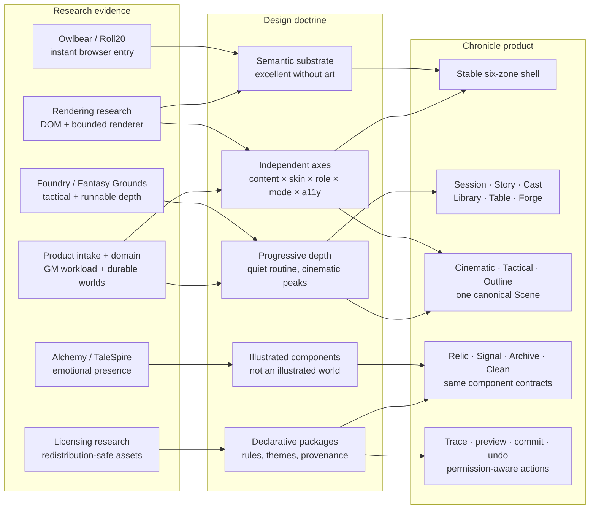

# Chronicle Triumph UI Direction

Status: **research synthesis + implemented vision spike**, 2026-07-27.  
Scope: synthesis of every pre-existing Markdown research/design document under `design/`.

## Decision

Chronicle should be a **Living Campaign Instrument**:

> A semantic, accessible workbench for any tabletop system, wearing the crafted art, material,
> light and motion of the current campaign.

It is neither a conventional dashboard with fantasy styling nor a simulated game world that
forces campaign management into a sidebar. The product remains data-, document- and
workflow-driven. Game feel comes from illustrated component skins, meaningful state transitions,
optional scene rendering and audiovisual cadence.

## Research soup: what survives

| Evidence | Keep | Reject |
|---|---|---|
| Foundry (`research/RB-01-foundry.md`) | Tactical ceiling, data ownership, regions and deep extensibility | Window soup, code/module dependence, power visible before it is needed |
| Roll20 (`research/RB-01-roll20.md`) | Browser reach, quick table entry, lighting diagnostics | Dated permanent dock, scattered settings, weak data portability |
| Owlbear (`research/RB-01-owlbear.md`) | Link-to-table speed, canvas performance, progressive tools, mobile friendliness | Minimalism that exports sheets, campaign memory and automation elsewhere |
| Alchemy (`research/RB-01-alchemy.md`) | Scene-as-mood-object, cinematic presentation, in-context actions, Zen/streamer modes | Spectacle hiding operations, shallow arbitrary-system support |
| Fantasy Grounds (`research/RB-01-fantasy-grounds.md`) | Runnable content, strong automation, reusable packages | Floating-window MDI, radial-menu dependence, coded effect strings |
| TaleSpire (`research/RB-01-talespire.md`) | Coherent art direction, visual desire, status/turn drama | Fixed aesthetic, camera tax, world visualization replacing actual VTT workflows |
| Rendering research (`research/RB-02-rendering-tech.md`) | DOM-authoritative product, Pixi viewport boundary, WebGL2 baseline, renderer abstraction | Native-engine shell, WebGPU requirement, inaccessible opaque canvas application |
| Asset research (`research/RB-04-asset-licensing.md`) | First-party/CC0 core, attribution ledger, sliced art kits, procedural effects | “Commercial use” assets without redistribution rights, NC/ND/SA traps |
| Map research (`research/RB-05-competitor-maps.md`) | Cinematic/Tactical/Outline scene renderers, tiled maps, honest diagnostics, staged WFC | Map-first product identity, generation before a stable wall/scene model |
| Domain proposal (`02-domain-model.md`) | Universe → Campaign → GameSession, membership-scoped roles, shared knowledge, reusable world continuity | Timelines in v1, Universe jargon during first-run, client-side scope filtering |
| Intake + plan (`00-intake.md`, `01-attack-plan.md`) | GM workload, onboarding, theming joy, no-code rules, accessibility as the moat | Day-one feature-count war against mature ecosystems |

The resulting competitive equation is:

> **Owlbear at minute one + Alchemy in emotional presence + Foundry at the tactical ceiling +
> Fantasy Grounds in runnable depth — without inheriting their structural baggage.**

## Synthesis map



## The universal shell

The whole product uses one stable spatial grammar:

```text
┌─ Campaign Context / Command / Role / Presence ──────────────────────────────┐
│                                                                             │
│ ┌─ Module ─┐ ┌─ Collection ─────┐ ┌─ Primary Stage ──────────┐ ┌─ Lens ──┐ │
│ │ Session  │ │ current module   │ │ document                │ │ details │ │
│ │ Story    │ │ objects/search   │ │ schema sheet            │ │ fields  │ │
│ │ Cast     │ │ filters/groups   │ │ collection              │ │ links   │ │
│ │ Library  │ │ scene outline    │ │ cinematic/tactical map  │ │ trace   │ │
│ │ Table    │ │                  │ │ builder/live preview     │ │ actions │ │
│ │ Forge    │ │                  │ │                          │ │         │ │
│ └──────────┘ └──────────────────┘ └──────────────────────────┘ └─────────┘ │
│                                                                             │
├─ Session Shelf / contextual actions / dice / live state / undo ────────────┤
└─────────────────────────────────────────────────────────────────────────────┘
```

### Zone contracts

1. **Campaign Context**
   - campaign, session, user role and presence;
   - universal search and command palette;
   - mode, skin and accessibility controls;
   - no module-specific clutter.

2. **Module Rail**
   - stable information architecture;
   - compact icons plus visible labels when expanded;
   - system packages may rename display labels but not routes or semantics.

3. **Collection Rail**
   - the current module’s objects, groups, filters and saved views;
   - supports large data sets and missing artwork;
   - collapses to a drawer on narrow layouts.

4. **Primary Stage**
   - exactly one dominant task;
   - may be a document, entity, sheet, card collection, scene renderer or builder;
   - keeps selection and state when its presentation mode changes.

5. **Context Lens**
   - one inspector for the currently selected object;
   - overview, fields, relations, history, permissions and calculation trace;
   - never becomes a global junk drawer.

6. **Session Shelf**
   - role- and selection-aware action ribbon;
   - character/resource glance, current turn, dice/chat and reversible history;
   - visible during play, quieter during preparation.

On tablets, Collection and Lens become intentional drawers. Focus mode retains only Primary
Stage, critical live state and the Session Shelf.

## Independent axes: the generalisation test

Chronicle only succeeds if these axes can change independently:

```text
Data scope  ×  Content package  ×  Art skin  ×  User role  ×  Workspace mode  ×  Accessibility
Universe       Fantasy             Relic       GM            Cinematic          Standard
Campaign       Science fiction     Signal      Player        Tactical           High contrast
Session        Modern mystery      Archive     Observer      Outline/Prep       Reduced motion
Object         Original system     Clean       Builder       Collection         200% zoom
```

A mystery campaign must work in a medieval skin. A fantasy rule package must work in the Clean
skin. A Player and GM must share component semantics while server permissions alter controls and
visibility. Universe lore must render through the same Story and Library primitives as
campaign-local extensions. No axis may silently contain logic from another.

## Product hierarchy

1. **Campaign Gate**
   - continue, create, join by link, import.

2. **Session**
   - GM workload surface: agenda, open decisions, preparation queue, recent objects, next scene.

3. **Story**
   - linked notes, wiki, quests, locations, timeline, backlinks and per-block visibility.

4. **Cast**
   - schema-driven characters, NPCs, factions, relationships, compact play glance and full sheet.

5. **Library**
   - generic Collections for templates, instances, inventories, cards, handouts and media.

6. **Table**
   - one Scene model with three render recipes:
     - **Cinematic:** art, cast, ambience, handout and dialogue focus;
     - **Tactical:** tiled map, tokens, grid, walls, fog, lighting and combat;
     - **Outline:** accessible DOM tree, positions, statuses, regions and relationships.

7. **Forge**
   - Theme Studio, visual rule/schema builder, formula/action graph, generators and package tests.

8. **Administration**
   - roles, packages, versioning, export/import, backup and license ledger.

Combat is a contextual Table state, not a permanent product silo.

## Durable world layer

Chronicle’s long-term retention object is not a single campaign file. The working hierarchy is:

```text
Universe
├─ shared knowledge, locations, factions and templates
├─ optional world date / future timeline reference
└─ Campaign
   ├─ campaign-local extensions and permissions
   └─ GameSession
      ├─ active Scene / Encounter
      └─ recap and audit history
```

`UniverseMembership` and `CampaignMembership` are parallel permission edges. GM, player,
co-GM and observer are roles on a campaign membership, never permanent properties of a user.
Character controllers are likewise explicit many-to-many permissions.

The product must make this depth progressive:

- a first campaign silently receives a personal Universe; onboarding never asks the user to
  understand the term;
- the Universe layer appears only when lore or assets are reused across a second campaign;
- campaign-local knowledge extends shared entries without mutating their source;
- search, snippets, backlinks and relations filter both Universe and Campaign visibility on the
  server;
- branching Timeline UI is deferred until real usage justifies the query and permission cost.

This makes Story more than campaign notes: it becomes the durable world artifact a GM keeps for
years, while the stable shell remains unchanged at Universe, Campaign and Session scope.

## Universal primitives

The same declarative primitives drive every system:

- `Universe`
- `Campaign`
- `GameSession`
- `UniverseMembership`
- `CampaignMembership`
- `Entity`
- `FieldGroup`
- `Resource`
- `Collection`
- `ItemTemplate`
- `ItemInstance`
- `Action`
- `Effect`
- `Trigger`
- `Relation`
- `ViewRecipe`
- `Permission`
- `ThemeManifest`

Examples:

- inventory, spellbook, cyberware, evidence bag and vehicle hardpoints are all `Collection`
  render recipes;
- HP, stress, oxygen and reputation are all `Resource`;
- character, starship, faction and location are all `Entity`;
- equip, reveal, consume, roll, move and compare are all traceable `Action` intents.

Rule packages define validated data and formulas. They never execute arbitrary code. Theme
packages may suggest a rule package or vice versa, but neither depends on the other.

## Art system: illustrated components, not illustrated screens

The interaction geometry remains semantic DOM. Art is applied through a manifest:

```text
theme
├─ tokens
│  ├─ semantic colour and contrast pairs
│  ├─ typography, spacing and density
│  ├─ elevation, focus and state
│  └─ motion and sound timings
├─ surfaces
│  ├─ shell.backdrop
│  ├─ stage.primary
│  ├─ rail.secondary
│  ├─ lens.detail
│  ├─ card.standard
│  └─ modal.focus
├─ ornaments
│  ├─ corners and stretchable edges
│  ├─ header crown and divider
│  └─ semantic emissive masks
└─ fallbacks
   ├─ controlled text scrim
   ├─ missing-art glyph
   └─ clean accessible surface
```

Each asset declares:

- slice metrics;
- safe text inset;
- intended component role;
- resolution tiers;
- emissive/accent mask;
- license/provenance/checksum;
- static and reduced-motion fallback.

No structural art contains baked-in text, controls, icons, runes, weapons or fixed game terms.

### Visual hierarchy

- Campaign arrival and Scene transitions receive the richest art.
- Primary Stage is crafted but contains controlled quiet reading surfaces.
- Collection Rail and Context Lens are calmer.
- Frequent controls are least ornate and most predictable.
- Normal cards remain inset and subdued.
- Selection may temporarily “open” a card with light, depth and optional artwork.

Provide two independent controls:

- **Density:** Compact / Comfortable.
- **Atmosphere:** Clean / Crafted / Cinematic.

Accessibility preferences may always reduce ornament, motion and contrast risk locally, even when
the GM defines the campaign skin.

## Motion and sound language

Motion communicates state; it is not animated wallpaper.

| Tempo | Duration | Use |
|---|---:|---|
| Response | 110–180 ms | press, hover, focus, validation |
| State | 220–340 ms | select, equip, reveal, inspector change |
| Transition | 600–1000 ms | Scene/chapter change and authored ambience |

Core motifs:

- selection travels from source card to Context Lens;
- equip/transfer visibly moves or snaps to its destination;
- calculations reveal trace before commit;
- undo reverses the same path;
- scene transitions synchronize backdrop, light, weather and audio metadata.

Reduced Motion replaces spatial travel with opacity/state changes and freezes all parallax,
particles, light flicker, weather and canvas camera easing. Low Power pauses ambience and lowers
asset resolution.

## GM, player and observer

The product does not load unrelated applications per role. The same components are shaped by
server-side permissions.

### Player

- Stage, own character glance and action shelf;
- all routine play in one gesture;
- join link may allow display name + GM approval without account.

### GM Director Layer

- hidden entities, scene queue, mood controls, walls/fog/regions;
- reveal and permission actions;
- calculation trace, diagnostics, audit and undo;
- `View as player` permission goggles.

### Observer / Streamer

- curated Stage and cast/status;
- captions/chat/audio metadata;
- secrets and private notes structurally absent, not merely visually hidden.

## Renderer boundary

DOM is authoritative for the product. Canvas is one optional Scene renderer.

```text
Declarative campaign + rule data
                │
Canonical normalized state and commands
          ┌─────┴───────────┐
          │                 │
     DOM workspace      MapRenderer API
 text/forms/a11y/art    Pixi adapter
          │          WebGL2 | WebGPU | 2D
     Theme manifest
```

Shipping decisions:

- WebGL2 is the initial feature baseline;
- WebGPU is runtime-probed and capability-gated;
- Canvas2D is a reduced graphics floor;
- Pixi remains behind `MapRenderer`;
- map rendering, LOS/WFC and atlas work move off the main thread where supported;
- large maps use a tile pyramid;
- effects and tilesets are declarative;
- uploads are decoded, validated and re-encoded server-side.

## Accessibility and performance gates

Accessibility is architecture:

- semantic DOM remains usable before art loads;
- full keyboard operation and visible focus;
- Canvas objects receive DOM proxies and an Outline view;
- mouse and keyboard emit the same commands;
- state is never encoded only by colour;
- themes pass automated contrast validation;
- 200% zoom and narrow layouts do not clip content;
- NVDA/Firefox, VoiceOver/Safari and keyboard-only tests begin with the first slice.

Performance reference:

- first interactive shell at or below 1.2 MB compressed;
- theme art lazy-loaded and resolution-tiered;
- no DOM layout work on the map hot path;
- 60 FPS target on a 2020–2022 integrated-GPU laptop;
- 300 scene tokens, at most 100 visible and animated;
- 20 dynamic lights, at most 8 animated;
- 144 MP maps only through tiling;
- 150 draw-call ceiling and zero hot-path allocations.

## Asset and extension policy

- commissioned first-party core art with explicit redistribution/export/sublicensing rights;
- audited CC0 defaults;
- selected CC BY only with automatic attribution;
- user assets scoped to their campaign;
- later marketplace licenses must explicitly cover self-hosting and export;
- every asset carries SPDX id, author, source, checksum, modifications and `derived_from`;
- AI-generated spike art is visual-direction material, not automatically production-safe Tier 0;
- extensions use declarative packages or sandboxed iframe/postMessage APIs.

## Triumph spike acceptance matrix

The next spike is successful only if it visibly proves:

1. one unchanged shell across Fantasy, Sci-Fi and modern Mystery content;
2. content package and art skin switched independently;
3. GM, Player and Observer projections, with unauthorized records omitted by the production response;
4. Session, Story, Cast, Library and Table inside the same spatial grammar;
5. Cinematic, Tactical and Outline recipes for one Scene without losing selection;
6. source selection travelling to Context Lens with a reversible action and trace;
7. Clean, Crafted and Cinematic atmosphere;
8. explicit Reduced Motion and high-contrast states;
9. missing artwork and long translated labels;
10. desktop plus narrow-layout composition.

If all theme assets are disabled, the spike must still be excellent software. When enabled, it
should look commissioned for the campaign rather than merely recoloured.

## Implemented proof in the Triumph spike

The interactive vision proof lives at
[`spikes/chronicle-triumph-shell.html`](spikes/chronicle-triumph-shell.html).
It is intentionally framework-free and data-driven so the design contract can be inspected
without confusing the spike with production architecture.

> **Security boundary:** the single-file spike contains every mock fixture and projects
> role-visible records in the browser. It proves the intended UI states, including owner-private
> versus GM-only data, but it is not an access-control proof. Production APIs must omit
> unauthorized records before delivery, and search/backlink endpoints need the same
> Universe × Campaign scope tests.

| Claim | Concrete proof |
|---|---|
| Content and skin are independent | Aldenfall, Kepler-9 and Nebelakte can each wear Relic, Signal, Archive or Clean |
| Skins are more than recolours | Relic uses role-specific illustrated panels; Signal uses a graphite/cyan 9-slice kit and condensed technical typography; Archive uses oxblood/charcoal Art Deco slices and editorial typography |
| Role projections alter structure | GM sees Director/Forge/GM secrets; Player receives role actions plus public and owner-private records; Observer removes private rails and receives a non-mutating read-only session surface |
| One Scene, three recipes | Table switches Cinematic, Tactical and semantic Outline without replacing the selected Scene |
| Actions are explainable | Selection travels into Context Lens; actions show preview, calculation/audit steps, commit, persisted committed history and an explicit Undo |
| Missing art is designed | Unillustrated records receive a theme-reactive specimen/sigil fallback rather than an empty card |
| Accessibility overrides survive art | Clean, High Contrast and Reduced Motion remain reachable; narrow layouts preserve rather than discard Collection and Lens |

Useful deterministic preview URLs:

- `?world=kepler&skin=signal&role=gm&module=table`
- `?world=nebelakte&skin=archive&role=player&module=story`
- `?world=nebelakte&skin=clean&role=player&module=table&scene=tactical&contrast=high&motion=reduced`
- `?world=kepler&skin=signal&role=gm&module=table&scene=outline&trace=1`
- `?world=kepler&skin=signal&role=player&module=library&drawer=collection`

Rendered evidence:

- [`spikes/chronicle-triumph-library.png`](spikes/chronicle-triumph-library.png) — Relic / Library / GM;
- [`spikes/chronicle-triumph-table.png`](spikes/chronicle-triumph-table.png) — Signal / Cinematic Table / GM;
- [`spikes/chronicle-triumph-story.png`](spikes/chronicle-triumph-story.png) — Archive / Story / Player;
- [`spikes/chronicle-triumph-observer.png`](spikes/chronicle-triumph-observer.png) — Clean / Session / Observer;
- [`spikes/chronicle-triumph-tactical-a11y.png`](spikes/chronicle-triumph-tactical-a11y.png) — Tactical / High Contrast / Reduced Motion;
- [`spikes/chronicle-triumph-outline-trace.png`](spikes/chronicle-triumph-outline-trace.png) — semantic Outline / action trace;
- [`spikes/chronicle-triumph-mobile.png`](spikes/chronicle-triumph-mobile.png) — 720 px primary Stage with persistent action shelf;
- [`spikes/chronicle-triumph-mobile-drawer.png`](spikes/chronicle-triumph-mobile-drawer.png) — 720 px Collection drawer.

The included raster kits and scene illustrations are **prototype direction art**. Before shipping,
they must be recreated or commissioned under the Tier-0 rights contract described above, encoded
into resolution tiers and entered in the asset ledger.

## Explicit non-goals

- no literal bag, table, room or game world as the only application shell;
- no floating-window desktop;
- no permanent toolbars for every possible feature;
- no art asset per exact screen size;
- no genre noun in core routes or component contracts;
- no Canvas rendering for documents, forms, sheets or builders;
- no WebGPU-only core mechanic;
- no theme JavaScript;
- no fake rule builder before the engine contract exists;
- no claim that a vision spike is production architecture.

## Product promise

> **A living, cinematic table that is effortless enough for tonight’s one-shot, deep enough for
> a hundred-session campaign, and belongs to whatever system and world you invent.**
