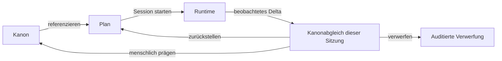

# GIGA-Analyse — Chronicle als Betriebssystem für Pen & Paper

Status: **Architektur-Draft v0.1**  
Datum: **2026-07-27**  
Autorität: Vorschlag zur Ratifikation; ersetzt weder den Champion noch die bindenden
Sicherheits- und Datenverträge. Er konkretisiert K8–K11 einschließlich des korrigierten
Eron-Party-Fixtures als Produkt- und GUI-Architektur.

Verwandte Verträge:

- [`00-intake.md`](00-intake.md) — Produktbrief und Kayas bindende Ergänzungen;
- [`02-domain-model.md`](02-domain-model.md) — bestehender Persistenzvertrag;
- [`03-triumph-ui-direction.md`](03-triumph-ui-direction.md) — räumliche Shell und visuelle
  Grundprinzipien;
- [`04-die-eine-plattform.md`](04-die-eine-plattform.md) — Plattformstrategie,
  Absorbieren/Anbinden/Verweigern;
- [`05-visual-reset.md`](05-visual-reset.md) — visuelle Richtung „die lebende Sternwarte“;
- [`feature-register.json`](feature-register.json) — kanonisches Register mit 771 Einträgen.

**Lesewege:** Für das schnelle Urteil: §§0, 4–6 und 24. Für Produktstrategie: §§1–5, 17, 21 und
23. Für GUI/UX: §§6, 9–11, 14, 18, 20 und 22. Für Daten- und Systemarchitektur: §§7, 12–13, 16,
19 und 21. Quellen stehen in §25.

---

## 0. Das Urteil vor der Analyse

Chronicle darf **nicht** versuchen, World Anvil, Foundry, Roll20, Inkarnate und alle weiteren
Werkzeuge als sichtbare Funktionssammlung nachzubauen. Das ergäbe fünf Produkte in einem Fenster,
fünf konkurrierende mentale Modelle und eine Navigation, deren Komplexität schneller wächst als
der tatsächliche Nutzen.

Chronicle soll stattdessen das bauen, was der heutige Werkzeugstapel nicht besitzt:

> **Eine durchgehende Identität für Welt, Vorbereitung, Spiel und Erinnerung.**

Olav ist nicht nacheinander Wikiartikel, Encounter-Eintrag, Token, Charakterbogen,
Initiativezeile und Sitzungsnotiz. **Olav ist ein Objekt.** Die verschiedenen Arbeitsräume zeigen
jeweils die passende Projektion desselben Objekts. Dasselbe gilt für Orte, Gegenstände, Fraktionen,
Szenen, Regeln, Kartenbereiche, Würfe und kanonische Absätze.

Die GUI folgt daraus fast zwangsläufig:

```text
                              CHRONICLE
                   ein Konto · ein Objektgraph · eine Sicht

 HEUTE / HOME          KAMPAGNEN-LOOP                              CREATOR-KONTEXT
   Router       WELT BAUEN → ABEND VORBEREITEN → SPIELEN              SCHMIEDE
                    ▲                              │
                    └──── bestätigte Residuen ─────┘

                         dieselben kanonischen Objekte
```

Die vorgeschlagene Hauptarchitektur lautet:

1. **Heute** ist Home und adaptiver Einstieg außerhalb des Workspace-Rails, kein Fachmodul.
2. **Welt bauen** vereint Wiki, Atlas, Zeit, Relationen und Veröffentlichung.
3. **Abend vorbereiten** ist zunächst eine minimale, kontextuelle Session-/Seed-Projektion. Ob
   daraus ein dauerhafter Workspace mit dem Label „Abenteuer“ wird, muss der IA-Prototyp beweisen.
4. **Spielen/Tisch** ist der Live-Runtime-Raum mit Cinematic-, Tactical- und Outline-Rezept.
5. **Schmiede** ist ein separater Creator-Kontext für Regel-, Bogen-, Theme-, Generator- und
   bedingt Kartenwerkzeuge, nicht gleichrangige Kampagnenroutine.
6. **Figuren, Gegenstände, Medien und Regeln sind scope-aufgelöste Objektbestände**, keine dauerhaft
   konkurrierenden Hauptbereiche.

Die existierende sechs-zonige **räumliche Grammatik** aus
[`03-triumph-ui-direction.md`](03-triumph-ui-direction.md) bleibt wertvoll:
Kontextleiste, Arbeitsraum, Sammlung, Bühne, Kontextlinse und Aktionsleiste. Was geändert werden
muss, ist die **Taxonomie der Hauptnavigation**. `Session · Story · Cast · Library · Table · Forge`
mischt heute drei verschiedene Achsen:

- **Zeit/Phase:** Session;
- **Objekttyp:** Story, Cast, Library;
- **Arbeitsmodus:** Table, Forge.

Diese Mischung ist auf Dauer nicht skalierbar. Eine Hauptnavigation muss genau **eine** Frage
beantworten. Die vorgeschlagene Frage lautet:

> **„Was versuchst du gerade zu tun?“**

Die Objekttypen werden danach innerhalb des gewählten Arbeitsraums angeboten, nicht daneben.

### 0.1 Die fünf stärksten Entscheidungen dieses Drafts

| Entscheidung | Warum sie trägt |
|---|---|
| **Kampagnen-Loop statt Feature-Menü** | Ein GIGA-Produkt bleibt erlernbar, wenn Home routet, Welt/Prep/Tisch den Lebenszyklus tragen und Creator-Tiefe separat erscheint. |
| **Ein Objekt, mehrere Rezepte** | Verhindert Kopien, Sync-Drift und das Gefühl zusammengeklebter Apps. |
| **Wissen als gemeinsame Projektion** | Artikelrechte, Kartennebel, Würfelmodifikatoren und Provenienz werden zu einem Mechanismus statt vier Integrationen. |
| **Schmiede als getrennte Werkbank** | Kreatoren erhalten maximale Tiefe, ohne dass normale Spielleitungen beim ersten Start ein IDE sehen. |
| **Import/Export als Hauptfunktion** | Die Plattform kann den gesamten Markt bedienen, bevor sie jede Spezialfunktion selbst besitzt. |

### 0.2 Der Produktsatz

> **Chronicle ist das TTRPG-Betriebssystem, in dem eine Welt entworfen, vorbereitet, gespielt und
> weitergeschrieben wird, ohne dass Figuren, Orte, Regeln oder Geheimnisse zwischen Werkzeugen ihre
> Identität verlieren.**

Die bereits ratifizierte schärfere Differenzierung bleibt darunter erhalten:

> **Was eine Figur weiß, ist was sie sieht, was ihr verborgen bleibt und was sie würfelt.**

Der erste Satz erklärt die Kategorie. Der zweite erklärt den Ring, den kein Werkzeugstapel durch
bloße Synchronisation herstellen kann.

---

## 1. Was hier analysiert wurde

Dieser Draft verbindet vier Evidenzschichten:

1. **Den bestehenden Projektkorpus** einschließlich Domain Model, Triumph-Shell, Plattformstrategie,
   Champion, offenen Entscheidungen und der Karten-/Verschachtelungsforschung.
2. **Das kanonische Feature-Register:** 771 Einträge in 12 Kategorien, davon 297 Chronicle-eigene
   Einträge und 474 Beobachtungen oder Kombinationen aus dem Markt.
3. **Die aktuelle Produktlandschaft:** offizielle Produkt- und Hilfeseiten der maßgeblichen
   Wiki-, VTT-, Regel-, Karten- und Creator-Werkzeuge, geprüft am 2026-07-27.
4. **Das echte Eron-Fixture:** kein abstraktes Beispieldorf, sondern ein gewachsenes Universum mit
   Artikeln, Links, Medien, Karte, realen Spielerfiguren und NPCs.

Rechteannahme für das Fixture: Der Nutzer ist mit einem Kollegen Schöpfer von Eron und hat die
Nutzung im Projekt autorisiert; Textattribution bleibt erhalten. Das wird **nicht** pauschal auf jede
hochgeladene Karte, jedes Porträt oder eingebettete Fremdasset ausgedehnt. Per-file Provenienz und
Lizenzstatus bleiben sichtbar und ungeklärte Assets verlassen das lokale Fixture nicht.

### 1.1 Was die 771 Registerzeilen tatsächlich bedeuten

| Kategorie | Einträge |
|---|---:|
| Karten | 137 |
| Plattform | 132 |
| Wissen | 104 |
| Geschäft | 70 |
| Regeln | 69 |
| Import/Export | 53 |
| Gemeinschaft | 42 |
| Sitzung | 40 |
| Zugänglichkeit | 40 |
| Inhalt | 30 |
| Figuren | 28 |
| Tisch | 26 |
| **Gesamt** | **771** |

Status:

- 406 × `konkurrenz-hat-es`;
- 140 × `unser-champion`;
- 63 × `idee`;
- 54 × `zurueckgestellt`;
- 45 × `gemessen`;
- 37 × `getoetet`;
- 26 × `gepfropft`.

Entscheidung:

- 535 × `absorbieren`;
- 164 × `verweigern`;
- 72 × `anbinden`.

Diese Zahlen sind **kein Screen-Inventar**. Ein Eintrag kann eine Sicherheitsinvariante, ein
Dateiformat, ein Mikroverhalten, ein Geschäftsmodell, eine Wettbewerbsbeobachtung oder eine
vollständige Funktion sein. Sie direkt in Navigationspunkte zu übersetzen wäre ein Kategorienfehler.

Die GUI-Aufgabe besteht deshalb aus **Capability Compression**:

> Viele Fähigkeiten werden durch wenige stabile Objekt- und Interaktionsverträge getragen.

Beispiele:

- Falls OPEN N2 später ratifiziert wird, sind Inventar, Zauberbuch, Beweismappe, Cyberware und
  Fahrzeugslots verschiedene Rezepte einer `Collection`; das ist Schema-Kompression, kein
  Auslieferungscommit.
- HP, Stress, Sauerstoff, Einfluss und Munition sind verschiedene `Resource`-Definitionen.
- Charakter, NPC, Kreatur, Fahrzeug und Fraktion teilen Entitäts-, Relations- und Sichtverträge.
- Weltkarte, Regionskarte und Battlemap teilen Karte, Anker, Platzierung und Projektion, aber nicht
  dieselbe Werkzeugdichte.
- Reveal, Ausrüsten, Würfeln, Verschieben, Prägen und Rückgängig sind nachverfolgbare `Action`
  Intents mit Vorschau, Berechtigung, Ergebnis und Audit.

### 1.2 Abgrenzung dieses Drafts

Dieses Dokument schlägt zur Ratifikation vor:

- die Produkt- und Workspace-Taxonomie;
- die GUI-Shell und ihre responsiven Zustände;
- die Zuordnung der Capability-Domänen zu Arbeitsräumen;
- die universellen Objekt- und Interaktionsmuster;
- die Kernflüsse über Vorbereitung, Spiel und Nachbereitung;
- Progressive Disclosure, Rollenprojektion und Komplexitätsbudgets;
- welche Oberflächen wirklich eigenständig sein dürfen.

Dieses Dokument legt auch nach einer IA-Ratifikation **nicht** fest:

- den öffentlichen Produktnamen;
- konkrete Hostingpreise;
- ob der optionale Karten-Platzierungseditor finanziert wird;
- die endgültige Slice-Zuordnung des Canvas **nach** `S-P1`; der Projektionsbeweis selbst bleibt
  unverrückbare Vorbedingung;
- visuelle Detailtokens einzelner Themes;
- konkrete Tabellen, Indizes oder API-Endpunkte außerhalb der notwendigen Architekturgrenzen.

---

## 2. Warum ein GIGA-Tool so schwer zu gestalten ist

### 2.1 Die Werkzeuge bedienen nicht „Pen & Paper“, sondern verschiedene Momente

| Moment | Typische Leitwerkzeuge | Primärer Job |
|---|---|---|
| Welt denken | World Anvil, LegendKeeper, Kanka, Obsidian | Wissen strukturieren und veröffentlichen |
| Abenteuer vorbereiten | Notion, Obsidian, World Anvil, PDFs | Informationen in spielbare Reihenfolge bringen |
| Regeln und Figuren | D&D Beyond, Demiplane, Foundry-Systeme | Verlässliche Regel- und Charakterdaten |
| Karten bauen | Inkarnate, Dungeondraft, Wonderdraft, Dungeon Alchemist | Visuelles Material erzeugen |
| Live spielen | Foundry, Roll20, Fantasy Grounds, Owlbear, Alchemy | Gemeinsamen Zustand synchron ausführen |
| Erinnern/teilen | Wikis, Session Notes, Discord, Videos | Aus Spiel wieder dauerhaftes Wissen machen |

Ein Mensch erlebt eine Kampagne als Kontinuum. Die Softwarelandschaft behandelt dieselbe Kampagne
als eine Kette von Ex- und Importen. Genau an diesen Übergängen entstehen:

- duplizierte Figuren;
- nicht mehr synchronisierte Karten;
- Handouts ohne Herkunft;
- Regelwerte, die in vier Systemen anders heißen;
- Geheimnisse, die pro Werkzeug erneut gepflegt werden;
- Sitzungsereignisse, die nie zurück in den Weltkanon gelangen;
- Links, die beim Verpacken oder Kopieren brechen;
- Rechte, die in jedem Produkt eine andere Bedeutung haben.

Chronicle gewinnt nicht dadurch, dass es jede Spezialoberfläche gleichzeitig zeigt, sondern dadurch,
dass es diese Übergänge **abschafft**.

### 2.2 Fünf Komplexitäten werden oft fälschlich zu einer vermischt

1. **Domänenkomplexität:** Wie viele Dinge kann die Plattform modellieren?
2. **Arbeitskomplexität:** Wie viele Schritte braucht der aktuelle Job?
3. **Informationskomplexität:** Wie viele Dinge sieht der Mensch gleichzeitig?
4. **Regelkomplexität:** Wie tief darf ein Spielsystem automatisieren?
5. **Betriebskomplexität:** Hosting, Sync, Versionen, Rechte, Assets, Backups.

Ein starkes System darf in Domäne und Regeln sehr tief sein. Es muss diese Tiefe aber so kapseln,
dass ein Mensch für einen konkreten Job nur einen kleinen Ausschnitt sieht.

Das zentrale Designziel lautet daher nicht „einfach“:

> **Chronicle muss lokal einfach und global mächtig sein.**

### 2.3 Warum eine riesige Sidebar nicht neutral ist

Jeder dauerhaft sichtbare Menüpunkt erzeugt:

- eine Entscheidung vor der eigentlichen Arbeit;
- einen Namen, den Neulinge lernen müssen;
- einen Ort, an dem Nutzer Inhalte vermuten;
- einen Supportpfad;
- einen mobilen Sonderfall;
- Berechtigungs- und Leerezustände;
- eine Erwartung, dass der Bereich vollständig ist.

Ein Menüpunkt ist daher keine kostenlose Verlinkung, sondern ein Produktversprechen. Die
Verjüngungsregel aus [`04-die-eine-plattform.md`](04-die-eine-plattform.md) wird hier auf die GUI
konkretisiert:

> **Kein neuer Hauptbereich ohne den Nachweis, dass sein Job nicht als Ansicht, Modus, Lens-Tab,
> gespeicherte View oder kontextuelle Aktion eines bestehenden Bereichs ausgedrückt werden kann.**

Zusätzlich gilt die stärkere geerbte Verjüngungsregel für **jede benannte Surface**, nicht nur für
Hauptbereiche:

> **Keine neue benannte Surface ohne `retired_surface_id` oder einen begründeten Decision Record,
> warum keine bestehende Surface denselben Job übernehmen oder dafür weichen kann.**

Der Job-Nachweis und der Retirement-/Exception-Record sind zwei getrennte Gates.

### 2.4 Das eigentliche All-in-one-Paradox

Je mehr Spezialwerkzeuge eine App aufnimmt, desto höher werden drei Risiken:

- **Breite zerstört den ersten Einstieg.**
- **Tiefe zerstört die gemeinsame Sprache.**
- **Anpassbarkeit zerstört Vorhersagbarkeit.**

Die Antwort ist kein minimalistisches Produkt. Die Antwort ist eine **fraktale GUI**:

- von außen ein Home, ein kleiner Kampagnen-Loop und ein separater Creator-Kontext;
- innerhalb jedes Arbeitsraums progressive Werkzeuge;
- innerhalb jedes Objekts wiederkehrende Tabs und Aktionen;
- für Experten direkte Sprünge, Befehle, gespeicherte Views und Automationen;
- für Creator die volle Schmiede hinter einer klaren Schwelle.

---

## 3. Die Produktlandschaft — was übernommen wird und was nicht

Stand der Online-Prüfung: **2026-07-27**. Wo eine Schwäche nicht vom Anbieter selbst beschrieben
wird, ist sie als Produkt-/Architekturinferenz zu lesen.

### 3.1 Vergleichsmatrix

| Produktklasse | Stärkster Vertreter | Was er hervorragend löst | Wo die Kontinuität bricht | Chronicle übernimmt |
|---|---|---|---|---|
| Weltwissen & Publishing | World Anvil | Tiefe Vorlagen, Verlinkung, Karten, Zeit, öffentliche Welten | Kein vollwertiger taktischer VTT-/Rules-Execution-Layer; viele getrennte Fachoberflächen | Wissensgraph, Stub-first, Reader-Ansicht, Veröffentlichung |
| Schnelles Worldbuilding | LegendKeeper | Schnelles Wiki, Maps, Boards, Suche, Offline/Collab | Kein Live-Regel-/Tischzustand | Unified Project Tree, schnelle Objekterstellung, freie Boards als View |
| Erweiterbares Live-VTT | Foundry | Dokumentmodell, Szenen, Token, Sicht, Licht, Systeme, Module | Compendium-Import erzeugt lokale World-Kopien ohne automatische Rücksynchronisierung; Betriebs- und Modulkomplexität | Scene-Runtime, IDs, Lazy Libraries, semantisches Drag-and-drop |
| Browser-VTT | Roll20 | Join-Hürde, Compendium → Sheet/Canvas, kontextuelle Aktionen | Mehrere getrennte Interaktionsflächen; Compendium-Integration hängt vom Sheet ab | Zero-install Join, Context Actions, table-ready content |
| Minimaler Tisch | Owlbear Rodeo | Sehr schnelle erste Szene, starker Canvas, progressive Tools | Der schlanke Kern deckt Kampagnenwissen und Regelautomation nicht selbst ab; Erweiterungen oder externe Werkzeuge vertiefen ihn | Fünf-Minuten-Erfolg, Stage-first, einfacher Asset Dock |
| Cinematic VTT | Alchemy | Scene als Stimmung, Universe-Inhalte, Wechsel Cinematic/Tactical | Universe und Live-Scenes sind verbunden; ein relationaler Raum-/Zeit-Wissensgraph ist nicht der dokumentierte Schwerpunkt | Scene als emotionales Objekt, authored transitions |
| Regelautomation | Fantasy Grounds | Tiefe ausführbare Inhalte und starke Automation | Hohe Lernlast, Desktop-/Fenstermentalität | Runnable packages, transparente Auswertung |
| Regeln/Charaktere | D&D Beyond, Demiplane | Offizielle Inhalte, geführte Charaktererstellung und integrierte Spielwerkzeuge | Lizenz-/Systeminseln; Welt- und Laufzeitintegration bleibt an das jeweilige Ökosystem gebunden | Container und Adapter, keine eigene Regelbuchredaktion |
| Kartengeneration | Dungeon Alchemist | Schnelles Ergebnis und Export in VTTs | Karte bleibt vorgelagertes Produkt | Generator als separierbare Schmiede und dokumentierte, zielsystemspezifische Exporte |
| 3D-Inszenierung | TaleSpire | Kohärente visuelle Präsenz und Begehbarkeit | Stark 3D-geprägte Ästhetik; Bögen/Dokumente überwiegend über Symbiotes; Kamera- und Bauaufwand | Dramatische Zustände, nicht der 3D-Kern |
| Persönliche Wissensbasis | Obsidian/Notion | Flexible Notizen, Verlinkung, schnelle persönliche Anpassung | Keine TTRPG-spezifische Live-Runtime oder Rules Engine; Rechte und Datenstruktur sind generisch und unterscheiden sich deutlich | Schnelles Schreiben, Backlinks, portables Format |

### 3.2 World Anvil — Tiefe respektieren, Oberflächenmodell nicht kopieren

World Anvil dokumentiert Wikiartikel mit über 25 Vorlagen, interaktive Karten, verschachtelte
Kategorien, Suche, Timelines, Chronicles und Kampagnenverwaltung
([Produktübersicht](https://www.worldanvil.com/about),
[Chronicles](https://www.worldanvil.com/features/chronicles)).

Übernehmen:

- „Link now, write later“ als Stub-/Tür-Prinzip;
- Welt → Region → Stadt → Ort als räumliche Exploration;
- Reader-/Public-Ansicht als eigenes Qualitätsziel;
- Zeit, Karte und Wissen als verbundene Projektionen;
- Vorlagen als **Curriculum mit Fragen**, nicht nur als leere Formulare.

Nicht kopieren:

- einen Manager oder Hauptmenüpunkt pro Capability;
- riesige typbasierte Eingabeformulare als Standardweg;
- Embedsyntax als Integrationsschicht;
- hochgeladene Bilder als Ende der Kartensemantik;
- manuell parallel gepflegte Graphen, wenn sie aus realen Beziehungen ableitbar sind.

### 3.3 Foundry — das Dokumentmodell lernen, die Fensterstadt nicht

Foundry dokumentiert Actors, Items, Scenes, Journals, Compendia, Adventures, Tokens, Walls,
Lighting und Scene Regions als tiefe Runtime-Dokumente. Die offizielle Paketliste zeigte bei der
Prüfung rund **495 gelistete Game Systems und über 5.700 Add-on-Module**; diese dynamischen Zahlen
sind Marktindikator, kein Produktvertrag
([Pakete](https://foundryvtt.com/packages/)).

Übernehmen:

- stabile Dokumentreferenzen;
- `Scene` als ausführbare Projektion mit Karte, Token, Licht, Audio und Verhalten;
- semantisches Drag-and-drop;
- Lazy Loading und wiederverwendbare Libraries;
- Pakete, die heterogene verlinkte Objekte bündeln;
- klare Rollen und objektbezogene Rechte;
- Trennung von Prototype/Template und platzierter Instanz.

Nicht kopieren:

- freie Fenster als primäre Arbeitsorganisation;
- lokale Kopien als normalen Wiederverwendungsmechanismus;
- Kernflows, deren Qualität vom Plugin-Set abhängt;
- Regeln oder UI-Logik im universellen Kern;
- eine Oberfläche, die Modulautoren beliebig fragmentieren können.

Foundrys aktuelle Doku beschreibt ausdrücklich, dass importierte Compendium-Dokumente lokale Kopien
werden und spätere Änderungen nicht automatisch zurückfließen
([Compendium Packs](https://foundryvtt.com/article/compendium/)). Chronicle braucht deshalb
explizite Semantik für **Referenz, Instanz, Fork, Snapshot und Update**, statt alle fünf als „Kopie“
zu behandeln.

### 3.4 Roll20 — den ersten Tisch und die kontextuelle Aktion lernen

Roll20 verbindet Journal/Characters, Tokens, Compendium, Canvas, Turn Tracker, Makros und Audio.
Die offizielle Hilfe zeigt dabei zwei besonders wertvolle Muster:

- Ein Token kann einen Character repräsentieren, dessen Steuerrechte übernehmen und Bars an
  Character-Attribute binden
  ([Token Features](https://help.roll20.net/hc/en-us/articles/360039674573-Token-Features)).
- Token Actions erscheinen als kontextuelle, ausgewählte Figur betreffende Automationen
  ([Macros & Token Actions](https://help.roll20.net/hc/en-us/articles/360037256794-Macros-Token-Actions)).

Übernehmen:

- Browserlink → Tisch mit minimaler Reibung;
- Compendium/Library → Sheet oder Canvas per Drag-and-drop;
- kontextuelle Aktionen statt permanenter Werkzeugleisten;
- manuelles Basismodell mit opt-in Regelautomation.

Nicht kopieren:

- voneinander abweichende Sheet-Verträge;
- Popout-, Sidebar-, Page- und Toolbox-Sprawl;
- Kernrechte oder Kernworkflow hinter Capability-Tarifen;
- denselben Zustand als Token, Journal und Sheet manuell verknüpfen zu müssen.

### 3.5 Fremdkarten- und Raster-Interop — Quellen, kein Produktduell

Chronicle wird nicht gegen Kartenmalprogramme positioniert. Deren Ausgabe ist ein Eingabevertrag:
beispielsweise dokumentiert Inkarnate Rasterexporte bis 8K und im Studio-Tarif 16K als Beta
([FAQ](https://inkarnate.com/faq)). Das belegt eine relevante Quellklasse, keine Produktparität.

Der Interop-Vertrag:

- verlässlicher Raster-/Export-Ingest;
- Preview und Fidelity Report vor dem Commit;
- schnelle Platz-, Regions-, Weg-, Anker- und Sicht-Anreicherung über dem fremden Bild;
- „in fünf Minuten spielbar angereichert“ als Qualitätsmaß.

Nicht kopieren:

- 30.000 Assets als Produktvoraussetzung;
- ein Terrain-Paint-Programm;
- Pinsel-, Stamp-, Clone-/Remix- oder Style-Preset-Parität;
- Pixel als kanonische Ortsdaten;
- einen kompletten Photoshop-artigen Editor in der Kern-App.

Die bestehende Kartenentscheidung bleibt richtig: Chronicle baut die **Karte, die weiß**, nicht die
Karte, die malt. Importierte Raster bleiben Bild; Orte, Regionen, Wege, Anker, Sicht und Provenienz
liegen als eigene semantische Schicht darüber.

### 3.6 LegendKeeper — wichtigster IA-Gegenbeweis

LegendKeeper führt Wiki Pages, Maps, Boards, Timelines, Assets, Suche, Secrets und Zusammenarbeit in
einem flexibleren Projektmodell zusammen
([Features](https://www.legendkeeper.com/features/)). Besonders lehrreich ist die Richtung eines
vereinheitlichten Projektbaums: Inhalte können verschiedene Darstellungen besitzen, ohne dass der
Nutzer zuerst einen Manager wählen muss.

Übernehmen:

- schneller Projektbrowser;
- Objekte mit mehreren View-Tabs;
- Inline-Erstellung;
- Boards als freie Projektion verlinkter Objekte;
- große Karten mit Pins und tiefer Verschachtelung;
- offline-tolerantes Arbeiten und Export-Vertrauen als Produktwert.

Nicht kopieren:

- Page, Map und Board zu einem untypisierten Universalobjekt verschmelzen;
- manuelle Sichtkontrolle als Ersatz für eine abgeleitete Wissensprojektion;
- Wiki und Karten als Endstation ohne Runtime.

„Offline“ wird dabei nicht als binär kopiert: LegendKeeper dokumentiert Grenzen bei Uploads,
Browser-Storage und noch nicht synchronisierten Änderungen. Chronicle muss pro Zustand ehrlich
angeben, was lokal verfügbar, nur als Draft gespeichert oder serverbestätigt ist.

### 3.7 Owlbear und Alchemy — zwei gegensätzliche Wahrheiten

Owlbear zeigt, wie wenig ein Tisch für seinen ersten Erfolg braucht: Raumlink, Scene, Map, Tokens,
Fog, Drawings und ein responsiver Browser
([Getting Started](https://docs.owlbear.rodeo/docs/getting-started/),
[Scenes](https://docs.owlbear.rodeo/docs/scenes/)). Initiative, Dice, Journals, Sheets und Compendia
können den schlanken Kern über
[Extensions](https://extensions.owlbear.rodeo/) vertiefen; gerade diese Trennung ist die
architektonische Lektion.

Alchemy zeigt, dass eine Scene mehr als ein Battlemap-Container sein kann: Bild, Motion, Musik,
Ambience, GM-Notizen und optionaler Tactical Tab bilden einen inszenierten Moment. Das dokumentierte
Universe bündelt außerdem unter anderem Articles, NPCs, Items, Handouts, Scenes und Assets. Eine
im laufenden Game ad hoc erzeugte Scene muss für spätere Universe-Wiederverwendung allerdings dort
neu aufgebaut werden
([Universe Orientation](https://help.alchemyrpg.com/en/articles/9821445-universe-orientation),
[Creating a Scene](https://help.alchemyrpg.com/en/articles/9821311-creating-a-scene)).

Chronicle braucht beide Wahrheiten:

- **Owlbear für Minute eins:** importieren, öffnen, spielen.
- **Alchemy für Stunde vierzig:** der Szenenwechsel besitzt Bedeutung, Atmosphäre und Residue.

### 3.8 Die allgemeine Wettbewerbslektion

Kein Einzelprodukt ist das eigentliche Gegenüber. Das Gegenüber ist ein funktionierender Stapel:

```text
World Anvil oder LegendKeeper
        + Foundry oder Roll20
        + D&D Beyond oder Demiplane
        + Inkarnate/Dungeondraft/Dungeon Alchemist
        + Discord
        + freie Browser-Extensions und Importer
```

Chronicle muss nicht jede Einzelkategorie am ersten Tag schlagen. Es muss drei Dinge besser machen
als der **gesamte Stapel**:

1. Identität und Berechtigung über alle Phasen erhalten;
2. den Übergang zwischen Welt, Vorbereitung und Tisch entfernen;
3. Import, Export und Weggehen glaubwürdig leichter machen.

---

## 4. Die neue Ordnung: Scope, Workspace, Objekt, Rezept

Jeder Chronicle-Screen entsteht zunächst aus den sechs bereits gesetzten unabhängigen Produktachsen:

```text
Data scope × Content package × Art skin × User role × Workspace mode × Accessibility
```

Erst danach komponiert die Oberfläche den fokussierten Gegenstand und sein Darstellungsrezept:

```text
(Datenscope × Package × Skin × Rolle × Modus × Accessibility)
× Objekt
× ViewRecipe
```

Beispiel: `Kampagne Eron × Eron-Regelpaket × Relic × Spielleitung × Prepare × reduzierte Bewegung`
komponiert `Olav der Ehrliche × actor-reference-card`. Keine dieser Achsen darf eine andere heimlich
enthalten. Ein Capability-Profil steht bewusst **außerhalb** dieser Gleichung: Es wählt nur reversible
Defaults und Lernpfade, niemals Daten, Rechte oder Funktionsgrenzen.

### 4.1 Scope — in welchem Ausschnitt arbeite ich?

```text
Plattform
└─ Universum
   ├─ geteiltes Weltwissen
   ├─ geteilte Assets und Vorlagen
   └─ Kampagne
      └─ GameSession

Innerhalb der Kampagne, aber nicht in der Scope-/Containment-Kette:
Abenteuer / Arc / Vorbereitungssammlung
```

Regeln:

- Ein erster Nutzer begegnet dem Begriff **Universum** nicht. Seine erste Kampagne erhält intern
  automatisch eines.
- Der Scope-Wechsler zeigt nur Ebenen, die im aktuellen Kontext Bedeutung besitzen.
- Der Wechsel von Kampagne A nach Kampagne B ändert Scope, nicht Produktmodus.
- Ein Universe-Objekt kann in einer Kampagne referenziert, erweitert oder geforkt werden, aber nie
  still als zweite Wahrheit kopiert werden.
- Session ist ein zeitlicher Ausführungskontext, kein dauerhafter Content-Silo.
- Eine `GameSession` gehört gemäß Domain Model direkt zur Kampagne. Sie kann Adventure-, Scene- und
  Planobjekte referenzieren, wird aber keinem Adventure untergeordnet.
- „Abend vorbereiten“ ist in diesem Draft zunächst Workspace oder kuratierte Plan-/Referenz-View.
  Ob `Adventure` später ein eigenes optionales Kampagnenaggregat wird, bleibt eine explizite
  Ratifikationsentscheidung.

### 4.2 Workspace — welchen Job erledige ich?

| Ziel | Typ | Leitfrage | Primäres Ergebnis |
|---|---|---|---|
| **Heute** | Home/Router, kein Workspace | Was ist jetzt wichtig? | Nächster sinnvoller Schritt |
| **Welt bauen** | Kampagnen-Workspace | Was ist wahr, bekannt und veröffentlicht? | Verknüpfter Kanon |
| **Abend vorbereiten** | zu testender Kampagnen-Workspace oder kontextuelle View | Was braucht der nächste Abend wirklich? | kleinster spielbarer Seed |
| **Spielen/Tisch** | Kampagnen-Workspace | Was geschieht gerade? | Synchroner, autoritativer Spielzustand |
| **Schmiede** | separater Creator-Kontext | Wie werden System, Darstellung und Packages hergestellt? | Wiederverwendbare Werkzeuge und Inhalte |

Damit behauptet der Draft nicht mehr, fünf gleichartige Nomen beantworteten dieselbe Frage. Der
persistente Kampagnen-Loop ist `Welt bauen → Abend vorbereiten → Spielen`. Heute routet in ihn;
Schmiede wechselt in einen anderen Creator-Scope. Ob „Abend vorbereiten“ dauerhaft einen Rail-Slot
verdient oder als View in Heute/Tisch kollabiert, ist ein Falsifikationstest des IA-Prototyps.

### 4.3 Objekt — worauf richtet sich die Aufmerksamkeit?

Eine stabile `ObjectRef` besteht mindestens aus:

```text
type · id · scope · revision
```

Die Auswahl bleibt beim Workspace-Wechsel erhalten, sofern dort ein Rezept existiert:

```text
Olav in Welt      → Artikel, Beziehungen, bekannte Passagen
Olav in Vorbereitung → Rolle in Szenen, offene Fäden, vorbereitete Reaktionen
Olav am Tisch     → Token, Bogen, Ressourcen, Aktionen, aktuelle Effekte
Olav in Schmiede  → Schema-/Layout-Testfixture, niemals sein Livezustand
```

Genau dieses Verhalten erzeugt das Gefühl einer einzigen Anwendung.

### 4.4 ViewRecipe — wie wird dasselbe Objekt für diesen Job dargestellt?

Beispiele:

- `article-reader`, `article-editor`, `relation-graph`, `timeline`;
- `atlas`, `actor-sheet`, `collection-table`, `comparison`;
- `scene-cinematic`, `scene-tactical`, `scene-outline`.

Ein Recipe ist keine Kopie der Daten. Es definiert:

- wie bereits projizierte Felder und Relationen angeordnet werden;
- wo vom Server angebotene Commands dargestellt werden können;
- welche Dichte und Anordnung gelten;
- welche leeren Zustände existieren;
- welche semantische DOM-Ersatzansicht ein Canvas besitzt.

`player`, `gm`, `observer` und `public` sind **keine View Recipes**. Rolle und Viewer-Projektion
wirken vorher und orthogonal. Ein Recipe darf weder Felder freigeben noch Commands erlauben; es kann
nur das sichere View Model komponieren, das der Server für diese Identität geliefert hat.

### 4.5 Rolle — welche Wahrheit darf diese Person erhalten?

Die Rolle filtert **serverseitig** vor der Darstellung. Sie ist kein Theme und kein Client-Filter.

```text
Platform:  platform_admin                         # Betrieb, nie Kampagnenrolle
Universe:  owner / editor / viewer                # geteilte Welt
Campaign:  owner / gm / co_gm / player / observer
Object:    controller / holder / author / recipient
Viewer:    authenticated member / invited guest / public
```

Diese Kanten werden nicht zu einer Rangzahl zusammengerechnet. Ein Universe-Editor kann in Kampagne B
nur Spieler sein und darf deren GM-Erweiterungen nicht lesen. Der Server bewertet Scope, Membership,
Objektbezug und Viewer-Projektion gemeinsam; `platform_admin` wird niemals als bequemer Ersatz für
eine fachliche Kampagnenberechtigung benutzt.

Die Oberfläche darf keinen verborgenen Datensatz als gesperrte Zeile rendern, wenn bereits seine
Existenz ein Geheimnis ist. „Nicht vorhanden“ und „vorhanden, aber verboten“ sind unterschiedliche
Produktzustände und werden im Datenvertrag unterschieden.

### 4.6 Capability-Profil — welche Tiefe ist für diese Kampagne aktiv?

Vorgeschlagene Startprofile:

| Profil | Aktiv bei Start | Später zuschaltbar |
|---|---|---|
| **One-shot** | einfacher Tisch, Figuren, Würfel, Handouts | Wiki, tiefe Regeln, Atlas |
| **Story Campaign** | Welt, Vorbereitung, Cinematic Table, Chronik | Tactical, komplexe Automation |
| **Tactical Campaign** | Figuren, Encounters, Tactical Table, Regeln | Weltpublishing, Async |
| **Worldbuilding** | Welt, Atlas, Zeit, Veröffentlichung | Tisch, Regeln |
| **System Creator** | Schmiede, Testkampagne, Package Validator | öffentliche Distribution |

Capability-Profile:

- ändern **keine Datenverträge**;
- entfernen keine vorhandenen Inhalte;
- beeinflussen Defaults, Navigation und Lernpfade;
- können jederzeit verlustfrei gewechselt werden;
- werden nicht als Tarifgrenze missbraucht.

---

## 5. Home, Kampagnen-Loop und Creator-Kontext

### 5.1 Heute — Home/Router, kein Dashboard-Friedhof

Heute beantwortet genau eine Frage:

> **„Was ist der nächste sinnvolle Schritt für mich in dieser Kampagne?“**

Es zeigt höchstens:

- aktive oder nächste Session;
- offene Vorbereitung mit echter Frist oder Abhängigkeit;
- höchstens einen „Im Buch weiterlesen“-Einstieg in den echten Artikelkontext, keine Passage-Liste;
- ausstehende Entscheidungen/Bestätigungen;
- zuletzt bearbeitete Objekte;
- einen primären Continue-Button;
- für Creator: fehlschlagende Pakettests oder unveröffentlichte Revisionen.

Heute zeigt ausdrücklich nicht:

- Vanity-Metriken;
- eine Activity Feed aller Ereignisse;
- leere Widgets;
- jede Capability als Shortcut-Kachel;
- „Tipps“, die dringende Arbeit verdrängen;
- GM-Geheimnisse in Spielerprojektionen.

Routing:

```text
aktive GameSession                         → Tisch
Session in Vorbereitung                    → minimaler Seed / Sessionkontext
„Im Buch weiterlesen“ oder eigene Tür      → Welt / echter Artikelkontext
fehlschlagender Package-Test               → Schmiede / Testtafel
sonst                                      → zuletzt sinnvoller Kontext
```

### 5.2 Welt — World Anvil plus lebender Spielzustand

Subbereiche innerhalb des Workspaces:

- **Enzyklopädie:** Artikel, Passagen, Vorlagen, Backlinks, Suche;
- **Atlas:** Karten, Orte, Regionen, Wege, verschachtelte Maßstäbe;
- **Zeit:** Ereignisse und Ansichten über den vorhandenen Datumsvertrag;
- **Beziehungen:** abgeleitete Graphen und Tabellen;
- **Lesarten:** GM-/Figurenvergleich, Herkunft, Sichtbarkeit;
- **Publizieren:** öffentliche Welt, Vorschau, Sitemap, Export.

Die Standardsicht ist kein Formular, sondern ein Lesedokument mit direkter Inline-Bearbeitung.
Strukturierte Felder erscheinen:

- als Infobox;
- im Context Lens;
- beim Erstellen über eine kurze geführte Vorlage;
- in einer erweiterten Felderansicht für Power User.

Die autorisierte GM-Diagnose unterscheidet intern vier mögliche Quellenzustände:

1. echtes fehlendes Ziel;
2. vorhandenes, aber für diesen Leser nicht sichtbares Ziel;
3. Stub/Keim, der noch kein Artikel ist;
4. autorisierte Tür mit einer Aktion.

Der Reader erhält diese Klassifikation **nicht**. Für einen Nichtinhaber kollabieren fehlendes Ziel,
unsichtbares Ziel und fremde Tür zu demselben gewöhnlichen Rotlink-Payload — byte-identisch,
einschließlich DOM/AX Tree und ohne verräterischen Count oder Timingpfad. Nur eine für diesen Viewer
tatsächlich gehaltene Tür darf als Aktion erscheinen.

### 5.3 Abend vorbereiten — aus Wissen wird ein kleiner spielbarer Seed

Dieser Bereich ist ein **zu falsifizierender IA-Fork**, keine ratifizierte Rückkehr zur klassischen
Prep-Maschine. Champion und Plattformvertrag versuchen Vorbereitung zu löschen oder auf einen Seed
zu schrumpfen. Die Minimalform ist deshalb eine kuratierte Projektion vorhandener Objekte für den
nächsten Abend:

- Anlass/Seed;
- wenige Weltreferenzen;
- nächste mögliche Scene oder Tür;
- nötige Beteiligte und Handouts;
- genau die offenen Entscheidungen, ohne die heute nicht gespielt werden kann.

Erst wenn reale Nutzung zusätzliche Struktur rechtfertigt, kann dieselbe Projektion optional zeigen:

- Arc/Adventure Outline;
- Szenenfolge und Alternativen;
- offene Fragen und Fronten;
- Quests/Ziele;
- Begegnungen;
- beteiligte Figuren/Fraktionen;
- Orte und Karten;
- Handouts;
- vorbereitete Regeln/Würfe;
- Sessionplan und Scene Queue.

Kernprinzip:

> **Vorbereitung referenziert Kanon; sie dupliziert ihn nicht.**

Wenn Kaya Olav in eine Szene zieht, entsteht eine Rollenreferenz mit szenenspezifischen Notizen,
kein zweiter Olav. Wenn sie einen NPC-Zustand für eine mögliche Begegnung braucht, entsteht ein
expliziter Snapshot oder Branch mit Herkunft.

Vorgeschlagene Ansichten:

- **Seed:** Standardansicht mit Anlass, Referenzen und nächstem Griff;
- **Outline:** optional geordnete Beats, Szenen und Abzweigungen;
- **Board:** optional räumliches freies Denken mit Objektkarten;
- **Scene Prep:** Fokus auf eine Szene;
- **Encounter:** Teilnehmer, Terrain, Ziele, Taktik, Beute;
- **Session Plan:** für heute ausgewählte Szenen, Handouts, Fragen und Sicherheitsnotizen;
- **Rehearsal:** Player-/GM-Vorschau ohne Livezustand zu verändern.

Kein Arc-, Quest-, Encounter- oder Readiness-Datensatz ist Pflicht. Diese Views dürfen erst
prominent werden, wenn die gemessene Prep-Zeit und Prägerate nicht schlechter werden. Wenn Nutzer
den Seed zuverlässig direkt aus Heute oder Tisch öffnen, verliert dieser Bereich seinen Rail-Slot.

### 5.4 Tisch — ein Zustand, drei Darstellungsrezepte

Der Tisch ist keine Karte mit angedockten Apps. Er ist die autoritative Runtime einer Session.

Eine `Scene` besitzt:

- Teilnehmer/Actor Placements;
- Stage/Map/Backdrop;
- Regionen, Wege, Wände, Licht und Fog-Metadaten;
- Regeln, Trigger und Encounter-Zustand;
- Handouts und präsentierbare Medien;
- Ambience-Cues;
- GM-Notizen und Scene-Ziele;
- Verweise auf Weltobjekte;
- einen nachvollziehbaren Verlauf reversibler Commands.

Drei Recipes:

| Recipe | Fokus | Typische Nutzung |
|---|---|---|
| **Cinematic** | Bild, Cast, Stimmung, Dialog, Handout | Reise, Gespräch, Entdeckung, Theater of Mind |
| **Tactical** | Karte, Token, Grid, Sicht, Licht, Initiative | Kampf, Positionierung, Exploration |
| **Outline** | semantischer DOM-Baum, Beziehungen, Status, Positionstext | Accessibility, Low Power, schnelle Improvisation |

Der Wechsel des Rezepts:

- ersetzt nicht die Scene;
- verliert nicht Auswahl, Initiative oder Zustand;
- ändert keine Berechtigung;
- erzeugt keinen zweiten Token-/Actor-Satz;
- bleibt als Nutzerpräferenz lokal, soweit die Spielleitung keine gemeinsame Bühne sendet.

Der GM besitzt einen **Director Layer**:

- Scene Queue;
- Reveal;
- View-as-Player;
- Hidden Cast;
- Fog/Region/Trigger;
- Encounter- und Initiativekontrolle;
- Vorschau → Commit → Undo;
- Diagnose und Berechnungs-Trace.

Spieler sehen:

- Bühne;
- eigene Figuren-/Ressourcenleiste;
- kontextuelle Aktionen;
- Würfel/Chat;
- erlaubte Handouts und Ziele;
- niemals leere Plätze, deren Existenz Geheimnisse verrät.

Bindende Outcome-State-Machine:

```text
active
  └─ Ressource fällt unter Systemschwelle → defeat_pending
       ├─ autorisierte menschliche Bestätigung → defeated + P4 Der Niederschlag
       ├─ Stabilisierung/Regelauflösung         → active/anderer Zustand
       └─ Undo                                 → vorheriger Zustand
```

Unter null stirbt nichts automatisch, wird nichts Kanon und wird keine Passage geprägt.
`defeat_pending` bleibt sichtbar, erklärbar und blockiert nur die vom Regelpaket benannten Aktionen.

### 5.5 Schmiede — maximale Tiefe hinter einer ehrlichen Schwelle

Schmiede ist ein Creator-Workspace, keine Sammlung normaler Kampagneneinstellungen.

Sie besitzt drei klar getrennte Authoring-Flows, von denen der dritte bewusst spät landet:

1. **System Builder** — Regel, Bogen und Test sind ein durchgehender Flow, keine drei Startkacheln.
   - Entitätsschemata;
   - Felder und Ressourcen;
   - Formeln;
   - Actions, Effects, Triggers;
   - Dice AST;
   - Layout-/Bogenrezepte;
   - responsive Zonen;
   - Zustands- und Rollenvarianten;
   - Migration, Fixture-Testtafel und Versionsregeln;
   - Datenbindung ohne beliebigen Code.
2. **Theme Studio**
   - semantische Tokens;
   - Material-/Surface-Rezepte;
   - Typografie, Dichte, Atmosphäre;
   - Kontrast- und Reduced-Motion-Prüfung.
3. **Generator**
   - in Slice 1/2 ausschließlich Adapter für externe Exportdateien;
   - nach Enginevertrag sowie grünen `S-P1`, `S-G1` und `S-K1` die späte K5-WFC-Wette;
   - Grammar/Constraints, Artkosten und globale Pfadbedingungen getrennt test- und kostbar;
   - kein Terrain-Paint- oder Stamp-Programm.

**Build & Package** ist der Abschluss dieser Flows, keine eigene Werkstatt:

- Manifest, Abhängigkeiten und Provenienz/Lizenzen;
- Validator und Migrations-Dry-run;
- signierte Datei und Export.

Nur der zusätzliche **Overlay-/Placement-Editor** ist bedingt, nicht committed:

- erst nach Ratifikation von M3;
- erst nach `S-P1`, `S-G1` und `S-K1`;
- erst wenn zwei unabhängige Nutzungsbeobachtungen den Bedarf bestätigen;
- dann ausschließlich Tile-/Region-/Place-Platzierung über dem semantischen Map-Vertrag.

Die Testtafel lebt im System Builder und prüft Fixture-Charaktere, Side-by-side-Regelauswertung,
Player-/GM-Projektion, Replay, Migration und Accessibility. Sobald eine vierte sichtbare
Authoring-Fläche gefordert wird, muss eine bestehende Fläche zusammengelegt oder aus dem Produkt
genommen werden; die Verjüngungsregel gilt auch für die Schmiede.

Die vorgeschlagene Reihenfolge innerhalb der Schmiede folgt der bereits bestehenden
Dependency-Richtung; dieser Draft macht sie nicht eigenständig bindend:

```text
Enginevertrag → Schemaform → Layout → Formel/Action-Graph → Paket → Test → Freigabe
```

Kein visueller Node-Editor darf Datenstrukturen erfinden, die der deklarative Enginevertrag nicht
bereits ausdrückt.

---

## 6. Die App-Shell

### 6.1 Desktop: eine dominante Bühne, höchstens ein offenes Instrument

```text
┌────────────────────────────────────────────────────────────────────────────────────────────┐
│ ⌂ HEUTE │ Universe: Eron / Campaign: aktuelle Runde / GameSession: 15 │ Auswahl: „Das Kind“ │
│ Suche/Befehl       Leitung ▾       Modus: Tactical       Skin       A11y       Sync/Profil   │
├──────────┬────────────────────────────────────────────────────────┬──────────────────────────┤
│ WELT     │                                                        │                          │
│ VORB.?   │                    PRIMARY STAGE                       │ Übersicht                │
│ TISCH    │                                                        │ Felder                   │
│          │                                                        │ Sicht & Rechte            │
│          │       Auswahl als Constellation auf der Stage         │ Historie & Herkunft       │
│          │                                                        │ Trace & Aktionen          │
│ ──────── │      Dokument / Board / Karte / Scene                 │                          │
│ SCHM. ↗  │                                                        │                          │
├──────────┴────────────────────────────────────────────────────────┴──────────────────────────┤
│ SESSION SHELF — nur wenn relevant: Figur · Zug · Ressourcen · Würfel · Chat · Verlauf · Undo │
└────────────────────────────────────────────────────────────────────────────────────────────┘
```

Das ist der **Default Frame**: Stage plus höchstens ein fokussiertes Instrument. Sammlung und
Hierarchie beginnen als Constellation, Drawer oder eingeklappter Rail. Auf einem breiten Bildschirm
darf ein bewusst gewählter Deep-Work-/Compare-Zustand zusätzlich Collection Rail **und** Context
Lens gleichzeitig öffnen; dieser Zustand ist eine Ausnahme, nicht der visuelle Ausgangspunkt.

Die sechs **räumlichen Verträge**:

1. **Kontextleiste**
   - Scope-Breadcrumb;
   - globale Suche/Command Palette;
   - Rolle und View-as;
   - Presence, Connection und Sync;
   - keine workspace-spezifische Werkzeughalde.

2. **Workspace Rail**
   - höchstens drei Kampagnenziele: Welt, der noch zu beweisende Prep-Slot und Tisch;
   - Heute sitzt als Home/Router außerhalb des Rails;
   - Schmiede ist sichtbar abgesetzt als Creator-/Scope-Wechsel, nicht als vierter Kampagnenmodus;
   - Label immer sichtbar oder über eine dauerhaft verständliche Expand-Funktion erreichbar;
   - Capability-Profil darf Ziele ausblenden, nie deren Semantik verändern;
   - system packages dürfen keine neuen Top-Level-Ziele injizieren.

3. **Collection/Outline Rail**
   - lokaler Objektbestand, Hierarchie, Filter, Saved Views;
   - zeigt im Welt-Workspace beispielsweise Artikel/Orte, in der Vorbereitung Szenen/Beats und am Tisch
     Scene Queue/Cast;
   - ist austauschbar, ohne die Bühne neu zu laden;
   - beginnt eingeklappt und wird nur für einen benannten Such-, Ordnungs- oder Deep-Work-Job gepinnt.

4. **Primary Stage**
   - genau eine dominante Aufgabe;
   - besitzt den größten zusammenhängenden Raum;
   - hält Auswahl, Zoom, Cursor und Arbeitskontext;
   - kann zwischen Recipes wechseln, ohne Datenidentität zu verlieren.

5. **Context Lens**
   - immer dieselbe Bedeutung: Erklärung und Bearbeitung des aktuell Gewählten;
   - standardisierte Tabs;
   - nie globale Einstellungen, Chat, Navigation oder allgemeine Notifications;
   - wird auf schmaleren Bildschirmen zu einem intentionalen Drawer.

6. **Session Shelf**
   - nur bei Live-/Async-Spiel oder einer aktiven Preview sichtbar;
   - enthält eigene Figur, relevante Ressourcen, aktuelle Aktion, Würfel/Chat und Undo;
   - verschwindet beim ruhigen Schreiben;
   - ist niemals ein zweites Hauptmenü.

### 6.2 Die Context Lens als universeller Vertrag

Jeder auswählbare Gegenstand darf nur die zutreffenden Tabs anzeigen:

| Tab | Inhalt |
|---|---|
| **Übersicht** | Name, Typ, Scope, Status, Bild, kurze Primärdaten |
| **Felder** | strukturierte Daten des aktiven Schemas |
| **Relationen** | semantische Beziehungen, räumlicher Pfad, Verwendung |
| **Sicht** | wer kennt/sieht was; Vergleich; keine verborgenen Metadaten im falschen Payload |
| **Historie** | Revisionen, Audit, Mints, Korrekturen, Undo |
| **Herkunft** | Autor, Quelle, Import, Lizenz, Generator/Seed, Checksums |
| **Trace** | Formel, Roll, Trigger, Effect, abgeleitete Werte |
| **Aktionen** | nur erlaubte und im aktuellen Kontext sinnvolle Commands |

Nicht jedes Objekt besitzt jeden Tab. Leere Standardtabs sind verboten.

### 6.3 Multitasking ohne Fensterstadt

Chronicle erlaubt vier kontrollierte Formen paralleler Arbeit:

1. **Peek:** kurzzeitige Vorschau eines Links/Objekts, ohne Auswahl zu verlieren.
2. **Pin:** ein Objekt bleibt als Referenz im Lens oder in einer kleinen Referenzleiste.
3. **Split:** zwei Recipes oder Projektionen werden bewusst verglichen.
4. **Workspace Tabs:** wenige benannte Arbeitskontexte mit persistierter Auswahl und Scrollposition.

Freie, überlappende Anwendungsfenster sind nicht das Standardmodell. Popout ist später als
Multi-Monitor-Option denkbar, aber jede Funktion muss im kanonischen Shell-Vertrag vollständig
benutzbar bleiben.

### 6.4 Command Palette und Omnibox

Eine einzige Tastenschnittstelle vereint:

- suchen;
- erstellen;
- springen;
- verlinken;
- präsentieren;
- würfeln;
- Scene aktivieren;
- Figur auswählen;
- Recipe wechseln;
- View-as setzen;
- zuletzt verwendete Commands wiederholen.

Beispiele:

```text
> Olav
  Öffnen: Olav der Ehrliche
  In aktuelle Vorbereitung aufnehmen
  Am Tisch auswählen
  Als Olav ansehen

> neue ort
  Ort schnell erfassen
  Ort aus Vorlage erstellen
  Roten Link als Keim anlegen

> scene silberader
  Scene vorbereiten
  Scene präsentieren
  Tactical Recipe öffnen
```

Quick Capture braucht keine sofortige Typentscheidung. Ein Gedanke darf als scope-gebundener
`UnsortedDraft` am aktuellen Kontext landen und später einem Objekt zugeordnet oder in eines
umgewandelt werden. „Unsortiert“ ist ein Zustand am Ursprung, keine globale Inbox oder
Hauptworkspace.

### 6.5 URL- und Deep-Link-Modell

Illustrativ:

```text
/u/eron
/u/eron/c/hauptrunde/world/objects/olav-der-ehrliche
/u/eron/c/hauptrunde/prepare?focus=scene.silberader
/u/eron/c/hauptrunde/sessions/15/table?scene=silberader&recipe=tactical
/forge/packages/eron-demo/rules/actions/wissensprobe
```

Anforderungen:

- IDs bleiben stabil über Umbenennungen;
- lesbare Slugs dürfen wechseln und leiten um;
- Auswahl und Recipe sind deep-linkbar;
- geheime IDs werden nicht durch erratbare öffentliche Routen geleakt;
- öffentliche Links verwenden ausschließlich die `public`/`fremd`-Projektion;
- ein Link zu einem nicht mehr erlaubten Objekt bestätigt dessen Existenz nicht.

### 6.6 Responsive Komposition

Tablet:

- Workspace Rail bleibt kompakt;
- Collection und Lens werden gegenseitig ausschließende Drawer;
- Stage und Session Shelf bleiben;
- Tactical Tools gruppieren sich nach Modus.

Telefon:

```text
┌──────────────────────────────┐
│ ⌂ Heute  Kampagne · Scene ⋮ │
├──────────────────────────────┤
│                              │
│        PRIMARY STAGE         │
│                              │
│   Map / Artikel / Figur      │
│                              │
├──────────────────────────────┤
│ kontextuelle Hauptaktion     │
├──────────────────────────────┤
│ Welt   [Vorbereitung] Tisch ⋮│
└──────────────────────────────┘
```

- Spielerhandy optimiert auf Lesen, Figur, Türen, Würfe, Handouts und Live-Bühne;
- Vorbereitung erscheint nur im validierten Prep-Profil; Schmiede bleibt ein bewusster Creator-Wechsel
  hinter `⋮`, nicht ein Player-Tab;
- die eigene Figur öffnet aus Session Shelf oder Context Action, nicht als konkurrierender
  Bottom-Nav-Workspace;
- GM-Handy kann präsentieren und freigeben, ist aber nicht der primäre Map-/Rule-Editor;
- Lens wird Full-height Sheet;
- Collection wird Such-/Outline-Sheet;
- Drag-and-drop erhält gleichwertige Pick/Move/Place-Commands;
- Hover ist niemals Voraussetzung;
- 200 % Zoom und Display Cutouts werden als echte Layouts getestet.

---

## 7. Der gemeinsame Objektgraph

### 7.1 Kein universeller JSON-Klumpen

„Ein Objektgraph“ bedeutet nicht „eine Tabelle für alles“. Die folgende Surface-Landkarte erweitert
den geerbten Domain-/Champion-Contract; sie ersetzt ihn nicht. Tragende Identitäts-, Projektions- und
Audittypen bleiben ausdrücklich sichtbar:

```text
Inherited spine
├─ User / AuthSession / Credentials / Zugangsvorfall
├─ Universe / UniverseMembership
├─ Campaign / CampaignMembership / GameSession
├─ Actor / CharacterProfile / CharacterController
├─ RulePackageInstallation
└─ AuditEntry (campaign-scoped · append-only · reversal-linked)

Common document contract
├─ Identity        id · type · scope · revision
├─ Presentation    name · summary · image refs · view recipes
├─ Provenance      author · source · licence · derived_from · checksums
├─ Visibility      projection inputs · publication state
├─ Relations       typed DocumentRefs
├─ Audit           created · changed · reason · reversal
└─ Package         schema/package/version/migration state

Typed aggregates
├─ KnowledgeEntry / Passage / PassageRelation / Link / Etikett
├─ Revelation / Vollmacht / Brief / Lesestand
├─ Actor / CharacterProfile
├─ ActorInstance / Zustand / StatusEffect
├─ PlaceFacet / Raumkante / Map / MapAnchor
├─ ItemTemplate / ItemInstance / Collection
├─ Scene / Encounter / Placement
├─ Quest / Objective / Front
├─ RuleDefinition / Action / Effect / Trigger
├─ Wurf / Augenblick / Outcome / CanonChange
├─ Asset / Handout / AudioCue
└─ Package / ThemeManifest / ViewRecipe
```

`PlaceFacet` teilt die Identität ihres `KnowledgeEntry`; es ist kein konkurrierender Ortseintrag.
Jeder Typ besitzt eigene Invarianten. Gemeinsame Referenzierbarkeit entsteht über `DocumentRef`,
nicht durch den Verlust der Typen. Die Item-Hälfte bleibt dabei eine **offene Schematür**:
`ItemTemplate`, `ItemInstance` und `Collection` benennen die irreversible Form, committen aber gemäß
OPEN N2 noch keine Inventaroberfläche oder Transferfunktion.

Die Champion-Typnamen bringen ihre Invarianten mit; sie sind keine frei interpretierbaren UI-Labels:

| Typ | Tragender Vertrag |
|---|---|
| **Vollmacht** | Inhalt nach Ausstellung unveränderlich; pro Inhaber/Anlass begrenzt; benanntes Ablaufdatum; explizit widerrufbar; Ausstellung, Einlösung, Verfall und Widerruf auditiert |
| **Brief** | darf nur Passage-IDs tragen, die der Sender hält; besitzt `zustellung_am` gemäß Postlaufzeit; Begleittext bleibt `UntrustedText`, nie automatisch Revelation oder Kanon |
| **Lesestand** | genau ein Watermark pro Leser und Entry (`letzte_gen_gelesen`); berechnet In-place-Umbruch, ist weder Ereignisfolge noch Activity Feed |

§11.8 verwendet genau diese Verträge. Eine Oberfläche darf bequemere Gesten anbieten, aber keinen
sechsten Inhaltstyp oder eine schwächere Semantik erfinden.

### 7.2 Facetten statt Kopien

Eine Figur kann Facetten besitzen:

```text
Actor
├─ LoreFacet        Passagen, bekannte Namen, Beziehungen
├─ RulesFacet       schema- und paketgebundene Werte
├─ CharacterFacet   Controller, Fortschritt, Spielerzuordnung
├─ VisualFacet      Portrait, Token, Varianten, Fallback
├─ RuntimeFacet     nur in einer Session-/Scene-Instanz
└─ ChronicleFacet   Ereignisse, Mints, Korrekturen, Provenienz
```

Wichtig:

- `RuntimeFacet` ist veränderlicher Spielzustand, nicht automatisch Kanon.
- `RulesFacet` ist an Paket und Version gebunden.
- `LoreFacet` wird durch `Sicht` projiziert.
- `VisualFacet` darf fehlen, ohne dass die Figur unbenutzbar wird.
- `ChronicleFacet` ist kein Activity Feed, sondern eine adressierbare Herkunftsschicht.

### 7.3 Template, Referenz, Instanz, Snapshot und Fork

Die UI muss diese fünf Vorgänge ausdrücklich benennen:

| Vorgang | Bedeutung | Beispiel |
|---|---|---|
| **Referenzieren** | dieselbe Identität verwenden | Olav in Sessionplan aufnehmen |
| **Instanziieren** | veränderlichen Kontextzustand erzeugen | Olavs Token in Scene 15 |
| **Snapshot** | Zustand für Replay/Provenienz einfrieren | Augenblick eines Würfelwurfs |
| **Forken** | bewusst unabhängige Variante erzeugen | alternative Abenteuerfassung; verzweigte Timelines erst nach eigener Ratifikation |
| **Kopieren** | neue Identität aus Vorlage erzeugen | generischer Wachmann als neuer NPC |

Ein generisches „Duplizieren“ für alle fünf ist verboten.

### 7.4 Kanon, Plan und Runtime

Chronicle trennt drei Wahrheitsklassen:

```text
KANON       dauerhaft, zitierbar, menschlich autorisiert
PLAN        vorbereitet, hypothetisch, GM-only, verwerfbar
RUNTIME     autoritativer aktueller Zustand einer Session
```

`Kanonstatus`, `PublicationState = private | explicit_public` und Viewer-Projektion sind orthogonal.
Ein GM-Geheimnis kann Kanon sein, obwohl es unveröffentlicht ist und für keine Spielerfigur
projiziert wird.

Übergänge:



Keine Live-Veränderung wird automatisch Kanon. Ebenso darf der Livezustand nicht als unbrauchbares
Chatlog verschwinden. Der Kanonabgleich ist eine **begrenzte Abschluss- und Transaktionsfläche dieser
Sitzung**, kein dauerhafter Posteingang. Vertagte Punkte werden einzeln und sichtbar als Planmarker
zurückgegeben; sie dürfen sich nicht zu der bereits verworfenen Ratifikationswarteschlange auftürmen.

### 7.5 Raum, Bezug und Karte

Die von RB-21 entschiedene Trennung muss in der GUI sichtbar bleiben:

- **Raum:** strikter Baum, genau ein Parent, keine Zyklen/Orphans, `Unverortet` als ehrlicher Root;
  `MAX_TIEFE = 24` begrenzt den gesamten Ort-/Ding-Containmentpfad.
- **Ort:** kanonische Place-Facette desselben `KnowledgeEntry`, keine zweite Identität.
- **Bezug:** typisierte, optional datierte Kante im Multigraph; niemals räumlicher Parent und niemals
  Rechtekante.
- **Karte:** Darstellung eines räumlichen Ausschnitts; `MapAnchor(map_id, ort_id, geometry)` bindet
  einen Ort an null/eine/mehrere Karten.
- **Posten → Ding:** `die Erhebung`, nur menschlich, auditiert und one-way.
- **Ding → Ort:** `die Beförderung`, nur menschlich, auditiert und one-way. Automatische Promotion
  und Rückkonvertierung sind nicht darstellbar.
- **Actor:** ist kein Knoten. `ActorInstance.steht_in_ort` hält seinen Standort; Tragen ist eine
  separate `ding.traeger_actor`-Kante.

Die einzigen räumlichen Sichtimplikationen:

```text
R-P1 · Aufstieg:     known(named|explored) child ⇒ Raum-Ahnen höchstens named
R-P2 · kein Abstieg: ein gehaltener Parent verrät keine Kinder
R-P3 · Bandsperre:   nur Raum impliziert; Bezug impliziert niemals
R-P4 · Trageschranke: Carriage impliziert in keine Richtung
```

Die Collection Rail darf daher zwei bewusst getrennte Ansichten anbieten:

- **Ortsbaum** für „wo liegt es?“;
- **Beziehungsnetz** für „wie hängt es zusammen?“.

Ein kombinierter Tree, der politische Mitgliedschaft, Besitz, räumliche Lage und Wiki-Nesting als
dieselbe Elternkante behandelt, ist verboten.

### 7.6 `Sicht` als gemeinsame Projektion

Illustrativ:

```text
ViewerContext
    identity? · UniverseMembership? · CampaignMembership?
    actingCharacter? · CharacterController[] · object relations · public/guest state
                                ×
Sicht(viewer_context, scope_ref, now)
    → sichtbare Passagen
    → Ortswissen: unknown | named | explored
    → sichtbare Relationen
    → Map/Fog-Maske
    → erlaubte Actions/Türen
    → Wissensinputs für Regeln
    → veröffentlichbare Reader-Projektion
```

`Sicht` ist:

- serverseitig;
- deterministisch für denselben Input;
- ohne Nenner/Metadaten über verborgene Mengen;
- für Suche, Backlinks, Graphen, Exporte und API ebenso bindend wie für HTML;
- als GM mit „View as …“ prüfbar;
- über Fixture-Paare bytegenau testbar.

Eine Figur ist optionaler fachlicher Blickpunkt, nicht die Identität des Viewers. Das Modell trägt
damit GM, Observer, Public, Gast, Spieler ohne Figur und Spieler mit mehreren kontrollierten Actors.
`unknown | named | explored` ist das geschlossene Ortswissens-Enum; UI-Synonyme dürfen keine vierte
Stufe erfinden.

Die GUI zeigt beim GM verständlich, **warum** etwas sichtbar ist. Sie liefert diese Erklärung niemals
an Leser, für die bereits die Ursache geheim ist.

---

## 8. Capability Compression — wo die 12 Registerkategorien landen

Die Registerwerte mischen Fachgebiete mit Qualitäts-, Lifecycle-, Interoperations- und
Geschäftsachsen. Sie sind ausdrücklich kein Domain Model und werden nur auf kanonische Orte
abgebildet:

| Registerkategorie | Kanonischer Ort | Zusätzliche Projektionen | Kein eigener Hauptbereich, weil … |
|---|---|---|---|
| **Wissen** | Welt | Vorbereitung, Tisch, Public | Wissen ist Substrat, nicht ein Werkzeug neben dem Spiel |
| **Regeln** | Schmiede | Figur, Encounter, Tisch, Trace | Authoring und Runtime sind verschiedene Recipes |
| **Figuren** | scope-aufgelöste Collection | Welt, Vorbereitung, Tisch | dieselbe kampagnenlokale Figur wandert durch Jobs |
| **Karten** | Welt/Atlas und Tisch | Schmiede/Generator; optional Placement | Lesen, Spielen und Herstellen brauchen verschiedene Dichten |
| **Tisch** | Tisch | Vorbereitung/Rehearsal | klarer Live-Workspace |
| **Sitzung** | Heute, Vorbereitung, Tisch | Welt/Chronik | Session ist Zustand und Zeitrahmen |
| **Inhalt** | scope-aufgelöste Library/Packages | alle Workspaces | Items/Assets sind Inputs, kein eigener Lebenszweck |
| **Import/Export** | kontextuelle Commands + Verwaltung | Schmiede/Paket | Migration ist Workflow, keine tägliche Hauptnavigation |
| **Plattform** | Shell + Administration | überall | Querschnitt |
| **Zugänglichkeit** | lokale Präferenzen + Verträge | überall | Querschnitt, niemals Theme-Option zweiter Klasse |
| **Gemeinschaft** | Publizieren/Collaboration | Welt/Heute | kein Social Network |
| **Geschäft** | Account/Licence/Hosting | Administration | vom kreativen Alltag getrennt |

### 8.1 Scope-aufgelöste Bestände

Folgende Bestände werden aus den für den Viewer erlaubten Plattform-, Universe- und Campaign-Scopes
aufgelöst und sind über Suche, Collection Drawer, Links und workspace-spezifische Saved Views
erreichbar:

- Figuren;
- Orte;
- Fraktionen;
- Gegenstände nur als offene Schema-/Importtür; aktive Inventar-UI bleibt `deferred:N2`;
- Szenen;
- Quests;
- Regeln;
- Assets/Medien;
- Handouts;
- Packages.

`Actor` und `Character` bleiben gemäß Domain Model kampagnengebunden. Ob eine Spielerfigur zwischen
Kampagnen über einen expliziten Portabilitätsvertrag, einen Export/Import oder einen bewussten Fork
wandert, ist offen; dieser Draft verspricht dafür weder eine globale Actor-ID noch eine stille
kampagnenübergreifende Identität.

Es gibt nicht für jeden Bestand dauerhaft einen Navigationseintrag. Nutzer können häufig verwendete
Saved Views an ihren Workspace pinnen:

```text
„Offene NPC-Fäden“
„Orte der Nordreiche“
„Handouts für heute“
„Nicht zugewiesene Medien“
„Regeltests mit Fehlern“
```

### 8.2 Derived Views statt neue Objekttypen

Eine neue Visualisierung ist nur dann ein neuer Datentyp, wenn sie eigene Identität und
Lebenszyklus braucht.

| Wunsch | Standardentscheidung |
|---|---|
| Beziehungsgraph | View über `Relation` |
| Diplomacy Web | View über Fraktionsrelationen |
| Familienbaum | View über Verwandtschaftsrelationen |
| Session Timeline | View über Sessions, Mints und Ereignisse |
| „Was geschah diese Woche?“ | Markierung in bestehenden Artikeln/Scopes |
| Encounter Board | View über Scene + Encounter + Actors |
| Inventory Grid | nur nach N2: ViewRecipe über Collection/ItemInstances |
| Quest Board | View über Quest/Objectives/Relations |

Damit verhindert Chronicle, dass jede Darstellung eine zweite Quelle der Wahrheit wird.

---

## 9. Universelle Interaktionsmuster

### 9.1 Auswahl

Jede Auswahl erzeugt:

- eine `ObjectRef`;
- eine sichtbare Fokusmarke;
- eine aktualisierte Context Lens;
- kontextuelle Commands;
- eine browserhistorientaugliche URL, sofern sicher;
- keinen impliziten Datenwechsel.

Map-Pin, List Row, Inline-Link, Token und Graph Node, die dasselbe Objekt repräsentieren, wählen
dieselbe `ObjectRef`.

### 9.2 Semantisches Drag-and-drop

Drag-and-drop sendet kein unspezifisches „move“. Quelle und Ziel handeln einen Command aus:

```text
Actor → Sessionplan        = referenzieren
Actor → Scene              = Placement/Runtime-Instanz vorbereiten
ItemTemplate → Inventory   = nur nach N2: ItemInstance erzeugen
Passage → Handout          = referenzieren oder Snapshot wählen
MapAsset → Scene           = Map/Backdrop zuweisen
Scene → Session Queue      = Reihenfolge ändern
Rule Action → Sheet Slot   = Action-View binden
```

Vor Commit zeigt die UI das Verb: **Aufnehmen, Platzieren, Instanziieren, Verknüpfen, Forken,
Verschieben**. Tastatur und Touch erhalten denselben Command-Dialog.

### 9.3 Vorschau → Commit → Residue → Undo

Konsequenzielle Aktionen folgen einem wiederkehrenden Ritual:

```text
Intent
  → Berechtigung und Vorbedingungen
  → Vorschau / Berechnungs-Trace
  → menschliche Bestätigung
  → autoritativer Commit
  → sichtbarer Residue
  → auditierbares Undo oder Korrektur
```

Beispiele:

- Reveal;
- Würfelwurf mit Mint;
- Encounter starten;
- Scene präsentieren;
- Regelpaket migrieren;
- Welt veröffentlichen;
- Import anwenden.

Routineaktionen wie Auswahl oder Filterung erhalten dieses Ritual nicht. Inszenierung markiert
Bedeutung, nicht jeden Klick.

### 9.4 Inspector statt Einstellungsdialog-Kaskaden

Objektnahe Konfiguration lebt in der Lens. Globale oder seltene Verwaltung lebt in einem klaren
Administration-Bereich. Modale Dialoge sind reserviert für:

- irreversible/weitreichende Bestätigung;
- kurze fokussierte Erstellung;
- Konfliktauflösung;
- Import-/Migrationsschritte;
- Sicherheits- oder Rechteübergänge.

Ein Dialog darf nicht der einzige Ort sein, an dem der Nutzer später den Zustand verstehen kann.

### 9.5 Batch und Power Tools

Experten erhalten:

- Mehrfachauswahl;
- Batch Actions mit Preview;
- gespeicherte Filter;
- Keyboard Commands;
- Command History;
- CSV/JSON-Import, wo der Vertrag es erlaubt;
- Dry-run und Diff;
- wiederverwendbare Recipes.

Diese Fähigkeiten erscheinen erst nach expliziter Mehrfachauswahl, Command-Suche oder
Advanced-Modus. Sie besetzen keinen permanenten Bildschirmraum.

---

## 10. Rollenprojektionen

### 10.1 Ein System, nicht vier getrennte Apps

Die Komponenten und Commands bleiben semantisch gleich; Serverprojektion und Arbeitsabsicht
verändern Inhalt und Aktionen.

| Berechtigungskante | Rolle | Primäre Arbeitsräume | Autorität |
|---|---|---|---|
| **UniverseMembership** | owner / editor / viewer | geteilte Welt und Assets | nur Universe-Scope; kein implizites GM-Recht in einer Kampagne |
| **CampaignMembership** | owner / gm | Heute, Weltprojektion, Vorbereitung, Tisch | Kampagnenleitung; Universe-Rechte bleiben separat |
| **CampaignMembership** | co_gm | nach explizitem Grant | begrenzte Leitung, kein implizites Owner-Recht |
| **CampaignMembership** | player | Heute, Weltprojektion, Tisch | lesen/handeln innerhalb eigener Sicht; Figur über Shelf/Lens |
| **CampaignMembership** | observer | Tisch + kuratierte Welt | read-only, Secrets strukturell abwesend |
| **Viewer Context** | public | veröffentlichte Welt | kein Mitgliedschaftsersatz, keine Kampagnenchrome |
| **Package Ownership** | system/theme creator | Schmiede + isolierte Testkampagne | Deep Work/Validator, kein Zugriff auf fremde Kampagnendaten |

`platform_admin` gehört in eine getrennte Betriebsoberfläche und verleiht im Produktflow keine
fachliche Universe- oder Kampagnenrolle.

### 10.2 GM „View as“

„View as Character“ ist ein serverseitiger Projektionsrequest:

- Stage, Search, Backlinks, Map, Lens und Commands verwenden dieselbe Zielprojektion;
- ein klarer, nicht thematisierbarer Banner verhindert Verwechslung;
- GM-Mutationen sind während des View-as standardmäßig gesperrt;
- Wechsel ist auditierbar, aber erzeugt keine Leseraktivität;
- Vergleich zweier Figuren ist ein bewusstes Split Recipe.

### 10.3 Spieleroberfläche

Spieler brauchen nicht eine reduzierte GM-App, sondern eine auf ihre Jobs optimierte Projektion:

- „Was kann ich jetzt tun?“;
- eigene Figur/Ressourcen;
- aktueller Ort und Scene;
- bekannte Welt;
- persönliche Türen, Briefe und Handouts;
- Beiträge/Notizen, sofern erlaubt;
- Zugriff und Geräteverwaltung.

Player-UI zeigt keine ausgegrauten Forge-, Import-, Fog- oder GM-Aktionen.

### 10.4 Observer/Public

Observer:

- laufende Stage;
- kuratierter Cast und Status;
- ggf. Chat/Captions;
- keine privaten Player Notes;
- keine GM-Metadaten;
- keine Mutationen.

Public:

- Reader-first;
- schnelle, indexierbare Seiten;
- eigene Navigation innerhalb veröffentlichter Welt;
- keine App-Chrome außer Suche, Weltpfad, Theme/A11y und Anmeldung;
- stabile URLs und Social Cards;
- derselbe Projektionstyp wie jede andere Sicht, kein zweites Publishing-CMS.

---

## 11. End-to-End-Flows

### 11.1 Campaign Gate

Erster Screen:

```text
Weiterarbeiten
Neue Kampagne
Beitreten
Importieren
```

Nicht:

- Produktmodul wählen;
- Universe konfigurieren;
- Rule Package intern verstehen;
- Hostingtopologie erklären;
- 20 leere Dashboardkarten ansehen.

„Beitreten“ besitzt nicht einen universellen Identitätsvertrag:

- **Hosted Proof / erster Abend:** zunächst der technisch belegte Pfad.
- **Einmaliger Gastabend/Observer:** Einladung → Anzeigename → Namenswache → GM-Freigabe →
  optional erlaubte Figur. Das Credential ist kurzlebig und daraus wird kein heimlich dauerhaftes
  Konto.
- **Wiederkehrendes oder asynchrones Spiel:** ehrlich benannte passwortlose „Wiederkehr“ mit
  usergebundenem, widerrufbarem `Credential`; der fachliche Zugriff bleibt über Membership und
  Controller kampagnenbegrenzt. Der Hosted-Pfad bietet Passkey **und** für authenticator-lose Browser
  den geerbten sicheren Cookie-Fallback (`HttpOnly`, `Secure`, `SameSite=Strict`, MAC-geprüft,
  widerrufbar). Ein Geräte-/Ausweis-Panel zeigt aktive Geräte; Recovery bindet ein Ersatzgerät an
  dieselbe `UserId`, nicht an eine neue Doppelidentität.
  Fehlende oder abgelaufene Credentials gegen offene Vollmachten erzeugen einen
  `Zugangsvorfall`, damit Nutzungs-Gates Lockout und Desinteresse nicht vermischen.
- **Self-host:** ausschließlich dessen Join-/Wiederkehrmechanismus bleibt OPEN P11. Bis er ratifiziert
  und belegt ist, verspricht weder Onboarding noch Marketing, dass der Hosted-Join unverändert auf
  LAN-/Self-host läuft.

### 11.2 Erste Stunde einer neuen Spielleitung

Ziel: erster sinnvoller Spiel-/Kanonmoment innerhalb des Erststundenbudgets.

```text
1. Absicht wählen:
   One-shot / Story Campaign / Tactical / Worldbuilding / eigenes System

2. Startmaterial:
   kleine Vorlage / importieren / leer beginnen

3. Anlass formulieren:
   sechs Zeilen oder geführte Prompts

4. erste Scene oder erster Ort:
   vorhandenes Material nutzen, kein Pflicht-Map-Editor

5. Spielerlink im belegten Hosted-Pfad:
   als Gast beitreten oder Wiederkehr-Credential verwenden, Figur zuweisen/erstellen

6. erster Wurf oder Reveal:
   Vorschau → menschlich prägen → sichtbarer Kanon
```

Die Absicht ist eine überspringbare, vorgewählte Frage und setzt nur reversible Defaults. Sie
entscheidet weder Tarif noch Datenmodell und zwingt niemanden, vor dem ersten Inhalt ein „Produktmodul“
zu verstehen.

Harte Ziele:

- höchstens drei unterschiedliche Oberflächen;
- höchstens sieben benannte Konzepte;
- kein „Universum“, Package Manifest, Projection, Passage-ID oder Theme Token im Lernpfad;
- erster Erfolg ohne Kunstassets;
- optionaler Demo-Content darf entfernt werden, ohne Struktur zu beschädigen.

### 11.3 Weltarbeit: vom Gedanken zum verknüpften Ort

```text
Quick Capture „Kanzlei Ossa“
→ Inline-Vorschläge: vorhandenes Objekt / neuer Stub / nur Text
→ Stub erhält stabile Identität
→ optional Ort-Facette + Unverortet
→ Verlinkung erscheint im Artikel
→ späterer Lens-Workflow fragt nach Typ, Parent, Feldern
→ Karte kann denselben Ort ankern
```

Der Schreibfluss wird nicht durch eine vollständige Typmaske unterbrochen.

### 11.4 Session Prep

```text
Heute → „Sitzung 15 vorbereiten“
→ Vorbereitungs-View / Session Plan
→ offene Fäden, Türen, letzte Konsequenzen
→ Scenes aus Welt-, Plan- oder optionalen Adventure-Objekten referenzieren
→ Cast, Handouts, Encounter und Map-Rezepte anheften
→ Rehearsal als Player-Projektion
→ Session Bundle einfrieren/starten
```

Der Sessionplan besitzt nur plan-spezifische Daten. Lore, Actors, Items und Maps bleiben Referenzen.

### 11.5 Live Loop

Eron-Beispiel:

```text
Scene „Silberader“ ist aktiv
→ Olav, Song Kayn und Oggugat stehen in der Scene
→ Yal'it ist als frühere Figur im Weltkontext, nicht automatisch im Live-Cast
→ GM wählt verborgene Passage / Region
→ Lens zeigt Empfänger und Regelwirkung
→ Reveal oder Probe wird ausgelöst
→ deterministischer Wurf zeigt vollständige Herleitung
→ menschliche Bestätigung prägt den Absatz
→ dieselbe Transaktion ändert:
     Artikelprojektion
     Karten-/Fog-Projektion
     künftige Wissensmodifikatoren
     Provenienz und zitierbaren Wurf
→ Residue bleibt an Ort, Passage und Session sichtbar
→ Audit/Undo/Korrektur sind erreichbar
```

Das ist der Kern-Demo-Flow, weil er die echte Fusion sichtbar macht.

### 11.6 Unvorbereiteter Ort um 21:47

```text
Gruppe geht nach Norden
→ GM wählt unbekannten Ort auf importierter/generierter Karte
→ Ort besitzt Seed/Struktur, aber keinen behaupteten Kanon
→ drei maschinenlesbare Fakten erscheinen als ungeprüfte Vorlage
→ GM ergänzt menschlich
→ Spieler handelt oder würfelt
→ GM prägt genau den entstandenen Absatz
→ Ort wird für berechtigte Leser erschlossen
```

Kein Wechsel zu Inkarnate, Wiki, Generator und VTT. Kein vollautomatisch erfundener Kanon.

### 11.7 Session schließen

```text
Session beenden
→ Runtime friert ein
→ Kanonabgleich dieser Sitzung gruppiert Deltas nach Zielobjekt
→ System unterscheidet:
     bereits geprägter Kanon
     vorgeschlagene Kanonänderung
     reiner Runtime-Zustand
     verworfene/temporäre Information
→ GM bestätigt, korrigiert, verschiebt oder verwirft
→ Spieler erhalten ihre eigene neue Lesart
→ nächstes Heute wird aus Zustand, nicht aus Activity Feed berechnet
```

Bereits geprägte Ergebnisse brauchen keinen zweiten Tastendruck; reiner Runtime-Zustand wird nicht
zur Arbeit erklärt. Der Abgleich zeigt nur eine kleine, begrenzte Menge echter Kanonfragen. Die
Session kann geschlossen werden, ohne eine unendliche Inbox zu eröffnen; bewusst vertagte Fragen
werden als konkrete Marker an ihrem Plan-/Weltobjekt abgelegt.

### 11.8 Async-Woche

Dieser Flow ist eine Projektion der unveränderten `Vollmacht`-, `Brief`- und `Lesestand`-Verträge
aus §7.1, kein lockerer Notification-Layer.

Spieler:

- öffnet Heute;
- erhält keinen Zeitstrom und keine Liste neuer Passagen, sondern höchstens „Im Buch weiterlesen“;
- landet dort im echten Artikel, in dem Umbruch, eigene Türen und Briefe in-place erscheinen;
- führt erlaubte Aktion aus;
- Wurf wird als ausstehender, idempotenter Zustand gespeichert;
- menschliche Bestätigung prägt;
- Ergebnis landet im Artikel, nicht in einem separaten Feed.

GM:

- sieht eine Set-Difference seit letzter Session;
- kann offene Vollmachten widerrufen;
- erhält keinen permanent wachsenden Inbox-Zähler als Ersatz für Lesen;
- bereitet die nächste Session aus dem aktuellen Kanon vor.

### 11.9 Regelwerk erstellen

```text
Schmiede → Regelwerkstatt
→ Entity-Schema definieren
→ Resources und Fields
→ eine Action mit Formula/AST
→ Trace gegen Fixture-Actor
→ Sheet Recipe binden
→ Player/GM/A11y-Vorschau
→ Migrations-Dry-run
→ Paket validieren
→ signierte Datei exportieren
```

Die Testtafel verwendet Fixture-Daten oder eine explizite Kopie. Eine Schmiede-Preview darf nie
Live-Kampagnendaten mutieren.

### 11.10 Import, Export und Migration

Import:

```text
Quelle erkennen
→ Lizenz/Provenienz erfassen
→ Strukturen analysieren
→ Mapping-Vorschlag
→ Konflikte und nicht konvertierbare Blöcke zeigen
→ Dry-run
→ atomarer Import
→ Bericht + rücksetzbarer Audit
```

Export:

```text
Scope und Projektion wählen
→ Format und Ziel wählen
→ Verlustbericht vorab
→ Assets + Hashes + Manifest bündeln
→ validieren
→ exportieren
→ Referenz-Import diffen
```

„Export erfolgreich“ ist nur erlaubt, wenn das Zielartefakt validiert wurde. Verlustbehaftete
Zielsysteme erhalten einen expliziten Fidelity Report.

Der geerbte Formatvertrag ist launch-blockierend und kommt **vor** Oberflächen, die ihn ständig
umschreiben würden:

1. versionierte JSON-Schemata für `.chronicle` und Rule Packages;
2. Veröffentlichung unter einer permissiven Schema-Lizenz;
3. öffentlicher Referenzparser samt Validierungs-Fixtures;
4. eine Nicht-Rückwirkungszusage: Eine veröffentlichte Bedeutung wird nicht still neu definiert;
   inkompatible Änderungen erhalten neue Version, Migration und lesbaren Verlustbericht.

Ein hübscher Exportdialog ohne diese vier Artefakte ist noch kein offenes Format.

---

## 12. Kartenarchitektur: Atlas, Scene und Schmiede sind drei Jobs

### 12.1 Ein Datenvertrag, drei Werkzeugdichten

| Kontext | Job | Sichtbare Werkzeuge |
|---|---|---|
| **Welt / Atlas** | Orte erkunden, verknüpfen, benennen, projizieren | Navigation, Layer, Place/Region/Route, Suche, Reveal |
| **Abend vorbereiten / Scene Seed** | spielbaren Ausschnitt vorbereiten | Scene-Referenz, Cast, Handout, Map Recipe |
| **Tisch / Tactical** | live bewegen, sehen, messen, ausführen | Token, Auswahl, Bewegung, Fog, Measure, Initiative |
| **spät: Schmiede / Generator** | aus stabiler Grammar spielbare Karten erzeugen | Importadapter zuerst; später K5/WFC, Preview, Export, Validator |
| **bedingt: Schmiede / Placement** | Overlay nach M3-/Nachfrage-Gates bearbeiten | Tile-/Region-/Place-Platzierung, Layers, Export |

Wenn alle Dichten gleichzeitig sichtbar sind, entsteht der typische VTT-Toolbar-Friedhof.

### 12.2 Die kanonischen Kartenobjekte

```text
Map
├─ extent / coordinate system / scale
├─ raster/vector sources
├─ child map transitions
├─ layers
├─ anchors → DocumentRef
├─ regions → PlaceFacet/Raum/Rule refs
├─ routes
└─ view recipes

Scene
├─ map_ref or backdrop
├─ placements
├─ walls / doors / lights / sounds
├─ encounter/runtime state
├─ triggers / region behaviours
└─ presentation metadata
```

Eine `Map` ist ein räumliches Artefakt. Eine `Scene` ist ein ausführbarer Moment. Eine World Map
kann ohne Scene existieren; eine Theater-of-Mind-Scene kann ohne Map existieren.

### 12.3 „Die Tafel ist die Karte“

Jede Map-/Scene-Struktur besitzt eine semantische Outline:

```text
Andaria
├─ Nördliche Minenreiche          benannt
│  ├─ Nord Tal                    erkundet
│  └─ Silberader                  unbekannt
├─ Königreich Terabur             benannt
└─ Unverortet
   └─ Kanzlei Ossa                Stub
```

Die Outline:

- ist keine A11y-Nachbildung, sondern gleichwertige View;
- erlaubt Navigation, Auswahl, Reveal und Relation ohne Canvas;
- ist die Fallback-Darstellung bei Low Power, fehlendem Renderer oder Bild;
- nutzt dieselben Commands wie der Map-Renderer;
- macht Ortsstruktur in Slice 1 möglich, selbst wenn die taktische Leinwand später kommt.

### 12.4 Kartenverschachtelung

Kein impliziter Infinite Zoom. Drei Übergänge werden visuell unterschieden:

1. **Zoom:** dieselbe Karte, anderer Maßstab.
2. **Betreten:** Wechsel zu einer Child Map / einem anderen Artefakt.
3. **Lesen:** Öffnen eines verknüpften Weltobjekts.

Jeder Marker kommuniziert vor Aktivierung, welcher Vorgang folgt. Breadcrumb und Back-Verhalten
bleiben stabil.

Fanout:

- bei ungefähr 1–8 Kindern alle sinnvoll zeigen;
- bei sehr großen Ebenen gruppieren, Top-Treffer und Suche anbieten;
- keine stetig dichter werdende Markerwolke als einziges Navigationsmodell.

### 12.5 Import-first

Unterstützte Pipeline:

```text
Bild / UVTT / Dungeondraft / strukturierter Weltgenerator
→ Format sniffing
→ Quarantäne und Assetprüfung
→ Rasterpyramide / Geometrie / Walls / Lights
→ Mapping auf Map/Scene/Place
→ Provenienzmanifest
→ Preview und Fidelity Report
→ Commit
```

Das Eron-Raster bleibt Bild. Chronicle legt eigene semantische Regionen, Wege, Labels und Anker
darüber. Die Häutungsregel gilt:

> **Was Chronicle zeichnet, darf das Theme tragen. Was ein fremdes Raster zeichnet, bleibt dessen
> Stil.**

M1 bleibt dabei ausdrücklich offen: Ob und mit welcher Fidelity editierbare, geschichtete
Inkarnate-/Wonderdraft-Quelldateien je lesbar sind, ist nicht belegt. Der zugesagte aktuelle
Ceiling ist Raster-/Austauschformat-Import plus eigene semantische Overlays — nicht die Übernahme
fremder Projektdateien oder Ebenen.

### 12.6 Generatoren — zunächst nur Export konsumieren

Slice 1 und 2 sind **import-only**. Chronicle nimmt eine vom Generator exportierte Datei entgegen;
es bettet oder forkt Azgaar/FMG nicht. Der Generatoradapter mappt Struktur auf die eigenen stabilen
Verträge. Eine spätere Einbettung braucht die in OPEN N3 benannten Strip-, Lizenz- und
Security-Gates sowie eine neue Prüfung.

Generator-Output landet zunächst als:

- Struktur;
- Seed/Version/Optionen als Herkunft;
- Stubs/Türen;
- niemals automatisch als menschlicher Kanon.

Maschinengeschriebene Prosa wird standardmäßig unterdrückt. Nur ein ausdrücklicher Opt-in zeigt sie
als `kind: rohblock` in einer markierten Karte „Vom Generator erzeugt — nicht geprüft“ samt Generator,
Version und `keim_hash`. Ein Rohblock ist adressierbar, aber niemals `Quelle`, Revelation oder Kanon.

```text
Generator extern ausführen
→ Exportdatei importieren
→ Struktur prüfen
→ optionalen Rohblock bewusst einblenden
→ menschlich bearbeiten
→ über vorhandene Prägegeste autorisieren
```

Black-box-Generierung direkt in veröffentlichte Artikel ist verboten. WFC bleibt eine späte,
separierbare K5-Wette; Algorithmus, Grammar/Constraint-Tiles, Art und globale Pfadbedingungen werden
getrennt gekostet.

### 12.7 Was die Kartenschmiede nicht verspricht

- keine 30.000 First-party-Stamps;
- kein vollwertiges Terrain Painting;
- keine nahtlose Bearbeitung jedes Fremdformats;
- keine automatisch schöne Ausgabe in vier Themes;
- kein kollaborativer Polygon-CRDT-Editor in v1;
- kein 3D-Zwang;
- kein AI-Art-Generator.

Optionaler späterer Placement Editor bleibt eine eigene Investitionsentscheidung. Seine Existenz
darf die Shell und den Map-Vertrag heute nicht voraussetzen.

---

## 13. Regeln, Bögen, Compendia und Automation

### 13.1 Der Core kennt Mechanismen, nicht D&D-Nomen

Core-Primitives:

- `Field`;
- `FieldGroup`;
- `Resource`;
- `Collection`;
- `Action`;
- `RollExpression`;
- `Effect`;
- `Condition`;
- `Trigger`;
- `Target`;
- `Duration`;
- `Modifier`;
- `Requirement`;
- `Result`;
- `ViewRecipe`.

Nicht im Core:

- Armor Class;
- Spell Slot;
- Saving Throw;
- Advantage;
- Klasse, Volk, Feat;
- konkrete D&D-/Pathfinder-Nomen.

Diese werden durch ein Package definiert.

### 13.2 Eine Automation muss erklärbar sein

Jede Regelaktion zeigt auf Anfrage:

```text
Action
├─ Eingaben
├─ Regel-/Paketversion
├─ Berechtigungen
├─ Formelbaum
├─ Modifikatoren mit Quelle
├─ Zufallsseed / Roll
├─ Effects
├─ Ergebnis
└─ GM Override mit Pflichtgrund
```

Die Routineansicht bleibt kompakt. Der Trace ist einen Klick oder Shortcut entfernt.

Der Visual Rule/System Builder ist erst als Differentiator bewiesen, wenn **derselbe erzeugte
Output** alle vier Klauseln erfüllt:

1. Er läuft an einem echten Live-Tisch.
2. Er liest die per-character `Sicht` innerhalb seiner Würfelmathematik.
3. Er prägt über eine erlaubte Geste ein zitierbares Ergebnis in die Enzyklopädie.
4. Er exportiert mit Fidelity Report in mindestens ein Rivalenformat.

„Baue ohne Code einen Charakterbogen“ allein ist Marktparität und wird nicht als eigenständiger
Wedge beworben.

### 13.3 Automation with override

Grundsatz:

- Regeln schlagen Standardaktionen vor oder führen sie nach bestätigtem Intent aus.
- Die Spielleitung kann überschreiben, wenn ihre Rolle das erlaubt.
- Override verlangt bei kanonischen oder ressourcenverändernden Aktionen einen Grund.
- Das Audit hält vorher/nachher und Reversal fest.
- Ein Package darf niemals eine Serverberechtigung umgehen.

### 13.4 Charaktererstellung: lehren im Moment der Entscheidung

Der Builder kombiniert:

- geführten Pfad für Neulinge;
- direkte Sheet-Bearbeitung für Erfahrene;
- kontextuelle Regelhinweise;
- sofortige Validierung;
- Herkunft jeder Option;
- Vorschau abgeleiteter Werte;
- späteres Zurückspringen ohne Datenverlust.

Nicht jeder Charakter braucht denselben Wizard. Das Package liefert Steps/Prompts als Recipe, Core
liefert Navigation, Validierung, Autosave, Undo und Accessibility.

### 13.5 Compendium und World Content

Unterscheidung:

| Ebene | Zweck |
|---|---|
| **Package Content** | versionierte Referenzdaten eines Systems/Creators |
| **Universe Library** | kampagnenübergreifendes SharedKnowledge und SharedTemplates, keine Live-Figur |
| **Campaign Reference** | Verweis mit optionaler kampagnenspezifischer Erweiterung |
| **Campaign Actor** | `Actor + CharacterProfile` als kampagnengebundene Figurenwahrheit |
| **Runtime Instance** | `ActorInstance`/`Placement` oder Effect als veränderlicher Session-/Scene-Zustand |

Updates:

- Package-Update verändert keine laufende Instanz still.
- Dry-run zeigt Migrationsfolgen.
- Kampagne pinnt Versionen.
- Erweiterungen/Forks behalten Herkunft.
- gelöschte Package-Inhalte zerstören keine historische Zitierbarkeit.

### 13.6 Content-Rechte und Lizenz

Chronicle liefert Container, Validator und ein legal nutzbares Referenzpaket. Die Plattform wird
nicht selbst zur Redaktion aller kommerziellen Regelwerke.

Jeder Content-Baustein kann tragen:

- Rechteinhaber;
- Lizenz;
- Quelle;
- erlaubte Nutzungs-/Exportziele;
- Attribution;
- Package und Version;
- Modifikationen.

Der Exporter verhindert nicht autorisierte Weitergabe, soweit der Vertrag sie eindeutig kennt, und
meldet unklare Provenienz statt sie zu verschweigen.

---

## 14. Theme, Darstellung und „Game Feel“

### 14.1 Drei unabhängige Regler

1. **Theme/Skin:** Material, Farben, Typografie, Ornament.
2. **Density:** Compact, Comfortable.
3. **Atmosphere:** Clean, Crafted, Cinematic.

Ein Sci-Fi-Regelpaket kann ein mittelalterliches Theme tragen. Ein Fantasy-Universum kann im
Clean-Skin arbeiten. Daten- und Regellogik hängen nie vom Theme ab.

### 14.2 K1 — Preset wählen, verändern, speichern, teilen

Der bindende Theme-Template-Vertrag startet mit vier klar unterscheidbaren Presets:

- Cyberpunk;
- Medieval;
- Fantasy;
- PixelArt.

Der Flow ist `pick → tweak → save → share`. Ein gespeichertes Theme ist ein versioniertes,
portables `ThemeManifest` mit Preview und Accessibility Report. **PixelArt ist kein Farbfilter**:
Typografie, Spacing-Raster, Border-/Icon-Geometrie, Bild-Sampling und Motion-Cadence ändern sich
gemeinsam, während Semantik, Fokus und Status gleich bleiben.

Die Budgetwahrheit aus OPEN M4 bleibt sichtbar: vor dem ersten zahlenden Nutzer werden **€0 für
kommissionierte Map-Art** ausgegeben. Source-owned Tokens und sichere Minimalpresets sind trotzdem
baubar; Umfang und Fotoqualität der Launch-Art bleiben eine zu kostende Produktfrage, keine
stillschweigende Vier-Theme-Kommission.

### 14.3 Layered authority

```text
Produkt-Basistokens
    → Kampagnen-Theme der Spielleitung
        → lokale Nutzerpräferenz
            → zwingende Accessibility-Korrektur
```

Accessibility gewinnt immer:

- hoher Kontrast;
- reduzierte Bewegung;
- reduzierte Transparenz;
- Art off;
- Systemfont/Lesefont;
- Zoom/Dichte;
- Low Power.

### 14.4 Die lebende Sternwarte als Shell, nicht als Welt

Visuelle Regeln aus [`05-visual-reset.md`](05-visual-reset.md):

- die aktuelle Welt-/Story-/Map-Bühne ist das leuchtende Objekt;
- Chrome ist Instrument;
- smoked glass nur für schwebende Instrumente;
- maximal drei Material-/Elevationsebenen gleichzeitig;
- Teal und Ember Gold markieren Bedeutung, nicht Dekoration;
- dichte Daten liegen im Archiv hinter Disclosure;
- Konsequenzen erhalten Ritual und Residue;
- ohne Art bleibt dieselbe Hierarchie.

### 14.5 Komponentenfamilien

Source-owned, semantisch:

- AppShell;
- WorkspaceRail;
- ScopeBreadcrumb;
- CollectionRail;
- Stage;
- ContextLens;
- SessionShelf;
- ObjectHeader;
- Passage;
- EntityCard;
- RelationChip;
- ResourceMeter;
- ActionButton;
- Trace;
- Reveal/Mint Ritual;
- MapOverlay;
- CommandPalette;
- Drawer/Sheet;
- Empty/MissingArt/Offline/Error states.

Illustration ist Inhalt oder Theme-Asset. Ein Button wird nicht als fest gemalte Fantasywaffe
ausgeliefert.

### 14.6 Motion

| Ebene | Dauer | Zweck |
|---|---:|---|
| Response | 110–180 ms | Press, Hover, Focus, Validation |
| State | 220–340 ms | Auswahl, Lens, Equip, Reveal |
| Transition | 600–1000 ms | Scene, Kapitel, autorisiertes Ritual |

Reduced Motion ersetzt räumliche Wege durch klare Zustandswechsel. Kein Partikel, Shader oder
Parallax trägt allein Information.

### 14.7 Sound

Core speichert höchstens benannte Cues und lokale User-Lautstärken. Keine eigene lizenzierte
Audiobibliothek als Plattformpflicht.

Semantische Cues:

- Scene enter/leave;
- reveal;
- roll impact;
- mint confirmation;
- warning/error;
- turn/attention.

Sound ist optional, lokal abschaltbar und nie einziger Feedbackkanal.

---

## 15. Suche, Backlinks, Graph und Publikation

### 15.1 Search ist ein Sicherheits- und Produktkern

Globale Suche arbeitet über:

- aktuelle Scope-Grenzen;
- serverseitige `Sicht`;
- Typen und Facetten;
- Volltext;
- Alias/alte Namen;
- Relations- und Ortskontext;
- zuletzt verwendete und aktuelle Session;
- Commands.

Unzulässig:

- Trefferzahl über verborgene Objekte;
- Snippets aus geheimen Passagen;
- Autocomplete, das einen geheimen Namen bestätigt;
- Backlinks aus einem nicht sichtbaren Scope;
- Client-Download eines Vollindex mit späterem Filter.

### 15.2 Search UX

```text
Schnell:
  Name, Alias, Command, zuletzt genutzt

Erweitert:
  Typ, Scope, Tag, Relation, Ort, Zeit, Sichtstatus,
  Herkunft, Package, fehlende Daten

Saved View:
  benannter, teilbarer Filter mit definierter Projektion
```

### 15.3 Backlinks und Relation

Backlinks sind keine Nebenliste, sondern:

- Quelle der Navigation;
- Hinweis auf Verwendung;
- Grundlage für Refactoring/Rename;
- Weg in Adventure/Scene-Kontext;
- Bestandteil von Import-/Export-Fidelity.

Der Lens-Tab „Relationen“ trennt:

- räumliche Eltern/Kinder;
- semantische Beziehungen;
- Erwähnungen/Backlinks;
- Verwendung in Scenes/Adventures;
- Package-/Instanzherkunft.

### 15.4 Warum es keinen Hauptworkspace „Chronik“ gibt

Eine Chronik ist in Chronicle kein separater Log-Silo:

- dauerhafte Ergebnisse leben an ihren Weltobjekten;
- die Herkunftsschicht erklärt, wann und wodurch sie entstanden;
- Session-/Wochenansichten sind abgeleitete Views;
- der begrenzte Kanonabgleich erscheint beim Sessionabschluss; vertagte Einzelpunkte kehren als
  konkrete Planmarker zurück, niemals als offene Ratifikations-Inbox;
- öffentliche neue Mints werden im verpflichtenden Public-Feed als abgeleitete Verweise projiziert,
  ohne eine zweite Wahrheit zu werden.

Ein eigener Hauptworkspace wäre vertretbar, wenn Nutzer einen eigenständigen, häufigen Job besitzen,
der nicht durch Welt/Heute/Session erfüllt wird. Dieser Nachweis liegt derzeit nicht vor. Der Name
des Produkts ist kein Grund für einen Menüpunkt.

### 15.5 Publikation

Die offene Welt besitzt sechs launch-blockierende Verträge:

1. **World-level Default-off:** Eine Welt ist privat, bis eine GM/World-Owner sie ausdrücklich
   publiziert; Artikel dürfen den Weltdefault nur über eine sichtbare, autorisierte Policy verfeinern.
2. **Stabile menschliche URLs:** lesbare World- und Article-Adressen überleben Renames durch
   unveränderliche Identität, Redirects und eine sichtbare Redirect-Verwaltung.
3. **Vollständige SEO-Hülle:** Sitemap, `robots`, lokalisierter `title`/`description`, `canonical`
   und OpenGraph entstehen aus derselben Public-Projektion.
4. **Feed geprägter Absätze:** neue öffentliche Mints erscheinen als abgeleitete Feed-Einträge;
   der Absatz bleibt das kanonische Objekt und der Feed keine zweite Wahrheit.
5. **Inbound-Link-Mapping:** importierte/alte URLs werden auf neue Objekt-IDs und Redirectziele
   abgebildet, damit eine Migration vorhandene Verweise nicht still zerstört.
6. **Keine neue Privacy-Fläche:** Public Reader, Feed, SEO, Social Card und Preview erhalten alle
   dieselbe `fremd`-/`Sicht(public)`-Projektion. Der Zwillingsbeweis muss auf jedem dieser Outputs
   bytegenau beziehungsweise in der vereinbarten sicheren Timingklasse grün sein.

Zusätzlich bleiben Content-Warnungen, sichtbare Attribution/Lizenz und vom Hostingstatus unabhängiger
Export Pflicht.

Veröffentlichung ist die serverseitige `public`-Projektion plus Reader-Recipe derselben Inhalte,
kein zweites CMS und keine Berechtigung im Theme.

### 15.6 Community ohne Social Network

Chronicle kann ermöglichen:

- öffentliche Welten;
- teilbare Artikel/Maps/Packages;
- kollaborative Einladungen;
- externe Package-Verkaufslinks;
- später Challenges bei ausreichender Population.

Chronicle baut zunächst nicht:

- algorithmischen Feed;
- Follower-Wachstumsmechanik;
- LFG-Marktplatz;
- Kommentare/Moderationsökosystem unter jeder Welt;
- eigenen Store.

---

## 16. Realtime, Offline, Authority und Fehlerzustände

### 16.1 Vier Zustandsklassen

1. **Authoritative shared state**
   - serverbestätigte Session, Ressourcen, Rechte, Mints, Reveals.
2. **Personal view state**
   - Auswahl, Scroll, Zoom, offene Tabs, lokale Theme/A11y-Wahl.
3. **Prepared draft state**
   - GM-Plan, unpublizierte Änderungen, Package-Entwurf.
4. **Ephemeral relay state**
   - Textchat, Cursor/Pointer, Typing- und Presence-Signale.

Klasse 1 braucht autoritative Reihenfolge und dauerhafte Residuen. Klasse 2 darf lokal/offline sein.
Klasse 3 braucht Konflikt- und Versionssemantik, darf das Live-Spiel aber nicht blockieren. Klasse 4
braucht höchstens eine begrenzte Raumreihenfolge und kurze Recovery; sie wird nicht zum
subpoena-fähigen Sitzungslog, nicht automatisch Kanon und nicht durch eine Prägegeste zitierbar.

### 16.2 Command statt State-Patch

Clients senden semantische Commands:

```text
MoveActor
RevealPassage
RollAction
ConfirmMint<PraegungKind>
ActivateScene
ApplyEffect
UndoCommand
```

`ConfirmMint` ist nur das Command-Envelope, **kein generischer sechster Handler**. Der Discriminator
ist eine geschlossene Allowlist der geerbten fünf Gesten:

```text
P1 Der Beleg
P2 Der Souffleur
P3 Die Regelkarte
P4 Der Niederschlag
P5 Die Randfrage          # erzeugt eine Frage, keine Passage
```

Nur diese `praegung.*`-Konstruktoren dürfen den Übergang aus Tischzustand in Kanon/Frage auslösen.
Eine sechste Geste braucht ein neues Verdict; Vollmacht verändert nur die Vorbedingung von P1.

Der Server:

- prüft Identität, Rolle, Scope und Vorbedingungen;
- schreibt atomar;
- liefert autoritativen neuen Zustand und Audit-Referenz;
- macht Retries idempotent;
- leakt im Fehler keine Geheimnisse.

### 16.3 Optimistic UI

Erlaubt bei:

- Auswahl;
- lokale Sortierung;
- Draft-Text;
- ungefährlichen, leicht rücksetzbaren View-Aktionen.

Nicht ohne besondere State Machine bei:

- Würfeln;
- Mint;
- Reveal;
- autoritative Ressourcenänderung;
- Rechte;
- Package-Migration;
- Veröffentlichung.

### 16.4 Reconnect

Nach Verbindungsabbruch zeigt die App:

- letzten bestätigten Stand;
- lokale ungesendete Drafts;
- ausstehende Commands mit Status;
- klaren Reconnect-Zustand;
- keine erfundene Erfolgsmeldung.

Ein ausstehender Wurf wird über seine ID wieder aufgenommen, nicht neu gerollt.

### 16.5 Offline

Offline-fähig:

- bereits projizierte, erlaubte Weltinhalte;
- persönliche Notizen/Drafts;
- lokale Reader-/A11y-Einstellungen;
- Schmiede-Dateiarbeit, soweit Packages lokal vorliegen;
- Export eigener Daten.

Nicht offline autoritativ entscheidbar:

- Reveal;
- serverseitige Sicht;
- Live-Wurf/Mint;
- Rechteänderung;
- geteilte Sessionmutation.

Die App darf Offlineverfügbarkeit nicht als Serverberechtigung interpretieren.

### 16.6 Fehlerdesign

Fehlerzustände besitzen:

- klare betroffene Aktion;
- erhaltenen Zustand;
- sichere Retry-/Undo-Option;
- Referenz für Diagnose;
- keine Rohdaten/Stacks für normale Nutzer;
- keine Bestätigung verborgener Objekte.

Beispiele:

```text
„Der Wurf wurde gespeichert, aber noch nicht geprägt.“
„Dein Entwurf liegt lokal vor und wird nach der Verbindung gesendet.“
„Diese Scene hat sich seit deiner Vorschau geändert. Änderungen vergleichen.“
„Das Zielsystem kann drei Sichtregeln nicht ausdrücken. Fidelity Report öffnen.“
```

---

## 17. Aus 771 Beobachtungen wird ein steuerbares Capability-Modell

### 17.1 Das bestehende Register ist Beweisbuch, nicht Produktstruktur

[`feature-register.json`](feature-register.json) ist wertvoll, weil es Herkunft, Marktbeobachtung,
Ideen, Ablehnungen und frühere Entscheidungen bewahrt. Für Planung und GUI-Architektur reicht es
bewusst nicht:

- 701 verschiedene `quelle`-Strings und 67 nicht normalisierte `wer`-Labels erschweren belastbare
  Gruppierung nach Anbieter und Artefakt;
- 569 von 771 Einträgen haben keinen `kosten`-Wert; die übrigen 202 vermischen
  Implementierungsaufwand, T-Shirt-Größen, laufende Kosten und Marktpreise;
- stabile Capability-IDs, Elternbeziehungen, Abhängigkeiten, Rollen und betroffene Objekte fehlen;
- Sicherheitsfundamente wie Membership, Audit, Schema-Versionierung und Projektion sind im Verhältnis
  zu sichtbaren Features unterrepräsentiert;
- ein Mikroverhalten und ein ganzes Subsystem können heute dieselbe Granularität besitzen.

Das Register wird deshalb **nicht ersetzt**, sondern in drei verbundene Modelle geteilt:

| Modell | Beantwortet | Granularität | Darf Navigation erzeugen? |
|---|---|---|---|
| **Evidence Ledger** | „Woher wissen wir das?“ | Beobachtung, Quelle, Claim, Messung | Nein |
| **Decision/Governance Ledger** | „Was wurde weshalb entschieden, von wem und was ersetzte es?“ | Entscheidung, Prinzip, Risiko, Geschäftsannahme | Nein |
| **Capability Registry** | „Was muss das Produkt können und wodurch?“ | stabiles Nutzer-/Systemvermögen | Nur nach expliziter IA-Entscheidung |

Das dritte Modell ist zwingend. `status`, `entscheidung`, `begruendung`, Herkunft und getötete Ideen
sind weder bloße Marktevidenz noch der aktuelle Capability-Zustand. Entscheidungen bleiben
append-only erhalten; eine neue Ratifikation superseded die alte, sie überschreibt sie nicht.

Eine Capability ist kein Button. `knowledge.project_for_viewer` kann Artikel, Suchergebnis,
Kartenregion, Würfeltrace, Handout und öffentliche Seite beeinflussen, ohne irgendwo als gleichnamiger
Menüpunkt zu erscheinen.

### 17.2 Vorgeschlagener Capability-Vertrag

```yaml
id: knowledge.project_for_viewer
parent_id: knowledge.projection
outcome: "Eine Person erhält ausschließlich die für ihre Identität ableitbare Welt."
owning_domain: projection
product_owner: projection-domain
code_owner: packages/projection
objects: [Passage, Revelation, Place, Scene, Actor, Roll]
contexts: [world, adventure, table, publication]
audiences: [authenticated_viewer, invited_guest, public]
membership_scopes: [universe, campaign]
permission_policy_refs:
  - policies.viewer_projection.v1
decision: build               # build | integrate | refuse
realization: native           # native | derived | external
lifecycle: proposed           # proposed | ratified | building | shipped | retired
validation_state: untested    # untested | spiked | measured | verified
release_horizon: foundation
dependencies:
  - identity.membership
  - object.stable_identity
  - audit.provenance
conflicts: []
non_goals:
  - client_side_secret_filtering
  - hand_assigned_acl_as_knowledge_model
surfaces:
  - world.reader
  - table.scene
  - search.results
  - publication.page
frequency: continuous
live_criticality: critical
costs:
  build_effort:
    range: unknown
    confidence: none
    estimated_at: null
    source_ref: null
  maintenance_burden:
    range: unknown
    confidence: none
    estimated_at: null
    source_ref: null
  operating_cost:
    range: unknown
    confidence: none
    estimated_at: null
    source_ref: null
  third_party_or_licensing_cost:
    range: none_known
    confidence: low
    estimated_at: 2026-07-27
    source_ref: null
risk: extreme
acceptance_gates:
  - security.b9_twin_proof
  - security.no_hidden_search_counts
superseded_by: null
```

`audiences` ist nur Produktadressierung. Es dupliziert keine Rechte. Die eigentliche
UniverseMembership × CampaignMembership × Objektbezug × Visibility-Entscheidung bleibt in
versionierten `permission_policy_refs`.

Evidence hängt über echte m:n-Links getrennt daran:

```yaml
evidence_id: evidence.foundry.journal.permissions.2026-07-27
capability_ids:
  - knowledge.project_for_viewer
provider_ids:
  - foundry
source_ids:
  - foundry.journal.permissions.2026-07-27
observation_type: competitor_contract
claim: "Journal-Rechte werden auf Entry-Ebene gesetzt; Pages sind keine eigene Rechteebene."
source_type: vendor_primary
confidence: vendor_claim
observed_at: 2026-07-27
legacy_record_refs:
  - feature-register.json#/eintraege/...
raw_payload_hash: sha256:...
```

Der unveränderte Legacy-Datensatz oder ein content-adressierter Snapshot bleibt erhalten. Damit
gehen `name`, `aka`, `kategorie`, `herkunft`, `wer`, `status`, `entscheidung`, `begruendung`,
`quelle`, `sicherheit`, `kosten` und `notiz` nicht beim Normalisieren verloren. Zusammengesetzte
Anbieter- oder Quellenzeilen können atomisiert werden, ohne das Original zu zerstören.

`source_type` und `confidence` sind orthogonal. Die heutigen 473 × `belegt`, 258 ×
`anbieterangabe` und 40 × `unsicher` werden über eine explizite Migrationstabelle erhalten;
`belegt` bedeutet nicht automatisch „Primärquelle“.

Entscheidungen hängen weder im Evidence- noch im Capability-Datensatz fest:

```yaml
decision_id: decision.knowledge.projection.build.v1
capability_id: knowledge.project_for_viewer   # optional bei Prinzip/Risiko
record_type: capability_decision              # capability_decision | principle | risk | business_assumption
decision: build                               # build | integrate | refuse | defer | retire
rationale: "Ein gemeinsames Prädikat trägt Wissen, Fog, Regelinput und Publikation."
evidence_refs:
  - evidence.foundry.journal.permissions.2026-07-27
source_refs:
  - design/04-die-eine-plattform.md
ratified_by: null
ratified_at: null
supersedes: null
reversal_cost: extreme
status: proposed                              # proposed | ratified | superseded | reversed
legacy_record_refs: []
```

So darf sich eine Anbieterbehauptung ändern, ohne dass die eigene Produktstruktur umbenannt wird.
Umgekehrt kann dieselbe Capability durch fünf Quellen und drei interne Spikes begründet werden, ohne
dass eine neue Entscheidung ihre Vorgänger aus der Geschichte löscht.

### 17.3 Die erste Capability-Landkarte

Zielgröße: ungefähr **80–100 echte Leaf Capabilities**, nicht 771 sichtbare Funktionen. Die genaue
Zahl entsteht durch Normalisierung, nicht durch ein willkürliches Limit.

| Capability-Cluster | Leaf-Beispiele | Primärer Besitzer |
|---|---|---|
| **Identität & Tenancy** | Konto, Universe, Membership, Rolle, Einladung, Gerätesitzung, Widerruf | Plattform |
| **Objektgraph** | stabile ID, Typ, Relation, Adresse, Version, Vorlage, Instanz, Fork, Snapshot | Core |
| **Wissen & Sicht** | Passage, Reveal, Geheimnis, Viewer-Projektion, Fog-Ableitung, Public-Projektion | Projection |
| **Dokument & Medien** | Rich Text, Embed, Asset, Transkript, Annotation, Revision, Autosave | Welt/Core |
| **Suche & Retrieval** | sichtgefilterter Index, Query, Suggestion, Backlink, Facette, Command Discovery | Search |
| **Collaboration** | Co-Editing, Presence, Mention, Konflikt, gezielter Review, flüchtiger Chat | Collaboration |
| **Content, Library & Rechte** | Template-Katalog, Package Content, Asset-Provenienz, Lizenz, Entitlement | Content |
| **Welt & Raum** | Place, Region, Route, Atlas, Anker, räumliche Hierarchie, Timeline-Projektion | Welt/Szene |
| **Vorbereitung** | Beat, Scene Plan, Encounter, Handout, Quest, Checkliste, Vorschau, Sessionpaket | Preparation |
| **Live Runtime** | Präsenz, aktive Scene, Token, Initiative, Ressource, Effekt, Roll, Reveal, Undo | Tisch |
| **Regeln & Figuren** | Schema, Feld, Formel, Aktion, Trace, Sheet-Rezept, Builder-Schritt, Migration | Rules |
| **Creator Tools** | Rule Builder, Sheet Builder, Theme Builder, Map Overlay, Generator, Package Build | Schmiede |
| **Interoperation** | Import, Export, Mapping, Fidelity Report, Bundle, Paketinstallation, Versionsprüfung | I/O |
| **Publikation** | stabile URL, Reader, Sitemap, Feed, Embed, Freigabe, Redirect, Attribution | Publication |
| **Betrieb & Vertrauen** | Audit, Backup, Restore, Offline Draft, Reconnect, Telemetrie, Diagnose, Moderation | Plattform |
| **Zugänglichkeit** | Tastatur, Fokus, Screenreader, 200 %, Kontrast, Reduced Motion, Input-Abstraktion | Querschnitt |
| **Geschäft** | Lizenz, Entitlement, Hosting-Limit, Upgrade, Rechnung, Creator-Verteilung | Commercial |

Die Registry kennt pro Capability genau **einen fachlichen Owner** und separat einen Code-Owner, auch
wenn mehrere Workspaces sie darstellen. Das beendet zwei gefährliche Sätze:

- „Das Tisch-Team hat auch ein eigenes Figurenmodell gebraucht.“
- „Für die Karte haben wir die Sichtlogik noch einmal vereinfacht.“

### 17.4 Vier Regeln gegen Capability-Sprawl

1. **Eine neue Capability braucht ein neues Outcome, nicht nur eine neue Darstellung.**  
   „Figur als Karte“ und „Figur als Zeile“ sind View Recipes derselben Capability.
2. **Derived Views erzeugen keine zweite Schreibautorität.**  
   Timeline, Beziehungsgraph, Aushang und Charakterwissen werden aus kanonischen Daten abgeleitet.
3. **Jede Capability nennt ihre Verweigerungen.**  
   Ein Map-Overlay ohne Terrain-Paint ist eine klare Capability; kein unfertiger Inkarnate-Klon.
4. **Kein `shipped` ohne Gate.**  
   Eine Oberfläche ist nicht ausgeliefert, nur weil der Happy Path klickbar ist.

### 17.5 Migration des bestehenden Registers

Die 771 Zeilen werden nicht manuell in einem Riesenschritt „aufgeräumt“. Die sichere Reihenfolge:

1. Das bestehende Register unverändert snapshotten und hashen.
2. Anbieter und Quellen normalisieren, zusammengesetzte Zeilen atomisieren, aber Originalrecords
   immer referenzierbar halten.
3. 80–100 Capability-Kandidaten mit stabilen IDs anlegen.
4. Evidence über Join-Records null, einer oder mehreren Capabilities, Providern und Quellen
   zuordnen.
5. Für bestehende `entscheidung`, `status` und `begruendung` append-only Governance Records
   erzeugen. Nicht zuordenbare Geschäftsannahmen, Designprinzipien, Risiken und verworfene Ideen
   leben dort als eigene typisierte Records weiter.
6. Abhängigkeiten und Akzeptanz-Gates aus Domain Model, Champion und Plattformvertrag ergänzen.
7. Coverage Report erzeugen:
   - Capabilities ohne Evidenz;
   - Evidenz ohne Capability;
   - Evidence mit unaufgelöstem Provider oder Source;
   - Capability ohne Decision Record;
   - Capability ohne fachlichen Owner oder Code-Owner;
   - ratifizierte Capability ohne Gate;
   - Refusal ohne `non_goal` und benannte Alternative;
   - supersedierte Entscheidung ohne Nachfolger;
   - Kostenwert ohne `cost_type`;
   - Surface ohne Owner;
   - externe Parität ohne Decision und Realization.

Das Ergebnis wird maschinenlesbar. Dokumente wie dieses bleiben Begründung; Registry, Evidence und
Governance werden gemeinsam zum steuerbaren Vertrag.

---

## 18. Screen- und Routenarchitektur

### 18.1 Acht Screen-Archetypen statt hunderter Spezialseiten

| Archetyp | Aufgabe | Beispiele |
|---|---|---|
| **Router** | nächsten sinnvollen Zustand anbieten | Heute, Campaign Gate |
| **Collection** | finden, filtern, vergleichen, batchen | Orte, Figuren, Medien, Regeln |
| **Object** | ein Objekt lesen/bearbeiten, Relationen sehen | Olav, Haus Paradon, ein Item |
| **Spatial** | räumliche Objekte navigieren/manipulieren | Atlas, Scene, Map Forge |
| **Sequence** | Reihenfolge und Abhängigkeit bearbeiten | Abenteuerplan, Initiative, Timeline |
| **Runtime** | autoritativen Live-Zustand ausführen | Tisch |
| **Workshop** | Schema/Regel/Layout mit Testtafel bauen | Regel-, Bogen-, Theme-Schmiede |
| **Review** | Unterschiede prüfen und bestätigen | Sessionabschluss, Import, Package-Update |

Neue Features müssen in einen dieser Verträge passen oder begründen, warum ein neunter Archetyp
wirklich notwendig ist. Das ist der Screen-Multiplikationsschutz.

### 18.2 Stabile URLs, wechselnde Rezepte

Vorgeschlagene URL-Sprache:

```text
/u/:universeId
/u/:universeId/c/:campaignId/today
/u/:universeId/c/:campaignId/world
/u/:universeId/c/:campaignId/world/maps/:mapId
/u/:universeId/c/:campaignId/prepare
/u/:universeId/c/:campaignId/sessions/:sessionId
/u/:universeId/c/:campaignId/sessions/:sessionId/reconcile
/u/:universeId/c/:campaignId/sessions/:sessionId/table
/u/:universeId/c/:campaignId/objects/:objectId
/forge
/forge/packages/:packageId
```

Die direkte Session-Route bewahrt `Campaign → GameSession`. Vorbereitung bleibt zunächst eine View;
Seed, Scene oder ein später ratifiziertes Adventure reisen als `ObjectRef`/Rückkehrkontext mit und
werden nicht zum Identity-Pfad der Session. Universe-interne Segmente sind technische Adressen; das
Erst-Onboarding zeigt den Begriff weiterhin nicht. Ein gehosteter Transport darf intern eine
flüchtige Room-ID besitzen, aber `Room` wird kein drittes fachliches Session-Aggregat und erscheint
nicht als dauerhafte Inhaltsadresse.

Die Objektadresse bleibt workspace-neutral. Aufrufkontext und View Recipe dürfen als Navigation-State
mitreisen:

```text
ObjectId: actor.olav
Workspace: table
Recipe: compact_live_sheet
ReturnContext: scene.kind_03
```

Ein Link auf Olav bleibt deshalb ein Link auf Olav. Er kann im Tisch als Live-Bogen, in Welt als
Biografie und in Vorbereitung als vorbereiteter Teilnehmer öffnen. Sicherheitsprojektion ist nie ein
Query-Parameter, sondern wird serverseitig aus Identität und Scope bestimmt.

### 18.3 Routeninventar nach Workspace

#### Heute

- Campaign Gate: Kampagne wählen, beitreten, erstellen, importieren;
- „Weitermachen“ mit letztem belastbaren Kontext;
- nächste GameSession und ihr kleinster Seed;
- eigene, konkret adressierte Briefe/Würfe/Freigaben ohne wachsende Sammel-Inbox;
- kürzlich veränderte Welt;
- Recovery/Reconnect.

#### Welt

- Explorer: Collections, gespeicherte Views, Tags, räumliche Hierarchie;
- Reader/Editor für ein Objekt;
- Atlas;
- Timeline als abgeleitete Sicht;
- Relationssicht als abgeleitete Sicht;
- Publikationsvorschau;
- scope-aufgelöste Suche.

#### Abend vorbereiten — nur falls der IA-Test den Slot bestätigt

- Seed/Anlass;
- Welt-, Scene-, Beteiligten- und Handout-Referenzen;
- optionale Outline/Encounter-Views nach Bedarf;
- keine Pflichtobjekte für Arc, Quest, Readiness oder Plan-vs.-Runtime.

#### Spielen/Tisch

- GameSession Join und Gerätecheck;
- Live Outline;
- Cinematic Scene;
- Tactical Scene;
- Character Focus;
- Initiative/Challenge;
- Roll-/Action-Trace;
- Sessionabschluss.

#### Schmiede

- System Builder: Schema → Regeln → Bogen/Layout → Testtafel;
- Theme Studio;
- Generator: Importadapter zuerst, K5/WFC spät nach seinen Engine-/Renderer-Gates;
- Build/Sign/Export/Migration als Abschluss;
- Overlay-/Placement-Editor ausschließlich nach M3 und dem Nachfrage-Gate.

#### Shellweite Oberflächen

- Omnibox;
- Object Picker;
- Command Palette;
- persönliche Pending-Zustände am verursachenden Objekt; keine generische Activity-/Ratifikations-Inbox;
- Import/Export Center;
- Member/Roles;
- Universe Settings;
- persönliche Accessibility-/Darstellungseinstellungen.

### 18.4 Warum Figuren und Library keinen Hauptworkspace brauchen

„Figuren“ ist eine wichtige gespeicherte Collection:

```text
type in [Actor, Character, Creature, Faction, Vehicle]
sort by recently_relevant
group by ownership_or_story_role
```

„Shellweit“ bedeutet dabei nur: von jedem passenden Workspace erreichbar. Jede Query trägt einen
`ScopeRef`; ein `Actor + CharacterProfile` bleibt Campaign-gebunden, und Runtime verwendet
`ActorInstance`/`Placement` statt einen zweiten Actor. Kampagnenübergreifende Figurenportabilität
bleibt bis zur Ratifikation ein expliziter Copy-/Import-/Fork-Vorgang, nie dieselbe ID.

„Library“ ist ebenfalls eine Collection über:

```text
package content + universe content + personal drafts + permitted public references
```

Beide sind überall über Sammlung, Suche, Pins und Deep Links erreichbar. Ein permanenter
Hauptworkspace wäre nur dann berechtigt, wenn „mit Figuren arbeiten“ oder „Bibliothek benutzen“ ein
eigenständiger, durchgehender Job mit eigener Zeitlogik wäre. Im Alltag sind sie **Material** für Welt,
Vorbereitung, Tisch und Schmiede.

### 18.5 Der kritische Übergang: Welt → Vorbereitung → Tisch

```text
WELT                         VORBEREITUNG                    TISCH

Haus Paradon ──referenziert──▶ Scene „Das Kind“ ──aktiviert──▶ Runtime Instance
     │                              │                              │
     ├─ Passage                     ├─ erwartete Beteiligte        ├─ echte Beteiligte
     ├─ Place/Map Anchor            ├─ vorbereitete Handouts       ├─ Reveals
     ├─ Geheimnisse                 ├─ mögliche Checks             ├─ Rolls/Effekte
     └─ Relationen                  └─ Exit Conditions             └─ beobachtete Folgen
                                                                    │
                                   ◀────── Review + Mint ────────────┘
```

Der Übergang ist eine **Projektion**, kein Export. Vorbereitung referenziert Weltobjekte und hält
bewusst nur geplante Overrides. Die Runtime erzeugt Instanzen und Events. Review schreibt bestätigte
Residuen zurück in den Kanon.

### 18.6 Panel- und Overlay-Regeln

- genau eine dominante Stage;
- im Default höchstens **ein** offenes Seiteninstrument: Collection Rail oder Context Lens;
- beide Seiteninstrumente gleichzeitig nur als benannter Wide-/Deep-Work-/Compare-Zustand;
- ein Peek ist nicht modal und verschwindet beim Kontextwechsel;
- ein Pin bleibt offen und ist benannt;
- ein Compare teilt die Stage bewusst 50/50;
- ein Modal darf keinen zweiten Modal öffnen;
- Vollbildwerkzeuge wie Map Forge oder Sheet Builder erklären ihren Eintritt und besitzen einen
  klaren Rückweg;
- globale Aktionen öffnen niemals überraschend einen neuen Workspace.

Damit ist Multitasking möglich, ohne die Desktop-Fensterstadt älterer VTTs nachzubauen.

---

## 19. Technische Zielarchitektur

### 19.1 Empfehlung: modularer Monolith, nicht vorschnelle Service-Landschaft

Die Produktdomänen sind groß; daraus folgt nicht, dass sie als verteilte Systeme starten sollten.
Für die frühe Plattform ist ein **modularer Server mit hart geprüften Paketgrenzen** die robustere
Form:

```text
Browser Client ─┐
                ├── HTTPS / Realtime ── Application Server ── PostgreSQL
Electron Client ┘              │                 │
                               │                 ├── Object/Blob Storage
                               │                 ├── Search Projection
                               │                 └── Background Worker
                               │
                               └── Projection + Command Contracts
```

Warum:

- Transaktionen über Reveal, Roll, Ressource, Mint und Audit bleiben lokal und atomar;
- ein Solo-/kleines Team betreibt ein Deployable statt zwölf;
- Domänengrenzen lassen sich in Code und CI härten;
- einzelne Worker, Search oder Asset-Transformation können später ausgelagert werden;
- Browser, Electron und Self-host teilen Content-, Command- und Projection-Protokolle; der
  Join-/Credential-Transport des Self-host bleibt davon ausgenommen und OPEN P11.

Die Backend-Sprache ist in diesem Draft **nicht ratifiziert**. Wichtiger als die Sprache sind
deterministische Formate, Transaktionsgrenzen und eine einzige serverseitige Projektion.

### 19.2 Client-Schichten

```text
┌──────────────────────────────────────────────────────────────┐
│ App Shell: Scope · Workspace · Selection · Lens · Commands   │
├──────────────────────────────────────────────────────────────┤
│ DOM Surfaces: Documents · Sheets · Lists · Forms · A11y      │
├──────────────────────────────────────────────────────────────┤
│ View Recipes: World · Prepare · Table · Forge                │
├──────────────────────────────────────────────────────────────┤
│ Client Contracts: Query cache · Command bus · Presence       │
├──────────────────────────────────────────────────────────────┤
│ MapRenderer boundary: PixiJS · camera · layers · hit testing │
└──────────────────────────────────────────────────────────────┘
```

Der DOM bleibt autoritativ für:

- Text, Formulare, Dialoge, Listen und Sheets;
- Fokusreihenfolge und Screenreader-Semantik;
- Command Palette, Inspector und Review;
- alle Zustände, die ohne Karte funktionieren müssen.

Pixi besitzt ausschließlich die performante räumliche Stage:

- Raster/Tile-Pyramid;
- Token- und Overlay-Darstellung;
- Fog-, Licht- und Effektlayer;
- Kamera, Pointer-Hit-Testing und Transform;
- optional große Mengen visueller Partikel/Marker.

Jedes fokussierbare oder relevante Canvas-Objekt besitzt ein zugängliches DOM-Gegenstück in Outline,
Selection Model oder Context Lens. Das Canvas darf nie die einzige Quelle für Name, Zustand oder
Aktion sein.

### 19.3 Paketgrenzen

Konzeptionelle Aufteilung:

| Paket | Darf wissen | Darf nicht wissen |
|---|---|---|
| `core` | IDs, Versionen, Commands, generische Relationen | konkrete RPG-Regeln |
| `identity` | Accounts, Membership, Rollen, Credentials | UI-Themes, Kartenrendering |
| `projection` | Viewer, Sichtprädikate, freigegebene Shapes | private Bytes an Clients |
| `chronik` | Passage, Revelation, Dokument, Provenienz | Pixi, Map-Paint |
| `rules` | Schema, Formula IR, Action, Trace, Migration | D&D als Kernnomen |
| `szene` | Map, Region, Place, Token/Placement, Runtime Scene | Wissensentscheidungen duplizieren |
| `render` | renderbare Projektion, Kamera, Layer | Berechtigungen selbst entscheiden |
| `adventure` | Beat, Plan, Session Prep, Referenzen | Weltobjekte kopieren |
| `table` | Live Commands, Initiative, Effekte, Ressourcen | Client als Autorität |
| `forge` | Geometrie, Regel-/Layoutdefinition, Generatoren | Kampagnen- oder Spielerwissen |
| `io` | Mapping, Schema, Fidelity, Bundle | unprotokollierte Datenkorrektur |
| `publication` | öffentliche Projektion, URL, Feed | neue Freigabelogik |
| `ui-shell` | Komposition und Navigation | zweite Domainlogik |

Ratifikationsreife CI-Regel aus dem bestehenden Plattformvertrag:

> **`packages/forge` darf niemals `packages/chronik` importieren.**

Die Schmiede erzeugt Geometrie, Definitionen und Packages. Die Kampagne entscheidet, wer davon was
sieht. Nur so kann Forge später getrennt ausgeliefert werden, ohne dass geheime Kampagnendaten oder
Chronicle-spezifische Annahmen darin festgewachsen sind.

Weitere empfohlene Dependency-Gates:

```text
render     -> scene projection DTOs, never identity/database
ui-shell   -> public package APIs, never package internals
rules      -> core primitives, never table UI
adventure  -> object references, never cloned world records
publication -> projection output, never raw canonical queries
```

### 19.4 Datenhaltung: relationaler Kern plus typisierte Erweiterung

Empfohlene Form:

- relationale Tabellen für Identity, Membership, Universe, Object Header, Relation, Version,
  Command, Audit und Asset-Metadaten;
- typisierte Domänentabellen für tragende Aggregate;
- versionierte JSON-Strukturen nur für package-definierte Felder und Layoutdefinitionen;
- Blob/Object Storage für Bilder, Audio, Tile-Pyramiden und Exportbundles;
- abgeleitete Search-/Reader-Projektionen, die aus dem kanonischen Zustand neu gebaut werden können.

Nicht empfohlen:

- ein einzelnes freies JSON-Dokument pro Kampagne;
- Voll-Event-Sourcing als Dogma;
- Clientdatenbanken als Autorität;
- Suchindex als Quelle der Wahrheit;
- Package-Code mit freiem Datenbankzugriff.

Chronicle braucht einen **Audit- und Command-Log**, aber nicht jede Cursorbewegung muss ein ewiges
Domain Event werden. Current State plus unveränderliche fachliche Residuen ist für Restore, Undo und
Provenienz klarer als eine universelle Event-Sourcing-Religion.

### 19.5 Query und Command

Queries liefern ausschließlich View Models:

```ts
type ObjectView = {
  objectId: ObjectId;
  version: Version;
  recipe: ViewRecipeId;
  visibleFacets: FacetView[];
  availableCommands: CommandDescriptor[];
  provenance: ProvenanceView;
};
```

Commands tragen:

```ts
type ScopeRef = {
  universeId: UniverseId;
  campaignId?: CampaignId;
  gameSessionId?: GameSessionId;
};

type CommandEnvelope<T> = {
  commandId: UUID;
  scope: ScopeRef;
  actingActorId?: ActorId;
  expectedVersions: VersionPrecondition[];
  issuedAtClient: Instant;
  payload: T;
};
```

Die authentifizierte `User`-Identität und `AuthSession` kommen aus dem sicheren Transportkontext,
nicht aus frei behaupteten Payload-Feldern. Der Server löst UniverseMembership,
CampaignMembership und gegebenenfalls CharacterController getrennt auf. `actingActorId` bezeichnet
eine fachliche Perspektive/Aktion, niemals eine Membership oder neue Autorität.

Glossar-Invariante:

```text
AuthSession  = Anmeldung/Gerät/Refresh/Widerruf
GameSession  = gespielter Abend mit fachlichem Zustand
TransportRoom = flüchtiger Realtime-Kanal, kein Domain-Aggregat
```

Der Client entscheidet nicht anhand verborgener Daten, ob eine Aktion erlaubt ist. Er erhält die
verfügbaren Aktionen als sichere Projektion und der Server prüft sie beim Commit erneut.

### 19.6 Realtime ohne zwei Wahrheiten

Der Server publiziert nach erfolgreichem Command:

- neue Versionen betroffener Aggregate;
- viewer-spezifische Invalidations;
- erlaubte Residuen;
- Presence separat von dauerhaftem Zustand.

Clients laden ihre Projektion nach oder wenden einen autoritativen, versionierten Patch an. Eine
allgemeine Broadcast-Nachricht mit dem vollständigen internen Event wäre ein Geheimnisleck.

Presence ist flüchtig:

- wer ist verbunden;
- worauf zeigt ein Cursor optional;
- wer editiert ein Dokument;
- welche Scene ist auf welchem Display aktiv.

Presence gehört weder in den Kanon noch in dauerhafte Undo-Historie.

Textchat nutzt denselben flüchtigen Transport, aber einen eigenen, raumgeordneten Kanal. Eine kurze
Recovery-Spanne darf Verbindungsabbrüche überbrücken; daraus entsteht ausdrücklich kein dauerhaftes
Sitzungsprotokoll. Würfe und Reveals werden als eigene autoritative Objekte referenziert, nicht als
Chatzeilen konserviert.

### 19.7 Package-Sicherheit

Ein Package darf Definitionen und deklarative Regeln liefern, aber kein beliebiges privilegiertes
JavaScript in Core-Prozessen ausführen. Mindestvertrag:

- manifestierte Capability-Anforderungen;
- versioniertes Schema und Migrationsbereich;
- Hash/Signatur;
- deklarative Rule IR;
- begrenzte Assets und Themes;
- Installation mit Vorschau;
- explizite Konflikte;
- Rollback auf vorherige Package-Version;
- Export des verwendeten Pakets oder einer auflösbaren Referenz;
- keine Netzwerk-, Dateisystem- oder Secret-Rechte ohne separate, sichtbare Vertrauensentscheidung.

Wenn später Code-Erweiterungen zugelassen werden, brauchen sie einen isolierten Runtime-Vertrag. Ein
Plugin-Ökosystem darf nicht zur Bedingung werden, damit der Kernabend überhaupt funktioniert.

### 19.8 Electron und Browser

Electron ist Verpackung, kein zweites Produkt:

- gleicher React-Code und gleiche View Recipes;
- Context Isolation, keine freie Node-Bridge in Renderer-Seiten;
- Dateisystemzugriff nur über schmale, validierte IPC-Commands;
- lokale große Assets/Exports als Mehrwert;
- identische Berechtigungs- und Projection-Semantik;
- Browser bleibt vollständiger Join- und Spielclient.

Self-host und Hosted teilen Kampagnenformat und Projection Core. Dass ihr **Join-, Credential- und
Recovery-Flow** identisch sein kann, ist ausdrücklich nicht behauptet: OPEN P11 bleibt bis zu einem
belegten Self-host-Mechanismus ungelöst.

---

## 20. Komplexitäts-, Qualitäts- und Performancebudgets

### 20.1 Progressive Disclosure ist ein Vertrag

| Stufe | Person/Moment | Sichtbare Tiefe |
|---|---|---|
| **0 · Join** | eingeladener Spieler | Name, Figur, Raum, Gerätecheck, Beitreten |
| **1 · Play** | Spieler im Abend | Stage, Bogen, Aktionen, Würfe, erlaubtes Wissen |
| **2 · Run** | GM im Abend | Scene, Beteiligte, Reveal, Initiative, Runtime Lens |
| **3 · Prepare** | GM vor dem Abend | Seed-/Szenenfolge, Weltreferenzen, Handouts, Vorschau |
| **4 · Create** | Worldbuilder/Systemautor | tiefe Editoren, Schemata, Generatoren, Package Build |

Stufe 4 darf mächtig und dicht sein. Sie darf die Stufen 0–2 nicht permanent belasten.

### 20.2 Sichtbares GUI-Budget

Initiale, zu testende Grenzen:

| Eigenschaft | Budget |
|---|---:|
| permanente Kampagnen-Workspaceziele | höchstens 3; Home und Creator-Wechsel separat |
| gleichzeitig dominante Primäraktionen | 1 |
| offene Seiteninstrumente im Default | maximal 1 |
| Seiteninstrumente im expliziten Wide-/Deep-Work-Zustand | maximal 2 |
| verschachtelte Modals | 1 Ebene |
| erste sichtbare Gruppen in einer Lens | 5–7 |
| globale Statusfarben | maximal 5 semantische Familien |
| Klickziele in einer Live-Toolbar | 7 vor „Mehr“ |
| Stage-Anteil bei 1600×1000 | mindestens 60 % |
| verlorene Auswahl beim Workspacewechsel | 0 |

Das sind keine ewigen Naturgesetze. Sie sind messbare Startbudgets. Ein Bruch braucht einen
beobachteten Nutzerjob, nicht „wir hatten noch Platz“.

### 20.3 Zeitbudgets

Zielwerte für wahrgenommene Responsivität:

| Interaktion | Ziel |
|---|---:|
| Hover/Pressed/Selection Feedback | nächster Frame |
| lokaler Filter/Command-Palette-Schritt | < 50 ms |
| normale Objektöffnung aus Cache | < 100 ms |
| Suchergebnis-Preview nach Eingabe | < 250 ms |
| serverbestätigter Live-Command im Normalnetz | sichtbare Bestätigung < 500 ms |
| Autosave lokaler Draft | ohne Eingabeblockade |
| Scene-Wechsel, vorbereitete Assets | erste brauchbare Stage < 1 s |
| Reconnect-Erklärung | sofort, bevor Recovery abgeschlossen ist |

Für Roll, Reveal und Mint zählt Korrektheit vor optimistischer Geschwindigkeit. Die UI darf den
Command sofort als **ausstehend** zeigen, aber nicht als erfolgreich.

### 20.4 Spatial-Performance

- Referenzgerät ist ein Laptop mit integrierter GPU der Jahrgänge 2020–2022;
- 60 fps als Ziel während Pan/Zoom im bindenden Budget-Fixture;
- 300 Scene-Tokens insgesamt, davon höchstens 100 sichtbar und animiert;
- 20 dynamische Lichter insgesamt, davon höchstens 8 animiert;
- 1.500 Wall-Segmente im Referenz-Fixture;
- höchstens 150 Draw Calls und **null Hot-Path-Allokationen pro Frame**;
- First-interactive Shell höchstens 1,2 MB komprimiert; Theme-Art lädt danach lazy nach
  Auflösungsstufe;
- 144-MP-Karten nur über Tiling, niemals als ungebremste Volltextur;
- keine DOM-Neuberechnung pro Map-Pointermove;
- Tile-/Asset-Streaming mit Abbruch veralteter Requests;
- getrennte Render-, Simulation- und Netzwerk-Ticks;
- Visibility-Deltas statt kompletter Fog-Neuberechnung;
- Qualitätsstufen für Partikel, Licht und Atmosphäre;
- Outline bleibt funktional, wenn GPU/Canvas ausfällt;
- CI misst diese Grenzen auf der benannten Referenzklasse; „läuft auf meinem Rechner“ ist kein Gate.

Die bestehende Tile-Pyramide beweist noch keinen Pixi-Pfad. `S-K1` bleibt das ehrliche erste Gate.

### 20.5 Accessibility-Budget

Jeder ratifizierte Kernflow muss bestehen mit:

- nur Tastatur;
- 200 % Zoom ohne verlorene Aktion;
- Screenreader und logischer Heading-/Landmark-Struktur;
- High Contrast;
- Reduced Motion;
- ohne Campaign Art;
- Touch ohne Hover-Abhängigkeit;
- verständlichem Plain-Language-Fehler;
- nicht ausschließlich Farbe, Sound, Position oder Animation als Bedeutungsträger.

Für Karten gilt Parität der **Aufgabe**, nicht identische Bedienung. Eine Route kann in Outline
ausgewählt, gemessen und offenbart werden, auch wenn die visuelle Canvas-Geste anders ist.

### 20.6 Bounded Customization

Anpassbar:

- Theme Tokens;
- Density;
- Stage Atmosphere;
- View Recipes;
- gespeicherte Collections;
- Sheet-/Rule-Package-Definitionen;
- optionale Workspace-Shortcuts.

Nicht frei überschreibbar:

- Fokus- und Sicherheitssemantik;
- Command-Bestätigung;
- Rollenindikator;
- Pending/Failed/Committed;
- Provenienz;
- die Bedeutung gefährlicher Aktionen;
- Serverprojektion.

Ein Theme darf Chronicle wie Horror, Sci-Fi oder helle Kinderbuchfantasy aussehen lassen. Es darf
nicht verbergen, ob ein Reveal wirklich ausgeführt wurde.

---

## 21. Ausbaureihenfolge: zwei parallele Spuren

Dieser Draft ersetzt nicht die Dependency-Reihenfolge aus
[`04-die-eine-plattform.md`](04-die-eine-plattform.md) und
[`CHAMPION.md`](iterations/CHAMPION.md). Er übersetzt sie in überprüfbare Produktinkremente.

### 21.1 Spur A — Wahrheitsfundament

1. `S-P1 · Drei Bücher, ein Server`: Viewer-Projektion und Byte-Grenze.
2. deterministischer Wurf.
3. addressierbares Passage-Atom und geschlossene Mint-Handler.
4. veröffentlichte `.chronicle`-/Package-Schemata, permissive Lizenz, Referenzparser und
   Nicht-Rückwirkungszusage.
5. Exportadapter und Fidelity Report.
6. ein hochqualitativer Eron-Import.
7. deklarative Rules Engine.
8. `S-K1`: erster echter Pixi-/MapRenderer-Pfad.
9. Visual Rule Builder auf der realen Engine.
10. semantische Kartenwerkzeuge und Generatoren spät.

Ohne 1–3 kann eine GUI den Differentiator nur darstellen, nicht beweisen.

### 21.2 Spur B — Experience-Slices

| Slice | Beweis | Enthält | Enthält ausdrücklich noch nicht |
|---|---|---|---|
| **B0 · IA Proof** | Home, Kampagnen-Loop und Creator-Wechsel sind verständlich; Prep verdient oder verliert seinen Slot | echte Eron-Daten, Shell, Auswahlkontinuität, GM/Player Toggle | persistente Produktlogik |
| **B1 · Die erste Prägung** | Welt → Roll → Residue ist ein Ring | Heute, Welt-Reader, Outline-Tisch, Roll Trace, Review/Mint | Tactical Canvas, Map Forge |
| **B2 · Der vorbereitete Abend** | Weltobjekte werden ohne Kopie spielbar | Vorbereitungssequenz, Scene Plan, Handout, Readiness, Join | tiefer Regelbuilder |
| **B3 · Die Karte, die weiß** | Atlas und Tisch teilen Sicht | Map Reader, Orte/Regionen, Token, per-character Fog, Outline-Parität | Terrain Paint, Stamps |
| **B4 · Das fremde System** | ein erzeugtes Package erfüllt alle vier P4-Klauseln | läuft live; liest `Sicht` in Dice-Math; mintet zitierbar; exportiert mit Fidelity Report | Marketplace und isolierter Sheet-only-Demo |
| **B5 · Die offene Welt** | Migration verliert kein Publikum und öffnet keine neue Privacy-Fläche | default-off Public Reader, rename-stabile URLs, vollständige SEO-Hülle, Mint-Feed, Inbound-Link-Mapping, `fremd`-Zwillingsbeweis | Social Network |
| **B6 · K5-Generatorwette** | nach Enginevertrag + grünen S-P1/S-G1/S-K1, unabhängig von M3 | erst Importadapter, dann getrennt gekostete WFC-Grammatik und Testkarten | Placement Editor, 30.000 eigene Assets, Terrain-Paint, 3D |
| **B7 · bedingter Placement Editor** | nur nach M3 + Nachfrage×2 | Tile-/Region-/Place-Platzierung über dem stabilen Map-Vertrag | Paint-, Stamp- oder Photoshop-Parität |

Nur der **bereits begonnene** Visual-Reset-Vergleich darf parallel zu `S-P1` fertiggestellt werden.
Keine neue IA-Fläche, Registry oder Produktoberfläche beginnt, bevor `S-P1` grün ist. Visuelle
Artefakte dürfen in Reviews nie als funktionaler Beweis für unfertige Spur-A-Verträge gelten.

### 21.3 Der eine Vertical Slice, der die Architektur falsifiziert

Das Eron-Szenario:

1. Eine GM öffnet **Heute** und setzt den Abend mit dem Kind fort.
2. In **Welt** öffnet sie einen Ort auf der Andaria-Karte.
3. Sie zieht keinen Artikel in ein anderes Tool, sondern referenziert Ort und verborgene Passage in
   einer Scene unter **Vorbereitung**.
4. Die Beteiligten sind korrekt:
   - Olav der Ehrliche;
   - Song Kayn;
   - Oggugat;
   - Yal’it als frühere Begleitung, nicht aktuelle Hauptgruppe;
   - alle anderen Beispielnamen bleiben NPCs.

   Der Draft verwendet bei Oggugat bewusst nur den bestätigten Kurznamen; ein vermuteter Nachname
   wird erst nach Quellenprüfung ins Fixture übernommen.
5. Im **Tisch** sehen GM und Song dieselbe Scene durch verschiedene `Sicht`-Projektionen.
6. Ein Reveal verändert zugängliche Passage und Fog über dieselbe Entscheidung.
7. Song führt eine Wissensprobe aus; der Trace benennt Basis, Paketregel, Wissen und Override.
8. Das Resultat erscheint pending, wird bestätigt und als zitierbare Herkunft an die Passage
   geprägt.
9. Beim Sessionabschluss werden Plan, tatsächlicher Verlauf und vorgeschlagene Kanonänderung
   verglichen.
10. Am nächsten Tag öffnet Olav in **Heute** denselben, nun erlaubten Weltzusammenhang.

Wenn dieser Flow Kopien, manuelle Rechte an vier Stellen oder einen Export benötigt, ist die
Architektur gescheitert.

### 21.4 Was vor diesem Slice nicht gebaut wird

- universeller Marketplace;
- Social Feed;
- 3D-Tisch;
- vollwertiges Paint-Programm;
- tausende eigene Stamps;
- beliebige Plugin-Ausführung;
- jedes Regelwerk;
- jeder Importer;
- Kalenderengine mit beliebigen Kosmologien;
- AI als Voraussetzung des Kernflows.

Das ist keine Kleinmut. Es schützt die teuren Tiefenwerkzeuge davor, auf einem falschen Objektmodell
zu wachsen.

Einige Punkte sind nach dem bestehenden Plattformvertrag nicht nur „später“, sondern bewusste
Produktgrenzen:

| Verweigert | Ehrlicher Weg der Nutzer |
|---|---|
| eingebautes Voice/Video und eigener SFU-Betrieb | Discord/Teamspeak/anderer Call; Chronicle kann einen externen Raumlink bereithalten, verarbeitet aber kein Gespräch |
| eigene lizenzierte Audiobibliothek | eigene Assets, rechtssichere Content-Packs oder externe Audiowerkzeuge |
| Terrain-Paint und eigener 30.000-Stamps-Katalog | Raster/UVTT aus Inkarnate, Dungeondraft oder Generator importieren und semantisch anreichern |
| native Telefon-App als zweite Codebasis | responsiver Browserclient mit vollständigem Spielerflow |
| beliebiges Package-JavaScript im Core | deklarative Regeln; später nur isolierte, explizit berechtigte Erweiterungen |
| Streaming-Studio als Subprodukt | OBS-/Browser-Capture und saubere Observer-Projektion |

---

## 22. Validierung: Gates statt Geschmack

Die folgenden Gates **ergänzen** die Suite aus
[`CHAMPION.md` §12.4](iterations/CHAMPION.md); sie ersetzen und schwächen kein bestehendes Gate.
Leak, Zwillingsbeweis, Kein Protokoll, Der Beleg hält, Der Streifen, Das dünnste Buch, Tischbudget,
Orakel-/Herkunftsprobe, Cold Read, Round-trip, Accessibility, Play Posture, Zwei Versionen ein Abend,
Infrastructure und Search at Scale bleiben unverändert geerbt. Ein dort rotes Gate bleibt hier rot;
insbesondere wird Search at Scale nicht durch eine Suchmaske „erledigt“.

### 22.1 Architektur-Gates

| Gate | Test | Muss gelten |
|---|---|---|
| **G-P0 · Prägerate** | instrumentierter Vier-Stunden-Abend | ≥8 Mints; ≤4 min GM-Chrome-Tippen; keine Interaktion >12 s; ≤2 benannte bedauerte Auslassungen; Mint-Mix wird ausgegeben — rot falsifiziert die Produktthese |
| **S-P1 · Drei Bücher, ein Server** | drei Viewer-Projektionen gegen denselben Serverzustand | Byte-/Existenzgrenze hält; Pflicht vor persistierender oder behavioraler IA-Arbeit |
| **S-T1 · Der Tisch, gebaut** | geerbter Canvas-Eintrittstest | bleibt bis zum Canvas-Eintritt aufgeschoben, wird dort aber unverändert und nicht durch einen Mock ersetzt |
| **W0 · Ankerprobe** | instrumentierte Wochen mit geringer Wiki-Tiefe | trotzdem ≥1 Vollmacht/Woche über Keim-Anker; rote Kampagnen werden mit Grund aus W1 ausgeschlossen |
| **W1 · Türquote** | vier instrumentierte Wochen nach W0-Filter | ≥50 % der Vollmachten vor Ablauf genutzt; ≥1 Vorhaben/Spieler/Woche; Ausgabe durch GM ≤120 s/Session; in ≥3/4 Wochen mindestens ein Mint außerhalb einer Session; Zugangsvorfälle werden getrennt |
| **W2 · Dickeres Buch** | dieselben vier Wochen | das dünnste Spielerbuch gewinnt ≥3 Passagen aus Nicht-Session-Tagen |
| **W3 · Kein Strom** | Artikelkontext aus Umbruch entfernen | null übrigbleibende Nodes; keine zeitgeordnete Feed-/Log-Fläche |
| **G-ID1 · Ein Olav** | Welt, Vorbereitung, Tisch und Review öffnen | dieselbe Campaign-ObjectId; keine stille Kopie |
| **G-PR1 · Zwillingsbeweis** | zwei Universen unterscheiden sich nur durch verborgenes Wissen | Response, DOM, AX Tree und sichere Timingklasse verraten nichts |
| **G-PR2 · Search Silence** | Spieler sucht geheimen Namen/Prefix | weder Treffer noch Count, Facette oder Suggestion leakt |
| **G-PR3 · View as** | GM schaltet auf Song/Olav/Public | Vorschau entspricht echtem Viewer-Vertrag |
| **G-RL1 · Nachgerechnet** | jeden Beleg und jede Vollmacht der Acceptance-Fixture replayen | byte-identisch in CI auf Windows/macOS/Linux, in Chromium und Node, über zwei Package-Minors, Locale `tr-TR`; integer-only Math, gepinnter RNG und locale-freie Formatierung |
| **G-MN1 · Mint** | Commit verlieren/retryen/doppelt senden | genau ein Residue mit Provenienz |
| **G-RT1 · Reconnect** | Netzwerk in Roll/Reveal trennen | kein Doppelwurf, kein falscher Erfolg |
| **G-DF1 · Defeat Pending** | Ressource unter Schwelle, Disconnect und Undo | nie Auto-Tod/Kanon; `defeat_pending` bleibt erklärbar; nur autorisierte menschliche Bestätigung erzeugt `defeated` plus P4 |
| **G-IO1 · Round Trip** | Eron importieren, exportieren, erneut lesen | dokumentierter Fidelity Report; keine stille Auslassung |
| **G-PK1 · Migration** | Package upgraden/downgraden | Vorschau, Konflikt, Rollback und Version sichtbar |
| **G-K2 · Das fremde System** | ein Builder-Output in der Acceptance-Fixture | derselbe Output läuft live, liest per-character `Sicht` in Dice-Math, mintet zitierbar und exportiert mit Fidelity Report in mindestens ein Rivalenformat |
| **G-PUB1 · Offene Welt** | eine private/public Zwillingswelt publizieren und umbenennen | alle sechs §15.5-Verträge grün: default-off, rename-stabile Human-URLs, SEO-Hülle, Mint-Feed, Inbound-Link-Mapping und identische `fremd`-Projektion ohne Leak |
| **G-FMT1 · Offenes Format** | Eron-Bundle und Referenzpaket mit Fremdparser lesen | versionierte permissiv lizenzierte JSON-Schemata und Referenzparser veröffentlicht; Fixtures grün; Nicht-Rückwirkungszusage dokumentiert |
| **G-PERF1 · Tischbudget** | Budget-Scene auf 2020–2022-iGPU | 60 fps; 300 Tokens, davon ≤100 sichtbar/animiert; 20 Lichter, davon ≤8 animiert; 1.500 Walls; ≤150 Draw Calls; null Hot-Path-Allokationen; First-interactive Shell ≤1,2 MB komprimiert; 144 MP nur tiled |
| **G-FG1 · Forge Seam** | Dependency-Graph in CI | Forge importiert Chronik nie |

### 22.2 GUI-Gates

| Gate | Test | Muss gelten |
|---|---|---|
| **G-IA1 · Fünf Sekunden** | stiller erster Blick auf Desktop | Betrachter benennt Karte/Artikel/Scene und ihren Zustand als Fokus, nicht Navigation oder Chrome; Scope und Hauptaktion bleiben auffindbar |
| **G-IA2 · Workspace Card Sort** | Nutzer sortieren 30 echte Jobs | Welt/Vorbereitung/Tisch in klarer Mehrheit korrekt; Prep-Grenzfälle benannt |
| **G-IA3 · Auswahlkontinuität** | Olav aus Welt nach Tisch öffnen | Auswahl und Rückweg bleiben erhalten |
| **G-PREP1 · Prep verdient den Slot** | dieselben Aufgaben mit Prep-Rail vs. Seed in Heute/Tisch | Prep-Zeit und Fehler sinken, Prägerate wird nicht schlechter; andernfalls Rail-Slot entfernen |
| **G-ON1 · Erster Abend** | neue GM mit Map + drei Figuren | spielbarer Raum ohne Handbuch in kurzer Session |
| **G-LV1 · Vier Stunden** | echter Spielabend | kein Panel-/Modal-Sprawl, keine dauernde Workspace-Flucht |
| **G-CRAFT2 · Teilbares Bild** | Default Frame ohne Erklärung aufnehmen | Screenshot wirkt wie ein bezahltes Spielwerkzeug, nicht wie Adminpanel oder Komponentenkatalog |
| **G-CRAFT3 · Wiederholbares Ritual** | Reveal → Roll → Mint mehrfach und mit Reduced Motion | Erwartung, Impact und Residue sind authored; reduzierte Bewegung erhält denselben Zustandswechsel |
| **G-CRAFT4 · Materialdisziplin** | Default Frame inventarisieren | höchstens drei sichtbare Material-/Elevationsebenen; Glas nur für Instrumente über der Stage |
| **G-MO1 · Komponierte Responsivität** | 1600×1000 und 390×844 | zwei bewusst komponierte Zustände; mobil Join, Sheet, Roll, Handout, Wissen und Fehler vollständig |
| **G-A11Y1 · No Art** | alle Kampagnenbilder deaktivieren | Hierarchie, Identität und Aktion bleiben verständlich |
| **G-A11Y2 · Gemessener Zugang** | Tastatur, Screenreader, Fokus, Kontrast, 200 %, Reduced Motion | Kernflows ohne alternative Sackgasse; keine Bedeutung nur durch Glow, Motion oder Farbe |
| **G-MAP1 · Outline-Parität** | Canvas deaktivieren | Initiative, Auswahl, Reveal, Entfernung/Relation und Zustand bedienbar |
| **G-TH1 · Theme Abuse** | extrem helles/dunkles Theme | Status und gefährliche Aktionen bleiben eindeutig |

Damit sind alle acht Craft Gates aus dem Visual Reset explizit getragen: Fünf-Sekunden-Fokus,
teilbares Bild, wiederholbares Ritual, höchstens drei Materialien, No-Art, komponierter
Desktop/Mobile-Zustand, gemessene Accessibility und das gemessene iGPU-Budget.

### 22.3 Produktmetriken

Sinnvolle Metriken:

- Zeit von Einladung bis sichtbarer eigener Figur;
- Zeit von leerer Kampagne bis erstem spielbaren Abend;
- Anteil vorbereiteter Objekte, die referenziert statt kopiert werden;
- Zeit und Fehler zwischen Prep und aktiver Scene;
- Anzahl manueller Sichtkorrekturen pro Session;
- Pending Commands, Wiederholungen und erfolgreiche Recovery;
- Anteil der Sessionereignisse, die Review verständlich rekonstruiert;
- Import-Fidelity nach Objektklasse;
- Exporterfolg ohne Supportkontakt;
- aktive Nutzung außerhalb des Spielabends, getrennt nach Rolle;
- wie oft Nutzer in Suche landen, weil die Navigation versagt.

Irreführend als Primärziel:

- erzeugte Artikel;
- Klicks;
- Länge des Feature-Registers;
- installierte Packages ohne aktive Nutzung;
- tägliche Aktivität als Selbstzweck;
- Anzahl kosmetischer Themes.

### 22.4 Die härtesten Research-Sessions

1. **Neue GM, eigener Stack:** bringt Material aus Wiki, Map Tool und VTT mit und plant einen Abend.
2. **Foundry-Power-User:** versucht Fenster-, Modul- und Makrogewohnheiten; beobachtet fehlende Tiefe.
3. **Worldbuilder:** arbeitet zwei Stunden nur an Text, Links und Atlas; der Tisch darf nicht stören.
4. **Improvisierende GM:** erzeugt um 21:47 einen Ort und ein Hindernis live.
5. **Spieler auf Telefon:** kennt das Produkt nicht, kommt über Link, rollt, liest und verliert kurz
   die Verbindung.
6. **Systemautor:** baut eine Nicht-D20-Ressourcenmechanik mit Trace und Migration.
7. **Accessibility Audit:** Canvas, Drag-and-drop, Sheet und Reveal ohne Maus und ohne Farbe.
8. **Weggeh-Test:** exportiert Kampagne und Packages, deinstalliert Chronicle und prüft Nutzbarkeit.

Der Weggeh-Test ist Teil der Produktqualität. Vertrauen entsteht nicht durch Lock-in-Versprechen,
sondern durch eine funktionierende Tür.

---

## 23. Risiko- und Entscheidungsregister dieses Drafts

### 23.1 Hauptrisiken

| Risiko | Wahrscheinlichkeit / Wirkung | Frühindikator | Gegenmaßnahme |
|---|---|---|---|
| **All-in-one wird fünf halbe Produkte** | hoch / existenziell | Roadmap nach Rivalen statt Jobs | Continuity-Slices und klare Verweigerungen |
| **Welt vs. Vorbereitung bleibt unklar** | mittel / hoch | Card Sort und Navigation springen | Beispiele, Transferflow und ggf. Prep-Slot entfernen |
| **`Sicht` ist technisch nicht tragfähig** | unbekannt / existenziell | S-P1 scheitert an Bytes/Timing/Komposition | vor weiteren Produktclaims falsifizieren |
| **MapRenderer-Schuld wächst** | hoch / hoch | DOM-Demos ersetzen GPU-Spike | S-K1 und Map-Reader vor Map-Writer |
| **Rules Engine wird versteckter Code** | mittel / hoch | Builder braucht Escape-JavaScript | begrenzte IR, Trace, Override, Paketgrenzen |
| **Forge frisst das Kernprodukt** | hoch / hoch | Creator-Editor dominiert normale Navigation | separater Creator-Kontext, CI-Seam, späte Tiefe |
| **Content-/Lizenzfalle** | hoch / hoch | Demo braucht geschützte Regeln/Assets | offene Formate, klare Provenienz, Partner statt Kopie |
| **Empty-State ist unüberwindbar** | hoch / hoch | Demo funktioniert nur mit Eron | Starter-Abenteuer, Import, Templates, fünfminütiger Tisch |
| **Realtime erzeugt Vertrauenbruch** | mittel / hoch | doppelte Würfe/Reveals | idempotente Commands, Pending State, Recovery Tests |
| **Customization zerstört Konsistenz** | mittel / mittel | Themes/Packages verstecken Zustände | bounded customization und semantische Tokens |
| **Mobile wird Mini-Desktop** | hoch / mittel | horizontale Panels, Hover-Tools | rollen- und task-spezifische Komposition |
| **Name „Chronicle“ ist zu generisch** | hoch / mittel | Such-/Markenverwechslung | Working Title kennzeichnen, Naming/Markenprüfung |
| **Ecosystem vor Nutzern** | mittel / hoch | Registry-Arbeit vor Package-Datei | file-first Packages; Marketplace spät |
| **Hosted und Self-host driften** | mittel / hoch | verschiedene Rechte-/Featurepfade | gleiches Format sowie Content-/Command-/Projection-Protokoll; Join-Ausnahme P11 sichtbar |

### 23.2 Ratifikationsvorschläge und geerbte Calls

Dieser Draft empfiehlt Defaults; er überschreibt
[`OPEN-DECISIONS.md`](iterations/OPEN-DECISIONS.md) nicht.

Bereits geerbt und hier **nicht wieder geöffnet**: Spieler zahlen nie; Browser und Electron teilen
eine Web-/DOM-Codebasis; die Einmallizenz der GM ist primär; optionale hosted Räume/Storage dürfen
Ressourcen, aber niemals Features bepreisen; das Ende einer Hostingzahlung sperrt eigenes Werk weder
beim Lesen noch beim Bearbeiten oder Exportieren.

| Entscheidung | Empfehlung des Drafts | Reversibilität |
|---|---|---|
| Hauptnavigation | Home außerhalb des Rails; `Welt bauen · Abend vorbereiten · Spielen`; Schmiede als Creator-Wechsel testen | hoch vor Umsetzung |
| `Abend vorbereiten` als Workspace | gegen die schlankere Variante „Seed in Heute/Tisch“ testen; kein eigenes Aggregat vor Beweis | hoch |
| Cast/Library | shellweit erreichbare, immer `ScopeRef`-gefilterte Collections; keine Hauptworkspaces | hoch |
| Kartenreihenfolge K5 | Map Reader + semantische Orte vor WFC; nur der Placement Editor wartet auf M3/Nachfrage×2 | mittel |
| Canvas in früher Slice | nur bereits begonnenen, nichtfunktionalen Visual-Reset parallel beenden; keine IA-/Runtime-Fläche vor S-P1 | niedrig nach Runtimebau |
| Public Name | „Chronicle“ nur Working Title bis Search-/Markenprüfung | hoch jetzt, teuer später |
| Öffentliche Welten | launch-blockierend für Migration, default-off | mittel |
| Hosting | Format und Projection Core gleich; Hosted nutzt geerbten Passkey-/Cookie-Fallback, Self-host-Credential/Join bleibt OPEN P11 | mittel |
| Forge als SKU | P7 bleibt vorab entschieden: maintenance:feature-Commit-Verhältnis >≈40 % in zwei aufeinanderfolgenden Monaten **oder** irgendein Kalendermonat mit null Feature-Commits löst die Abspaltung als Lifeboat-SKU aus; nur ohne Trigger bleibt die Bündelung später offen | niedrig, wenn Seam jetzt bleibt |
| Sprachstrategie | UI-Texte lokalisierbar; IDs/Format sprachneutral | niedrig, wenn früh |

Ein Marketplace ist keine wartende Roadmap-Zeile. Store/Registry sind im geltenden Vertrag für Jahre
verweigert. Packages werden als sichere Dateien installiert und extern verkauft/verlinkt; jede spätere
Registry braucht eine neue Ratifikation samt Moderations-, Sicherheits- und Betriebskosten.

Der Naming-Risk ist konkret, ohne hier ein Rechtsurteil zu behaupten: World Anvil verwendet
„Chronicles“ bereits als Produktbegriff. Vor Domain, Store-Auftritt oder öffentlichem Schema-Namen
braucht der Working Title deshalb Search-, Marken- und Verwechslungsprüfung.

### 23.3 Eine wichtige semantische Entscheidung

Der Begriff „alles kombinieren“ braucht eine harte Definition:

> **Chronicle kombiniert die Arbeit und die Identität, nicht zwangsläufig jede Spezialtiefe.**

Es kann aus Inkarnate exportierte Rasterbilder importieren, semantisch anreichern und in Chronicle-
oder Zielformate exportieren, ohne selbst Pinselparität zu besitzen. Es kann Foundry-Scene-JSON mit
explizitem Asset-/Versions-Fidelity-Report ausgeben, ohne dessen gesamtes Modulökosystem einzubetten.
Es kann strukturierte World-Anvil-Exporte übernehmen, sofern der Nutzer den derzeit
Guild-gebundenen Export besitzt, ohne 25 Formulare als 25 Manager nachzubauen.

Diese Grenze ist kein Kompromiss am Rand. Sie ist die einzige Form, in der ein kohärentes
All-in-one-Produkt baubar bleibt.

---

## 24. Gesamturteil und konkreter nächster Entwurf

### 24.1 Das Gesamturteil

Die App ist groß, aber ihre GUI muss nicht „riesig“ wirken. Sie braucht:

1. einen stabilen Scope;
2. einen kleinen Kampagnen-Loop, Home als Router und Schmiede als separaten Creator-Kontext;
3. dieselben typisierten Objekte in allen Phasen;
4. eine dominante Stage;
5. Collection Rail und Context Lens als wiederkehrende Instrumente;
6. View Recipes statt Objektkopien;
7. `Sicht` als serverseitige gemeinsame Projektion;
8. Review als Brücke von Runtime zurück zum Kanon;
9. Schmiede-Tiefe hinter einer bewussten Schwelle;
10. offene Formate und Fidelity Reports als Vertrauensvertrag.

Der sechs-zonige räumliche Vertrag der Triumph-Shell bleibt der **strukturelle** Vorgänger. Keine
frühere HTML-/Material-/Card-Oberfläche ist visueller Ahne oder Default; dafür gilt der Visual Reset.
Auch die bisherige gleichrangige Navigation
`Session · Story · Cast · Library · Table · Forge` wird nicht unverändert weitergebaut.

### 24.2 Was Chronicle in einem Satz je Rolle ist

- **Für die GM:** „Plane aus deiner echten Welt, spiele ohne Export und schreibe danach nur noch die
  bestätigte Differenz zurück.“
- **Für Spieler:** „Deine Figur, dein Wissen, deine Würfe und deine Welt sind eine zusammenhängende
  Perspektive.“
- **Für Worldbuilder:** „Dein Wiki ist kein Archiv neben der Kampagne; es ist das Material, aus dem
  gespielt wird.“
- **Für Systemautoren:** „Baue erklärbare Regeln und Bögen als portable Packages, nicht als
  produktspezifische Hacks.“
- **Für GM/Worldbuilder mit Karten:** „Importiere dein vorhandenes Bild oder strukturiertes
  Austauschformat und gib Orten Identität, Sicht und Spielzustand, statt Chronicle als
  Malprogramm-Ersatz zu behandeln.“

### 24.3 Der nächste visuelle Beweis

Der bestehende React-Visual-Lab sollte **keine neue Produktfläche** erhalten, bevor `S-P1` grün ist.
Die bereits begonnene zweite Hero-Komposition darf als nichtfunktionaler Visual-Reset-Vergleich
fertiggestellt werden. Erst nach `S-P1` wird daraus ein durchklickbarer IA-Beweis mit denselben Daten:

1. **Heute:** Kampagne, nächste Session, ein konkret adressierter Kanonabgleich aus Sitzung 15.
2. **Welt:** Andaria-Atlas plus ausgewählter Ort und Passage.
3. **Vorbereitung:** Scene „Das Kind“ mit Weltreferenzen und korrekter Party.
4. **Tisch/GM:** Reveal, Wissensprobe, Pending → Committed.
5. **Tisch/Song:** dieselbe Scene als echte Spielerprojektion.
6. **Review:** Roll und Reveal werden als nachvollziehbare Residuen gezeigt.
7. **Welt danach:** geprägter Absatz mit Herkunft.
8. **Mobile:** Join, Song-Fokus, Roll und erlaubtes Handout.

Das überspringt die bindende Sequenz aus [`05-visual-reset.md`](05-visual-reset.md) nicht: Der
Tisch/GM-Herozustand wird zunächst in zwei materiell verschiedenen Kompositionen gegen die Craft
Gates geprüft; aus dem Sieger werden Tokens, Primitives und Motion-Rezepte destilliert. Erst dieses
lokale Kit wird über die acht IA-Zustände gezogen. So prüft ein Artefakt erst die visuelle Sprache und
dann die Informationsarchitektur, ohne beide Fragen zu vermischen.

Über alle acht Zustände muss `selectedObjectId` sichtbar zusammenhängen. Der Test ist nicht, ob jede
Seite einzeln hübsch ist, sondern ob man spürt:

> **Ich habe nie die App gewechselt und nie denselben Gegenstand neu angelegt.**

### 24.4 Lieferobjekte nach diesem Draft

Empfohlene Reihenfolge:

1. **`S-P1`: technischer Projektionsbeweis; vor jeder persistierenden oder behavioralen IA-Fläche.**
2. Bereits begonnenen, nichtfunktionalen Visual-Reset-Vergleich beenden: zweite Hero-Komposition,
   Craft-Gate-Verdict, lokales Kit. Dieser Schritt darf parallel zu S-P1 abschließen, aber nichts
   Neues beginnen.
3. `07-ia-proof-spec.md`: Zustände, Interaktionen, Testaufgaben und Breakpoints des Visual-Lab.
4. `capability-registry.json`: erste 80–100 normalisierte Capabilities.
5. `evidence-ledger.json` plus `decision-ledger.json`: verlustfreie Migration/Normalisierung des
   bisherigen Registers.
6. `screen-inventory.md`: jede Route → Archetyp → Capability → Rolle → Gate.
7. React IA Proof mit automatisierten Desktop-/Mobile-Captures.
8. Nutzerprüfung mit Worldbuilder, GM und Spieler, bevor weitere Hauptbereiche gestaltet werden.

### 24.5 Ratifikationsvorschlag

Folgende Aussage ist stark genug, um die nächste Runde zu tragen:

> **Wir bauen nicht World Anvil, Foundry, Roll20 und Inkarnate nebeneinander. Wir bauen den
> kontinuierlichen Kreislauf Welt → Vorbereitung → Tisch → bestätigte Welt. Heute routet hinein,
> Schmiede erweitert ihn. Alle Oberflächen sind Projektionen desselben Objektgraphs.**

---

## 25. Quellen und Evidenz

### 25.1 Lokaler Projektkorpus

Die Autorität folgt dem Status im jeweiligen Dokument. Diese Quellenliste erklärt keine
Forschungsnotiz, offene Entscheidung oder diesen Draft pauschal für ratifiziert:

- [`00-intake.md`](00-intake.md)
- [`02-domain-model.md`](02-domain-model.md)
- [`03-triumph-ui-direction.md`](03-triumph-ui-direction.md)
- [`04-die-eine-plattform.md`](04-die-eine-plattform.md)
- [`05-visual-reset.md`](05-visual-reset.md)
- [`CHAMPION.md`](iterations/CHAMPION.md)
- [`OPEN-DECISIONS.md`](iterations/OPEN-DECISIONS.md)
- [`feature-register.json`](feature-register.json)
- [`fixtures/eron/`](fixtures/eron/)

### 25.2 Offizielle Produkt- und Hilfsquellen

Geprüft am **2026-07-27**:

- World Anvil:
  [Produktübersicht](https://www.worldanvil.com/about),
  [Chronicles](https://www.worldanvil.com/features/chronicles),
  [strukturierter Weltexport](https://www.worldanvil.com/learn/world/export)
- Foundry VTT:
  [Packages](https://foundryvtt.com/packages/),
  [Scenes](https://foundryvtt.com/article/scenes/),
  [Compendium Packs](https://foundryvtt.com/article/compendium/),
  [Adventures](https://foundryvtt.com/article/adventure/),
  [Actors](https://foundryvtt.com/article/actors/),
  [Tokens](https://foundryvtt.com/article/tokens/),
  [Walls](https://foundryvtt.com/article/walls/),
  [Lighting](https://foundryvtt.com/article/lighting/),
  [Scene Regions](https://foundryvtt.com/article/scene-regions/),
  [Users and Permissions](https://foundryvtt.com/article/users/),
  [Hosting](https://foundryvtt.com/article/hosting/)
- Roll20:
  [Token Features](https://help.roll20.net/hc/en-us/articles/360039674573-Token-Features),
  [Macros and Token Actions](https://help.roll20.net/hc/en-us/articles/360037256794-Macros-Token-Actions),
  [Compendium](https://help.roll20.net/hc/en-us/articles/360039178694-Compendium),
  [VTT Quality-of-Life Improvements](https://help.roll20.net/hc/en-us/articles/25289127045143-VTT-Quality-of-Life-Feature-Improvements)
- Inkarnate:
  [FAQ und Feature-/Exportübersicht](https://inkarnate.com/faq)
- LegendKeeper:
  [Features](https://www.legendkeeper.com/features/)
- Owlbear Rodeo:
  [Getting Started](https://docs.owlbear.rodeo/docs/getting-started/),
  [Scenes](https://docs.owlbear.rodeo/docs/scenes/),
  [Extension Registry](https://extensions.owlbear.rodeo/)
- Alchemy:
  [Universe Orientation](https://help.alchemyrpg.com/en/articles/9821445-universe-orientation),
  [Creating a Scene](https://help.alchemyrpg.com/en/articles/9821311-creating-a-scene)
- Fantasy Grounds:
  [aktuelle Produktübersicht](https://www.fantasygrounds.com/),
  [Ruleset Documentation](https://fantasygroundsunity.atlassian.net/wiki/spaces/FGCP/pages/996641133/Ruleset%2BDocumentation),
  [Ruleset Overview](https://fantasygroundsunity.atlassian.net/wiki/spaces/FGCP/pages/996644412/Creating%20a%20Ruleset%20-%20Overview)
- D&D Beyond:
  [Official Digital Toolset](https://www.dndbeyond.com/en)
- Demiplane:
  [Getting Started](https://support.demiplane.com/hc/en-us/articles/33046325857815-Getting-Started-on-Demiplane-Your-Official-Digital-Companion)
- Dungeon Alchemist:
  [FAQ](https://www.dungeonalchemist.com/faqs),
  [Fantasy-Grounds-Export](https://www.dungeonalchemist.com/import-to-fantasy-grounds)
- Dungeondraft und Wonderdraft:
  [Dungeondraft](https://dungeondraft.net/),
  [Wonderdraft](https://www.wonderdraft.net/)
- TaleSpire:
  [FAQ](https://talespire.com/faq),
  [Symbiote User Documentation](https://symbiote-docs.talespire.com/user_docs.html)
- Kanka:
  [Features](https://kanka.io/features)
- Obsidian und Notion:
  [Obsidian Links](https://obsidian.md/help/links),
  [Notion Wikis](https://www.notion.com/product/wikis)

Marktvergleiche in diesem Dokument sind Produktarchitektur-Inferenzen aus dokumentierten Fähigkeiten,
keine Behauptung, dass ein Wettbewerber „schlecht“ sei. Preis-, Paket- und Featureangaben können sich
ändern und müssen vor einer öffentlichen Wettbewerbsseite erneut geprüft werden.

---

**Draft-Ende — v0.1.**  
Nächste sinnvolle Ratifikation: Hauptnavigation, Beweis oder Entfernung des Vorbereitungs-Slots und
Kartenreihenfolge.
