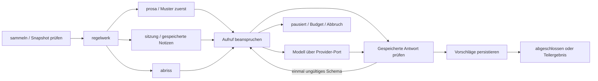

# KI-Chronist vollständig anschließen · 2026-09-08

Status: nach unabhängiger Gegenprüfung und Vertragskorrektur von Root zur Umsetzung freigegeben.
Basis: Kartenlieferung `ca3898b` (025/native v14 und 026/native v15) im Feature-Worktree.
Vorgänger: [Chronist-Agent](../../docs/superpowers/specs/2026-09-07-chronist-agent-design.md).
Auftrag: [vollständige Feature-Abnahme](../../docs/FEATURE_COMPLETION_20260908.md).
Dieser Entwurf präzisiert die vorhandene Entscheidung; alle Aufgaben bleiben im Umfang.

**Reservierung nach aktualisiertem Owner-Routing: Migration 027 und native v16 gehören dem Chronisten.**
026/v15 enthalten die vom Nutzer priorisierte Kartenlöschung; 025/v14 die Kartografie.
Chronist-Produktionsdateien entstehen jetzt auf den ausdrücklich zugewiesenen Flächen.
Die Kartenlieferung bleibt in einem festen Integrationscheckout davon unabhängig.

## 1. Ergebnis und belegter Ausgangspunkt

Die Spielleitung kann Wiki-Prosa durchsehen, ausdrücklich gespeicherte Sitzungsnotizen auswerten
und einen erzählerischen Abriss erstellen. Jeder Lauf beginnt mit dem Regelwerk. Modellbeiträge
werden geprüft, mit Quellen gezeigt und als bearbeitbare Vorschläge gespeichert. Ein Mensch kann
sie verwerfen oder als eigenen Antrag ins Wiki einreichen. Erst eine gesonderte vorhandene
Ratifikation beziehungsweise Berichtigung kann daraus Kanon machen.

Lokal ist die Voreinstellung. Externe HTTP-Anbieter und unterstützte CLI-Anbieter gehören zur
vollständigen Lieferung, verlangen aber je Lauf eine Freigabe des sichtbaren Umfangs. Unterbrechung,
Verbrauch, Budget, Wiederaufnahme und Kampagnensicherung gehören zu demselben Produktweg.

| Befund im aktuellen Code | Konsequenz |
|---|---|
| `packages/chronist/src/regelwerk.ts` enthält genau drei Befundarten; `domain/chronist.ts` führt nur dieses Regelwerk über die autorisierte Zeitleiste aus. | Bestehendes GET und Befundformat erhalten; Graph, Anbieter und persistente Durchsicht ergänzen. |
| `documents.saveEntry` setzt geänderte/neue Passagen auf `notiz`; `mintRatifikation` verlangt `antrag`. Es gibt keine ausführbare Einreichungsoperation. | `submitProposal` gehört in die vorhandene Dokumentdomain und ihren atomaren Revisionsschreiber. |
| `saveEntry` kann Inhalt unter derselben PID und Generation verändern. `passages.revision_id` ist die Erstellungsrevision. | Quellen an die beim Sammeln aktuelle `entries.current_revision_id` und den Blockhash im unveränderlichen Snapshot binden. |
| `communication.purge` löscht Tischchat physisch; Native exportiert nur Nachrichten vom Typ `letter`. | Kein Tischchat in Quellen, Checkpoints, Prompts, Exporten oder versteckten Mitschriften. |
| `commands` ist ein ausgeschlossener Laufzeitcache. | Einreichungs-ACK und Idempotenzbeleg zusätzlich dauerhaft beim Vorschlag speichern. |
| `gate-boundaries.mjs` enthält keine Chronist-/Netzregel. | Vorhandenes Gate allein belegt weder Reinheit noch lokale Ausführung; gezielte Gegenprüfungen ergänzen. |

Codeanker: `server/src/domain/documents.ts:29,37,88,108,127,141,151`,
`server/src/domain/gameplay.ts:267,279,292,296,333`,
`server/src/domain/communication.ts:55`, `io/src/campaign-schema.ts:79`, jeweils unter `packages/`.

## 2. Wissensquelle, Sitzung und Quellenprüfung

### 2.1 Eine Passage ist die Quellenatom-Einheit

`SourceRef = { entryId, passageId, revisionId, contentHash }`. `revisionId` bezeichnet die aktuelle
Entry-Revision zum Sammelzeitpunkt, nicht die erste Revision der Passage. Der Snapshot muss die PID
enthalten und sein `Blockinhalt` muss den angegebenen kanonischen SHA256-Hash besitzen. Die
Kampagnenzugehörigkeit folgt aus den echten Entry-/Revision-/Passagenrelationen, nie aus Clienttext.

Der Server erzeugt zusätzlich eine laufinterne, deterministische `sourceId`, Titel und Klartext nach
`plainBlock`. `textVersion = "plain-block-1"` friert diese Abbildung für Zitate ein. Zeichenpositionen
sind halb offene UTF-16-Indizes `[from,to)` wie `String.slice`; Grenzen dürfen kein Surrogatpaar
zerlegen. Es wird nach der Berechnung weder normalisiert noch zusammengezogen. Quellenreferenzen,
vollständiger Block, Klartext und Titel bilden den unveränderlichen `SourceSnapshot` des Laufs.

Sammlung erfolgt unter der bestehenden Mitgliedschafts-/Wissensgrenze, in einem konsistenten
Datenbank-Snapshot. `documents.source` ist ungefiltert und kein öffentlicher Sammler. Verwendet
werden `getEntry`/`knowledge`/`held`, die bestehende Passageprojektion und danach die explizite Auswahl.
Beim Start werden Vorschau und Quellen nochmals gegen den aktuellen Stand geprüft.

Jede Eingabe eines Modellknotens steht vorher im Umfang: Quellentexte, Titel, deterministisch
abgeleitete Datumsfakten und gegebenenfalls vom Menschen gewählte Bezugspassagen. Keine versteckte
Suche, keine weiteren Artikel durch Modellwerkzeuge und keine nachträgliche Kontextanreicherung.
Nicht ausgewählte Bezugsereignisse erfordern eine neue Auswahl und Vorschau.

Die Auswahl wird vor Scopehash, Vorschau und Einheitenteilung eindeutig nach
`(entryId, passageId, revisionId, contentHash)` in UTF-16-Codeunit-Reihenfolge sortiert.
Exakte Duplikate werden vor dem Hash entfernt; mehrere Pins derselben Passage sind ein Fehler.
`sourceId = chronistHash("source-snapshot",{ref,title,block,textVersion,text})` enthält weder sich
selbst noch Run-ID/Scopehash. Dieselbe unveränderte Quelle behält damit zwischen Preview und Start
ihre laufinterne Referenz, ohne eine noch nicht vergebene Lauf-ID zu benötigen.
`facts` enthält ausschließlich deterministisch aus diesen Snapshots abgeleitete Fakten. Jede Tatsache
besitzt im Einheitenkatalog einen `factId` und die vollständigen Quell-IDs; ein außerhalb der Auswahl
ermittelter GM-Zeitleistenstand ist weder Faktinput noch versteckter Vergleichskontext eines Modellcalls.

### 2.2 Sichtbarkeit und veraltete Quellen

Der Server bestimmt `dependencies` einer Einheit als die vollständige Menge ihrer Eingaben.
Jeder daraus entstandene Vorschlag erbt diese Menge; Modellzitate dürfen sie weder ersetzen noch
verkleinern. Eine Zusammenfassung aus geheimem B darf nicht durch ein Zitat auf sichtbares A sichtbar
werden. Auch abgeleitete Fakten und Zwischenzusammenfassungen vererben ihre Quellen transitiv.

Bei jedem Vorschlagsabruf prüft der Server aktuelle Mitgliedschaft, aktuelle Leseperspektive und
Sichtbarkeit **aller** Abhängigkeiten. Fehlende Sichtbarkeit entfernt den ganzen Vorschlag samt
Titeln, Zitaten, Begründung und ableitbaren Zählern. Beobachter ohne gehaltene Quellen erhalten
keine Vorschläge. Vollständige Laufverwaltung und Gesamtzahlen bleiben der Spielleitung vorbehalten.

Eine Quelle ist veraltet, sobald Entry-Kopf, Passageinhalt oder Quellentitel vom festgehaltenen
Stand abweichen oder die Passage zurückgezogen wurde. Selbst eine andere Bearbeitung desselben
Eintrags macht den konservativen Revisionspin veraltet. GM darf den alten Vorschlag samt markierter
Historie weiter prüfen; Spieler bekommen veraltete Vorschläge nicht ausgeliefert. Einreichen und
neue Modellaufrufe mit veralteten Quellen enden mit `source-stale`; kein stilles Rebase. Bereits
erhaltene Antworten dürfen noch verbucht werden, werden aber nicht als aktuelle Vorschläge gezeigt.

Für die Laufkontrolle wird die GM-Berechtigung vor jedem Aufruf und jeder Ergebnispersistenz neu
geprüft. Rechteentzug beendet weitere Effekte. Ein bereits abgesandter Aufruf lässt sich nicht
rückwirkend zurückholen; sein Verbrauch wird trotzdem erfasst und seine Antwort bleibt gesperrt.

### 2.3 Sitzungsnotizen ohne zweiten Dokumentbestand

Notizen sind gewöhnliche Wiki-Einträge/Passagen mit `geltung = notiz`, gespeichert über die vorhandene
Dokument-API und denselben Editor. Ein optionaler Tag `chronist-session:<sessionId>` hilft beim
Wiederfinden, ist keine Berechtigung und keine Beweisquelle. Der Sitzungsmodus verlangt eine echte
`game_sessions.id` derselben Kampagne und explizit gewählte gespeicherte Notizpassagen. Weitere
Wiki-Bezugspassagen können in der Vorschau sichtbar hinzugenommen werden.

Die Notizoberfläche bietet vor dem Speichern eine ausdrückliche Übernahme von Szenenangaben und
bestätigten Würfen an. Dafür liefert ein GM-autorisierter, begrenzter Kontextabruf Szenen-/Sitzungsdaten
und lesbare Wurfergebnisse. Wurfbelege werden über die vorhandene Replay-Prüfung validiert; ungültige
oder ausstehende Würfe sind keine bestätigten Ereignisse. Keine rohen `receipt.context`-Strukturen,
Regelschlüssel, versteckten Passagen oder Tischchattexte ausgeben. Die vorhandene Liste der letzten
100 Würfe genügt nicht als vollständiger Sitzungsabruf: explizit nach Sitzung filtern, stabil paginieren
und abgeschnittenen Umfang anzeigen. Erst das menschliche Speichern macht daraus Chronist-Quellen.

Damit teilen Prosa, Sitzung und Abriss denselben Quellen-/Restore-/Sichtvertrag. `scenes`,
`game_sessions`, `action_rolls`, `confirmed_mints` und `week_baselines` werden wiederverwendet;
keine neue Zeitleiste, Sitzungsnotiztabelle oder automatische Chatarchivierung entsteht.

### 2.4 Prüfung bedeutet Belegbarkeit, nicht eine Wahrheitsgarantie

Das bestehende Regelwerk läuft unverändert zuerst. Die bewusst ausgeschlossene Behauptung
„ein Jahrhundert ohne Ereignis ist eine Lücke“ bleibt ausgeschlossen. `luecke` bezeichnet im neuen
Stapel ausschließlich einen deterministisch belegten unlesbaren Datumswert, mit bestehender Befundart.

Prosa erhält zunächst klare Datumsmuster. Das Modell bearbeitet nur verbleibende Einheiten und
relative Bezüge. Eine relative Datierung benennt eine ausgewählte Bezugspassage und einen ganzzahligen
Jahresabstand; der Prüfer berechnet das Ergebnis selbst aus einem sicher erkannten Bezugsjahr.
Unaufgelöste oder widersprüchliche Bezüge werden gezählt und verworfen. Unterstützte Jahre liegen
für diese neue Extraktion bei -999999 bis 999999; dies behauptet keinen neuen Weltkalender und
ändert nicht heimlich die bestehende Zeitleisteninterpretation.

Modelloutput ist eine geschlossene, versionierte Struktur mit begrenztem Text, Kandidatenart und
Zitaten. Keine Tools, URLs zum Abrufen, HTML oder ausführbaren Argumente. Jeder Kandidat muss einen
echten Ausschnitt seiner Einheit zitieren; Fakten/Zitate außerhalb ihrer Quellen werden verworfen.
Der Modelloutput wird serverseitig in vorhandene Text-/Feld-/Listenblöcke überführt. Links erhalten
nur validierte, aktuell sichtbare Entry-Ziele. Das Modell bestimmt weder IDs noch Berechtigungen,
Status, Urheberschaft, Prüfentscheidung oder Prägungsdaten.

## 3. Verbindliche schmale TypeScript-Grenze

Die folgenden Signaturen sind der gemeinsame Implementierungsvertrag. `packages/chronist` enthält
Graph, deterministische Funktionen, Parser und Anbieterprotokolle. Es importiert weder Server noch
DB/Fastify, liest keine Umgebungsvariablen und öffnet weder Netzwerk noch Unterprozesse. Konkrete
I/O-Adapter und der Checkpoint-Speicher gehören dem Server. Tests injizieren aufgezeichnete Antworten.
Die Typnamen externer LangGraph-Exporte werden beim Einbau gegen den gepinnten TS-Stand kompiliert;
es wird keine eigene Ersatz-Checkpointer-API als Runner eingeführt.

```ts
import type { Blockinhalt } from "@chronicle/chronik";
import type { CanonicalValue } from "@chronicle/core";
import type { BaseCheckpointSaver } from "@langchain/langgraph-checkpoint";
import type { Befund, Zeitereignis } from "./regelwerk.ts";

export type ChronistMode = "prosa" | "sitzung" | "abriss";
export type ChronistKind = "ereignis" | "widerspruch" | "luecke" | "abriss";
export type Sha256 = string; // Laufzeitparser: exakt 64 kleine Hexzeichen
export interface ChronistSourceRef {
  readonly entryId: string; readonly passageId: string;
  readonly revisionId: string; readonly contentHash: Sha256;
}
export interface ChronistSourceSnapshot {
  readonly sourceId: string; readonly ref: ChronistSourceRef;
  readonly title: string; readonly block: Blockinhalt;
  readonly textVersion: "plain-block-1"; readonly text: string;
}
export interface ChronistBudget {
  readonly maxCalls: number; readonly maxInputChars: number;
  readonly maxOutputChars: number; readonly callTimeoutMs: number;
  readonly maxActiveMs: number; readonly concurrency: number;
  readonly maxInputCharsPerCall: number; readonly maxOutputCharsPerCall: number;
}
export interface ChronistSnapshot {
  readonly schemaVersion: 1; readonly graphVersion: "chronist-1";
  readonly runId: string; readonly mode: ChronistMode;
  readonly sessionId: string | null; readonly scopeHash: Sha256;
  readonly sources: readonly ChronistSourceSnapshot[];
  readonly facts: readonly Zeitereignis[];
  readonly budget: ChronistBudget;
}
export interface ChronistCitation {
  readonly sourceId: string; readonly from: number; readonly to: number;
}
export type ChronistDate =
  | { readonly kind: "absolute"; readonly year: number;
      readonly source: ChronistCitation }
  | { readonly kind: "relative"; readonly anchorSourceId: string;
      readonly offsetYears: number; readonly source: ChronistCitation };
export interface ChronistModelDraft {
  readonly kind: "ereignis" | "abriss"; readonly text: string;
  readonly citations: readonly ChronistCitation[];
  readonly date: ChronistDate | null;
}
export interface ChronistUnitPlan {
  readonly unitId: string; readonly mode: ChronistMode;
  readonly sourceIds: readonly string[]; // vollständige Abhängigkeiten
  readonly sourceSpans: readonly ChronistCitation[];
  readonly factIds: readonly string[]; readonly parentUnitIds: readonly string[];
  readonly promptVersion: "chronist-prompt-1";
  readonly maxOutputChars: number;
}
export interface ChronistDispatch {
  readonly schemaVersion: 1; readonly profileId: string; readonly model: string;
  // Vollständiger nichtgeheimer HTTP-Body bzw. CLI-Modellinput samt Systemprompt
  // und Ausgabeschema; der bekannte Profilparser validiert seine geschlossene Form.
  readonly wireText: string; readonly inputChars: number;
  readonly maxOutputChars: number; readonly requestHash: Sha256;
}
export interface ChronistModelUnit extends ChronistUnitPlan {
  readonly attempt: 1 | 2;
  readonly parentResults: readonly { readonly unitId: string;
    readonly candidateHashes: readonly Sha256[] }[];
  readonly dispatch: ChronistDispatch;
}
export interface ChronistCandidate {
  readonly candidateKey: string; readonly kind: ChronistKind;
  readonly blocks: readonly Blockinhalt[];
  readonly citations: readonly ChronistCitation[];
  readonly dependencies: readonly string[];
  readonly origin: "regelwerk" | "modell";
  readonly ruleFinding: Befund | null;
  readonly date: ChronistDate | null;
}
export type ChronistStopReason = "cancelled" | "budget" | "source-stale"
  | "authorization" | "provider-unavailable" | "outcome-unknown" | "call-in-flight"
  | "scope-changed";
export interface ChronistUsageEvidence {
  readonly inputChars: number; // vollständiger gebundener Dispatch
  readonly outputChars: number; // tatsächlich innerhalb des Limits verarbeiteter Text
  readonly outputComplete: boolean; // false: Restreservierung bleibt gebunden
  readonly inputTokens: number | null; readonly outputTokens: number | null;
  readonly tokensComplete: boolean;
  readonly durationMs: number; // bekannte monotone Adapterdauer, kein Rohzeitstempel
  readonly costMicros: number | null; readonly currency: string | null;
  readonly costKind: "reported" | "estimated" | "unknown";
  readonly costComplete: boolean;
}
export interface ChronistProviderReply {
  readonly text: string; // begrenzter Antworttext, keine Header/rohen Fehler
}
export interface ChronistCallPermit {
  readonly callId: string; readonly fence: number;
  readonly requestHash: Sha256; // kurzlebige Capability, nie Modellinhalt
}
export type ChronistCallOutcome =
  | { readonly kind: "returned"; readonly reply: ChronistProviderReply;
      readonly usage: ChronistUsageEvidence }
  | { readonly kind: "failed"; readonly code: "unavailable" | "timeout"
      | "cancelled" | "output-limit"; readonly mayHaveExecuted: boolean;
      readonly usage: ChronistUsageEvidence };
export type ChronistCallClaim =
  | { readonly kind: "invoke"; readonly permit: ChronistCallPermit }
  | { readonly kind: "recorded"; readonly outcome: ChronistCallOutcome }
  | { readonly kind: "stop"; readonly reason: ChronistStopReason };
export interface ChronistProviderPort {
  // Synchron und rein: das Portobjekt ist an ein geprüftes Providerprofil gebunden.
  prepare(plan: ChronistUnitPlan, snapshot: ChronistSnapshot, attempt: 1 | 2,
    parents: readonly { readonly unitId: string;
      readonly candidates: readonly ChronistCandidate[] }[]): ChronistModelUnit;
  invoke(unit: ChronistModelUnit, permit: ChronistCallPermit,
    signal: AbortSignal): Promise<ChronistCallOutcome>;
}
export interface ChronistEffectsPort {
  check(): Promise<ChronistStopReason | null>;
  readSnapshot(): Promise<ChronistSnapshot>;
  readCandidates(unitId: string): Promise<readonly ChronistCandidate[]>;
  persistUnit(unit: ChronistModelUnit): Promise<void>;
  claimCall(unit: ChronistModelUnit, attempt: 1 | 2): Promise<ChronistCallClaim>;
  recordCall(permit: ChronistCallPermit, outcome: ChronistCallOutcome): Promise<void>;
  persistCandidates(unitId: string, candidates: readonly ChronistCandidate[]): Promise<void>;
  recordRejection(unitId: string, attempt: 0 | 1 | 2,
    reason: "schema" | "citation" | "rule-conflict", count: number): Promise<void>;
  finish(result: "completed" | "partial" | "paused",
    reason: ChronistStopReason | null): Promise<void>;
}
export interface ChronistGraphPorts {
  readonly provider: ChronistProviderPort;
  readonly effects: ChronistEffectsPort;
  readonly checkpointer: BaseCheckpointSaver;
}
export interface ChronistGraph {
  start(snapshot: ChronistSnapshot, signal: AbortSignal): Promise<void>;
  resume(runId: string, signal: AbortSignal): Promise<void>;
}
export function createChronistGraph(ports: ChronistGraphPorts): ChronistGraph;
export function parseChronistSnapshot(value: unknown): ChronistSnapshot;
export function parseChronistModelReply(value: unknown):
  { readonly schemaVersion: 1; readonly candidates: readonly ChronistModelDraft[] };
export function parseChronistCandidate(value: unknown): ChronistCandidate;
export function verifyChronistCandidate(candidate: ChronistCandidate,
  unit: ChronistModelUnit, snapshot: ChronistSnapshot):
  { readonly ok: true; readonly candidate: ChronistCandidate }
  | { readonly ok: false; readonly reason: "schema" | "citation" | "rule-conflict" };
export function chronistHash(kind: string, value: CanonicalValue): Sha256;
```

Ports sind pro Lauf an authentifizierten Initiator, Kampagne und Ausführungsbesitz gebunden. Der Graph
kann keine andere Kampagne oder Anbieteradresse durch Parameter auswählen. `check`, `claimCall`,
`persistCandidates` und der Checkpointer prüfen dieselbe Ausführungs-Fence. Die Provider-Capability
bleibt außerhalb serialisierten Graphzustands; der Adapter prüft sie unmittelbar vor dem tatsächlichen
Effekt. `recordCall` darf auch nach Rechteentzug den begonnenen Verbrauch idempotent abschließen,
aber keine neue Modellarbeit oder sichtbaren Vorschläge autorisieren.

Der Graph ruft nach Prüfung seiner Plan-/Elterninputs zuerst `provider.prepare(...)` auf, dann
`persistUnit`, dann `claimCall`, schließlich `invoke`. `prepare` ist ein synchroner reiner Renderer
des beim Portaufbau vertrauenswürdig gebundenen Providerprofils/Modells; es liest keine Dateien,
Registry, Umgebungsvariable oder Datenbank und führt keinen Netzwerk-/CLI-Effekt aus. Die sichere
Registry wird bereits vom Server beim Bau des Ports in ein unveränderliches Profil aufgelöst.
Der Graph muss deshalb weder HTTP-Formate erraten noch selbst einen Anbieter wählen. Der Server
validiert vor Persistenz und unmittelbar vor Dispatch mit demselben gepinnten Profil die identische
vollständige Wireabbildung, den Hash, alle Quellen-/Elterninputs und die Budgetwerte. `prepare` darf
keine neuen Quellen, Kontextfelder oder Modellturns hinzufügen. Profil-/Versionsabweichung bedeutet
`scope-changed`, keine still geänderte Wiederaufnahme. Alle benötigten nichtgeheimen Profilwerte
und Prompt-/Schemaversionen stehen im dauerhaften Run-/Dispatchbeleg und sind in dessen Hash gebunden.
`prepare(...,parents)` erhält die tatsächlich geprüften Kandidatenbytes, nicht nur unauflösbare IDs.
`readCandidates` lädt beim Resume die **geprüften Originalkandidaten**, niemals menschliche Entwürfe,
über den an diesen Lauf gebundenen Serverport. Der Graph gleicht Unit/Dependency gegen den Plan ab;
der reine Renderer berechnet die Kandidatenhashes aus den übergebenen Bytes selbst und schreibt
sie als `unit.parentResults` in die unveränderliche Metadatenstruktur. Der Server prüft diese Hashes
gegen dieselben gespeicherten Originale. Inhalt wird nicht über einen versteckten Cache oder eine
DB-Lesung im Renderer beschafft und nicht noch einmal im Einheitenkatalog dupliziert. Der Repairversuch
ergänzt ausschließlich die feste versionierte Schema-Korrekturanweisung; ein früherer ungültiger
Rohoutput wird nicht als zusätzlicher, bisher ungebundener Promptkontext zurückgesendet.

`persistCandidates` ist die autorisierte Speicherung des Zwischenstands, **kein Wiki-Schreiber**.
Sie validiert Form, Quellen und Fence erneut; `(runId,unitId,candidateKey)` verhindert doppelte
Vorschläge. `recordRejection` und `finish` sind ebenfalls wiederholbar. Ablehnungszahlen gehören zum
stabilen Schlüssel `(runId,unitId,attempt,reason)`; Versuch 0 ist die deterministische Prüfung.
Wiederholung schreibt denselben absoluten Wert, sie inkrementiert nicht erneut nach Checkpoint-Replay.

`persistUnit` validiert den deterministischen Plan und die aufgelösten Elternresultate, speichert
die Einheit unveränderlich außerhalb des prunebaren Checkpoints und ist für identische Bytes
idempotent. Der zweite Versuch benutzt dieselbe `unitId`, aber einen eigenen persistierten Dispatch
mit Repairtext und Requesthash; seine Dispatchidentität ist `(runId,unitId,attempt)`. Derselbe Schlüssel
mit anderen Bytes ist ein Konflikt. `claimCall` akzeptiert nur diesen gespeicherten Dispatch.

### 3.1 Begrenzte Hashdomäne statt fremder RulePackage-Grenzen

Nachprüfung des tatsächlichen Codes: `packages/core/src/canonical.ts:96–104` hat keine
1-MiB-/50k-Knoten-Grenze. Diese Grenzen gehören zu `packages/rules/src/validation.ts:9`.
`packages/io/src/campaign-v3-json.ts:10–17` unterscheidet beide Domänen bereits ausdrücklich.
Ein rein lokaler Aufruf des echten Core-Hashers mit 1.168.623 UTF-8-Bytes und einem Array aus
60.001 Elementen besteht; SHA256 `026f63ff72aac5087e08f29779969cc9fcb1484fecc2124ad0c38df35a678147`.
Kein RulePackage-Parser und kein vergrößerter globaler Core-Standard wird für Chronist benötigt.

`chronistHash(kind,value)` prüft zuerst einen geschlossenen Chronistwert und berechnet dann
`canonicalHash({hashVersion:"chronist-hash-1",kind,value})` aus `@chronicle/core`. `kind` kommt aus
dem festen Katalog `source-snapshot|scope|unit-plan|dispatch|candidate|draft|start-request|submit-request|ack|checkpoint|run-evidence`.
Keine unversionierte zweite JSON-Sortierung; Hashbytes folgen dem bestehenden Core-Encoder.
`SourceRef.contentHash` bleibt ausdrücklich **der vorhandene** `canonicalHash(block)` ohne neuen
Envelope, damit der Vergleich mit Wiki-Blöcken unverändert bleibt. Snapshot-/Scopehash binden
zusätzlich Titel, Klartextversion und vollständige Auswahl. Hashfelder stehen außerhalb des jeweils
gehashten Werts; es gibt keine selbstreferenzielle Hashdefinition.

Die neue reine Admission prüft ohne Getterausführung: nur Plain Objects/Arrays, keine Zyklen,
Accessor-/Symbol-/versteckten Felder, Sparse Arrays, gefährlichen Schlüssel oder nichtendlichen
Zahlen. Sie zählt höchstens **500.000 Wertknoten**, höchstens **48 Ebenen** und höchstens
**20 MiB kanonische UTF-8-Bytes einschließlich Hash-Envelope** je Hashinput. Die Knotenzählung
bezieht jedes Objekt, Array und jeden skalaren Wert ein; Objektschlüssel werden im Bytebudget
mitgezählt. Längenprüfung und JSON-Escaping werden vor der großen Gesamtausgabe begrenzt
ausgeführt. Dies ist die Admission vor dem bestehenden Encoder, keine neue Hashimplementierung.

Das zusätzliche Bytepolster erlaubt 16 MiB persistierte Laufevidence plus bis zu 2 MiB menschliche
Entwürfe und Envelope; die engeren Speichergrenzen aus §4 bleiben bindend. Eine Million gewählte
UTF-16-Zeichen kann allein mehr als 1 MiB UTF-8 oder durch JSON-Escaping mehrere MiB beanspruchen
und wird deshalb nicht am RulePackage-Limit abgeschnitten. Alle Maxima gelten gleichzeitig:
Vorschau prüft tatsächliche Snapshot-/Planbytes und reserviert Antwort-/Checkpointbedarf; eine
zu große Kombination endet vor einem Modellcall mit sichtbarem Teilumfang oder `budget`.
Native-Modul-/Gesamtbundlehash und Export bleiben in der vorhandenen IO-Domäne mit deren
256-MiB-/5-Millionen-Knoten-Gesamtgrenze; sie werden nicht durch den 20-MiB-Runhasher geleitet.

## 4. Graph, Wiederaufnahme und Budgets

TS-`@langchain/langgraph` bleibt auf der vorgesehenen Linie `>=1.4,<2`, mit exaktem Lockfile.
Roots aktuelle Primärquellenprüfung bestätigt LangGraph 1.4.14 und Checkpoint 1.1.5 sowie
`StateGraph`/`Annotation`, `Command`/`interrupt`, `durability: "sync"`, Abort-Signal und
`RunControl.requestDrain`. Diese APIs bilden die Implementierung; keine selbst gebaute Retry-Pumpe.
Der im bestehenden Arbeitsgraph verwendete Python-Stand wurde für diesen Entwurf erneut als
LangGraph 1.2.11 geprüft. Produktgraph und bereits vorhandener Arbeitsgraph sind keine gegenseitigen
Ersatzrunner. Der Produktgraph läuft im vorhandenen Server-/Electron-Prozess, ohne Python-Sidecar.
LangSmith-Tracing und automatische Trace-Exporte bleiben ausdrücklich aus. Der Server-Bootstrap
schaltet `LANGSMITH_TRACING` und `LANGCHAIN_TRACING_V2` ausdrücklich aus; `callbacks: []` allein
deaktiviert umgebungsgetriebenes Tracing nicht.



Der Lauf wählt einen Modus; der Graph modelliert Einheitenteilung, begrenztes Fan-out, Wiederholung,
Verifikation und Halt als Knoten/Kanten. Keine Schleife um Modellaufrufe außerhalb LangGraph.
Die Regelbefunde werden vor dem ersten Modellaufruf dauerhaft geschrieben und bleiben auch bei
unerreichbarem Anbieter benutzbar. Geklärte absolute Prosa-Daten brauchen keinen Modellaufruf.

Einheiten werden nach der kanonischen Quellreihenfolge aus §2.1 und halb offenen Ausschnitten
geteilt. `unitId` hängt an Scope, Promptversion und der geschlossenen Planrezeptur. Der dauerhafte
Einheitenkatalog enthält die Pläne, Fakt-/Quellspans, Elterneinheiten und die Hashes tatsächlich
verwendeter geprüfter Elternkandidaten. Die Rezeptur ist ein azyklischer Graph mit maximal
128 Modelleinheiten (`modelUnits`).
Der gespeicherte Quellen-/Faktenbestand und dieser Katalog werden nicht mit Checkpoints gelöscht.
Abrisse über mehrere Einheiten verwenden ausschließlich die gebundenen Elternresultate; die
vollständige transitive Quellenmenge und zusätzliche Calls stehen bereits in der Vorschau.
Auch eine Schlusszusammenfassung ist eine vorgeplante, budgetierte Einheit.

Vor jedem Claim wird über `provider.prepare` aus dem versionierten Providerprofil und der unveränderlichen Rezeptur ein
vollständiger Dispatch materialisiert. `wireText` enthält beim HTTP-Profil die exakten nichtgeheimen
Requestbodybytes als UTF-8-kodierbaren Text, einschließlich System-/Entwicklerprompt, sämtlicher
Nachrichten, Modellparametern, leerer Werkzeugkonfiguration, Ausgabeschema und gegebenenfalls
Repairtext. Der Adapter sendet genau diesen Body und ergänzt nur freigegebene Transport-/Authheader.
Beim CLI-Profil enthält es eine geschlossene kanonische Bestandsaufnahme aller tatsächlich
modellwirksamen Eingabestrings aus stdin und festen Argument-/Konfigurationsfeldern. Implizite
CLI-Kontexte müssen deaktiviert oder vom gepinnten Profil vollständig erfasst und begrenzt sein.
Der `profileId` bestimmt den reinen Parser/Renderer; freie URLs, Shellargumente oder ausführbare
Providerobjekte sind kein Teil dieser Struktur. Die persistierte Schema-/Promptversion liefert
bei Replay exakt dieselben Bytes. Ein abweichender Dispatch verlangt einen neuen Requesthash.

`dispatch.inputChars` ist die UTF-16-Länge dieses vollständigen Wiretexts, nicht nur Quelltextlänge
oder eine Anbieter-Tokenangabe. Der Requesthash bindet Run/Unit/Attempt, Providerfingerprint, Profil,
Modell, Wiretext und Ausgabelimit. Dynamischer Repairtext und Zwischenabrisse bekommen in der
Vorschau ihre **maximale** Größe; vor Dispatch wird der tatsächliche vollständig materialisierte
Wert erneut geprüft. Bei Überschreitung kein Abschneiden des Prompts und kein Call. Implizite
SDK-/CLI-Retries, Kompaktionen und weitere Modellturns sind deaktiviert; andernfalls muss das
Profil jeden tatsächlichen Modellcall vorab an diese Claimgrenze führen können und ist bis zum
Nachweis nicht verfügbar.

`claimCall` speichert atomar unter Lauf-/Kampagnen- und globaler Dispatchplatzsperre einen
geschlossenen Callbeleg: `{schemaVersion:1,runId,unitId,attempt,callId,requestHash,fence,state,
claimedAt,dispatchAt,deadlineAt,reservation,usage,outcome,history}`. Nicht vorhandene Zeitpunkte/
Outcomes sind `null`; alle Zeitpunkte sind serverseitige, sichere ganzzahlige Millisekunden.
`reservation = {calls:1,inputChars:dispatch.inputChars,outputChars:dispatch.maxOutputChars,
storageBytes}` wird **vor beiden parallelen Calls** in dieselben Gesamtzähler eingerechnet.
`storageBytes` deckt worst-case JSON-/UTF-8-Escaping des Antworttexts, Ergebnis-/Prüfbeleg und die
begrenzt benötigten nächsten Checkpoint-Writes. Keine DB-Verbindung bleibt während des Calls offen.

| Dauerhafter Callzustand | Erlaubter Übergang/erneuter Claim |
|---|---|
| Kein Beleg | Nur nach Quellen-/Freigabe-/Fence-/Budget-/Platzprüfung nach `reserved`; genau ein Permit. |
| `reserved` | Adapter konsumiert Permit einmal per CAS nach `dispatched`, prüft dabei nochmals Autorisierung/Fence/Abbruch und setzt Deadline. Gleichzeitiger Claim liefert `call-in-flight`. |
| `dispatched` | Genau dieser Adapter darf senden. Wiederholter Claim liefert `call-in-flight`; niemals ein zweites Permit. |
| `returned` / `failed` | Identischer Claim gibt den gespeicherten Outcome zurück; kein Dispatch. `failed` setzt bewiesenen Nichtdispatch oder vollständigen Ausgang voraus; abweichender Requesthash ist Konflikt. |
| `unknown` | Claim stoppt mit `outcome-unknown`. Nur ausdrücklich autorisierter nächster Versuch mit eigener Reservierung darf weiterarbeiten. |

Der Adapter darf vor erfolgreichem Dispatch-CAS keine Bytes senden. Stirbt der Besitzer in
`reserved`, belegt die fehlende CAS, dass dieser Versuch nicht senden durfte; er endet als
`failed` mit `mayHaveExecuted=false`. Ab `dispatched` ist Prozessverlust auch vor einem möglichen
ersten Netzwerkbyte **unknown**. Reservierte Callzahl und Eingabe werden konservativ dauerhaft
gerechnet; es gibt höchstens zwei reservierte Versuche pro Einheit, selbst bei einem belegten
Ausfall vor Dispatch. So kann ein nicht erreichbarer Provider das Versuchsbudget nicht umgehen.
`claimCall(unit,attempt)` verlangt außerdem `attempt === unit.attempt`.

Alle Outcomes, auch Timeout/Abbruch/Ausgabelimit, liefern bekannte Usage aus §3. Die Domäne kennt
die gebundene Eingabemenge bereits aus dem Claim und nimmt keine kleineren Adapterangaben an.
Ausgabeverbrauch zählt die innerhalb der Grenze tatsächlich dekodierten/verarbeiteten UTF-16-Zeichen;
der Adapter stoppt inkrementell vor deren Überschreitung. Transportbytes und Streamframes besitzen
zusätzliche feste Obergrenzen. Das ist kein Versprechen, ein entfernter Anbieter produziere nach
einem Abbruch keine weiteren Tokens: dessen bekannte Tokens/Kosten werden getrennt mit
Vollständigkeitsflags geführt, unbekannte Werte bleiben `null`.

Für jede Ressource gilt `bekannt verbraucht + noch gebunden <= Budget`. Bekannter Verbrauch
wird nie kleiner. Solange `outputComplete=false`, bleibt `reservedOutput-knownOutput` gebunden;
ein neuer Versuch addiert seine eigene maximale Ausgabe. Nur belegter vollständiger Ausgang
oder bewiesener Nichtdispatch gibt ungenutzte Ausgabe-/Speicherreservierung frei. Ein später
authentifizierter Beleg desselben alten Calls darf bekannte Usage erhöhen und den Ausgang
abschließen; er ersetzt keine frühere Evidenz, sondern ergänzt `history`. Native/Restore lösen
`unknown` niemals aus eigener Vermutung auf. Widersprüchliche doppelte Outcomes sind Konflikte.
Timeout, unklarer Ausgang und Abbruch starten keinen automatischen Retry; einzig unbrauchbares
Antwortschema erlaubt einmal die vorgeplante Repairkante. Vollständig gespeicherte Antworten
werden auch im Crashfenster vor dem nächsten Checkpoint wiederverwendet.

| Grenze | Voreinstellung | Harte Grenze |
|---|---:|---:|
| Ausgewählte Passagen | 128 | 512 |
| Ausgewählter Klartext, UTF-16-Zeichen | 120000 | 1000000 |
| Reservierte Modellversuche einschließlich Retry/Schlussknoten | 32 | 128 |
| Eingabezeichen kumuliert, einschließlich vollständigem Prompt | 400000 | 4000000 |
| Ausgabezeichen kumuliert | 64000 | 512000 |
| Eingabezeichen je Modellaufruf | 12000 | 24000 |
| Ausgabezeichen je Modellaufruf | 12000 | 64000 |
| Gleichzeitige Aufrufe eines Laufs | 2 | 4 |
| Zeit je Aufruf | 60000 ms | 120000 ms |
| Aktive Laufzeit, Pausen ausgenommen | 300000 ms | 1800000 ms |
| Vorschläge je Lauf | 256 | 256 |
| Laufevidence inklusive Originalvorschlägen, Katalog, Callbelegen und Checkpoints | 16 MiB | 16 MiB |
| Menschliche Vorschlagsentwürfe kumuliert je Lauf | 2 MiB | 2 MiB |

Speichergrenzen messen kanonische UTF-8-Bytes, nicht JavaScript-Zeichen oder DB-Zeilenschätzungen.
Sie gelten aggregiert über beide Tabellen je Lauf; Datenbankindizes sind kein JSONinhalt.
Graphzustand hält Run-/Snapshot-/Einheitenreferenzen und begrenzte Arbeitswerte, keine zweite
Vollkopie aller Quellen je Checkpoint. `readSnapshot` liefert den autorisierten gebundenen Snapshot
für Start/Resume; ein pro Ausführung begrenzter Cache darf nur diesen unveränderlichen Wert halten.
Die 256-Vorschläge-Grenze wird bei Kandidatenpersistenz gemeinsam mit deren maximalen Bytes geprüft.

Grenzen sind benannte versionierte Konstanten, keine verstreuten Zahlen. Der Benutzer kann seine
Grenzen innerhalb des harten Rahmens verkleinern. Vorher bekannte Überschreitungen werden vor
Effekten angezeigt. Ein erfülltes Budget beendet den Lauf geordnet mit dem vorhandenen Stapel;
Restumfang kann als neuer, erneut sichtbarer Lauf ausgewählt werden. Laufzeitgrenzen ersetzen keine
HTTP-/Ausgabe-/Prozessgrenzen des Adapters. Der Server begrenzt zusätzlich aktive Anbieteraufrufe
über Kampagnen hinweg; keine DB-Verbindung/Transaktion bleibt während Netzwerk oder CLI offen.

Abbruch setzt dauerhaft eine Abbruchanforderung und signalisiert laufenden Adaptern `AbortSignal`.
Keine neuen Calls danach. Der Server wartet begrenzt auf laufende Belege und markiert Ungewissheit
gegebenenfalls ausdrücklich. Ein solcher Lauf ist wiederaufnehmbar; Aufrufzählung und Budget werden
dabei nicht zurückgesetzt. Beim Host-Schließen laufen dieselben Stop-/Checkpoint-Effekte vor DB-Close.

Aktive Laufzeit wird als persistierte Folge nichtüberlappender Ausführungsintervalle geführt:
`{executionId,fence,startedAt,accountedThrough,reservedUntil,closedAt,closeKind}`. Kampagnenlock
und DB-Zeit bestimmen die monotonen Endpunkte. Ein Heartbeat verbucht die seit `accountedThrough`
bekannte aktive Zeit und reserviert das nächste begrenzte Fenster, bevor weitere Arbeit zugelassen
wird. Vor Callstart muss auch sein gesamtes verbleibendes Deadlinefenster in der aktiven Zeit
reservierbar sein; parallele Calls belegen die Vereinigung der Zeitfenster, nicht doppelte Wandzeit.
Nach Crash wird das alte offene Intervall konservativ bis `reservedUntil` geschlossen, bevor ein
neuer Besitzer sein eigenes Intervall beginnen darf. Diese Abrechnung wird nie zurückgesetzt;
Pausen außerhalb der Intervalle zählen nicht. Ein Runtime-Timeout/Prozessende bleibt zusätzlich
am Adapter wirksam, auch wenn die DB-/Hostverbindung verloren geht.

Abgelaufene Ausführungsleasen allein geben Dispatchplätze nicht frei. Calls in `dispatched` oder
`unknown` belegen sie bis zum bestätigten Transport-/Prozessende oder bis zur konservativen
Dispatchdeadline. Späte Tokens/Kosten können weiterhin unbekannt sein; der Platz bezeichnet den
begrenzt beaufsichtigten Adapter, keine Behauptung über entfernte Rechenzeit. Die globale Grenze
wird über kurze gemeinsame DB-Sperre und die aktiven Callbelege aller Kampagnen hergeleitet,
kein nur pro Node-Prozess gezähltes Semaphore. Ein verlorener alter Fence kann keinen neuen
Dispatch-CAS oder Checkpoint mehr gewinnen.

## 5. Anbieter, Freigabe und Geheimnisse

Die Serverkonfiguration bietet eine Registry fester Anbieterreferenzen. Der Browser bekommt nur
`{id,label,location,transport,available,availabilityCode,models,pricing}` ohne Secrets. HTTP-Requests wählen eine
Registry-ID und ein erlaubtes Modell; keine frei eingereichten URLs, Shellbefehle oder Umgebungen.

| Anbieter | Vorgabe |
|---|---|
| Ollama | Lokaler Standard, konfigurierter Loopback-Endpunkt; fehlt er, Regelbefunde und verständlicher Verfügbarkeitszustand. |
| HausKI / eigener HTTP-Endpunkt | Explizit vom Betreiber eingerichtete Adresse und Protokolladapter; Standortklassifikation kommt aus der vertrauenswürdigen Konfiguration. |
| Externe HTTP-Anbieter | Konfigurierte HTTPS-Adapter für OpenAI, Anthropic und Google; Auswahl, Tarife und Freigabe vor jedem Lauf. |
| CLI: codex, claude, gemini | Geplante Registryadapter mit einzeln nachgewiesener Runtime-Capability. Ohne geprüfte Text-/Tool-/Kontext-/Abbruch-/Abrechnungsgrenze des exakten Binarys `available=false`; keine pauschale Freigabe aufgrund des Namens. |

Eine CLI wird erst verfügbar, wenn der Host die Capability ausdrücklich aktiviert **und** ein
versionierter Adaptertest für das gepinnte ausführbare Binary besteht. Der Capabilitydatensatz
enthält Binaryhash/-version, Profilversion, festen Argumentvektor ohne Shell, kontrollierten cwd,
erlaubte Umgebung, Authgrenze, vollständige Modellinputabbildung, deaktivierte Werkzeuge/MCP/Hooks/
Discovery sowie begrenzte Prozesse/Antworten und einzeln kontrollierbare Modellcalls. Der Test
verwendet Transport-Doubles und Marker außerhalb des Arbeitsverzeichnisses; keine Modellantwort
beweist für sich, dass keine Dateien gelesen oder Hooks ausgeführt wurden. Ungeprüfte Profile
haben `availabilityCode="capability-unverified"`; fehlendes Binary, Hostverbot und fehlende Auth
sind eigene Codes. Keine Schlüssel-/Accountprüfung durch allgemeines Provider-GET.

Der belegte Dokumentationsstand aus der [Gegenprüfung](chronist-contract-review-20260908.md) lautet:

| CLI | Grundlage für den Adapter | Noch erforderlicher Nachweis vor `available=true` |
|---|---|---|
| Claude Code | Dokumentiertes `--tools ""`, leere strikte MCP-Konfiguration, deaktivierte Anpassungen und `--no-session-persistence`; `--bare` reduziert automatische Kontexte. | Zusammenwirken aller Flags, wirklich leere Windows-Argumente, vollständiger Systemprompt/Schema, Authmodus von `--bare`, Null Zusatzcalls und beaufsichtigtes Prozessende. |
| Gemini CLI | Leere `tools.core`-Allowlist; `hooksConfig.enabled=false`, `admin.mcp.enabled=false`, `admin.extensions.enabled=false`, `admin.skills.enabled=false`. | Exakter Release und weitere Registry-/Discoverypfade, kontrollierte Konfigurationsquellen, vollständiger Modellinput, Null Zusatzcalls und Prozessende. Headless oder Plan allein genügt nicht; Plan kann Plandateien schreiben. |
| Codex CLI | Lokales 0.153.4-Help belegt `--ephemeral` und `--ignore-user-config`; offizielle Konfiguration benennt einzelne Werkzeugflags. | Ein vollständiger textbeschränkter Modus ist damit nicht belegt. `read-only` und `features.shell_tool=false` sind keine allgemeine Tool-/Lesesperre. Adapter bleibt unverfügbar, bis das gesamte Profil nachgewiesen ist. |

Primärquellen: [Claude CLI](https://code.claude.com/docs/en/cli-reference),
[Gemini Konfiguration](https://geminicli.com/docs/reference/configuration/),
[Gemini Plan](https://geminicli.com/docs/cli/plan-mode/),
[Codex CLI](https://learn.chatgpt.com/docs/developer-commands?surface=cli),
[Codex Konfiguration](https://learn.chatgpt.com/docs/config-file/config-reference).
Diese Unterschiede reduzieren den beauftragten Umfang nicht; CLI-Abnahme bleibt ein offenes
Arbeitspaket, bis die verlangten unterstützten Profile nachgewiesen und bedienbar sind. HTTP bleibt
benutzbar. Im gehosteten Betrieb ist die CLI-Registry leer. Runtime-Capabilities kommen allein aus
dem Host, niemals aus HTTP, Modelloutput oder Kampagnenimport.

`lokal` bedeutet eine freigegebene private Ausführungsgrenze: Loopback oder ausdrücklich konfigurierte
private HausKI-Adresse. Kein automatisches Folgen von Redirects zu anderen Zielen, kein stiller
externer Fallback, keine vom Modell ausgewählten Ziele. Externe Authentifizierungs-/Cloud-CLIs sind
auch auf dem eigenen Rechner `fremd`. Providertransport wird nur über den autorisierten Effektadapter
erreicht und ist mit Transport-Doubles unabhängig vom Modell testbar.

Preview erzeugt `scopeHash` nach §3.1 über Modus, Sitzung, kanonisch sortierte vollständige
Quellsnapshots, Fakten und Planrezeptur, Prompt-/Graph-/Hashversion, Anbieter-ID, Standort, Modell,
Konfigurationsfingerprint und Budget. Es zeigt Quellen mit Titeln,
Zeichenzahlen, geplanten Einheiten und maximalen Aufrufen einschließlich Retries. Kosten werden als
Schätzung mit Tarifstand/Währung oder als unbekannt ausgewiesen. Zum Start muss die Spielleitung
genau diesen aktuellen Hash bestätigen. Bei `fremd` ist `externalConsent: {scopeHash}` erforderlich;
lokal ist keine externe Zustimmung zu erfinden. Zustimmung wird mit menschlicher Identität und Zeit
gespeichert, nicht als frei wiederverwendbarer globaler Schalter. Jede Start-/Resumeentscheidung
erhält einen unveränderlichen Eintrag in `controlEvidence`:
`{schemaVersion:1,executionId,kind:"start"|"resume",actorUserId,decidedAt,scopeHash,
providerFingerprint,externalConsent,acknowledgeUnknownOutcome}`. `externalConsent` ist bei lokaler
Ausführung `null`, sonst genau `{scopeHash}`; alle übrigen optionalen Werte sind explizit `null`
oder `false`. Die heutigen GM-Rechte werden unabhängig von dieser historischen Identität geprüft.

Die im Scope gehashte Planrezeptur ist ID-frei: sie benennt kanonische Quellen-/Faktindizes,
Spans, Modi und frühere Elterneinheiten durch stabile Planindizes. Erst **nach** diesem Scopehash
werden die `unitId`s aus Scopehash und jeweiliger Rezeptur abgeleitet. Run-ID, Unit-ID, spätere
Antworten und der Scopehash selbst stehen nicht in seinem Eingabewert. So entstehen keine
Hashzyklen; das Preview bindet dennoch die gesamte erlaubte spätere Berechnung und ihre Grenzen.

Der Fingerprint enthält keine Schlüssel oder Authentifizierungsheader. Geheimnisse liegen allein
in der Betreiberkonfiguration beziehungsweise einer ausdrücklich dafür erweiterten Desktop-
Secretgrenze. Die vorhandenen Desktop-Profilgeheimnisse sind heute nur DB-/Cookie-Secrets; sie werden
nicht beiläufig umgenutzt. Einrichtung muss Providerverfügbarkeit und externe Freigabe getrennt
behandeln. Ein Schlüssel ist keine Freigabe zum Senden.

## 6. Datenbank, Versionen und unveränderlicher ACK

Zwei neue Tabellen, beide kampagnengebunden. JSON-Strukturen besitzen `schemaVersion: 1`, geschlossene
Schlüssel, Größenlimits und referenzielle semantische Parser. Keine beliebigen Providerobjekte,
Fehlerstacks, Header oder Secretfelder speichern.

| Tabelle | Dauerhafter Inhalt |
|---|---|
| `chronist_laeufe` | `id,campaign_id,created_by,created_at,updated_at,version`; Modus/Sitzung/Graphversion; `start_command_id,start_request,request_hash,start_ack`; unveränderlicher Snapshot/Scope/Providerbeschreibung; historische `controlEvidence`; unveränderlicher Plan-/Einheiten-/Dispatchkatalog; Budget, Usage, gebundene Reservierungen und aktive Zeitintervalle; Status/Abbruchgrund; Callbelege samt Zustandsfolge, Prüfzähler; echte Graph-Checkpoints und Pending-Writes; Ausführungs-Fence und zeitlich begrenzter Besitz. |
| `chronist_vorschlaege` | `id,campaign_id,run_id,unit_id,candidate_key`; Version, geprüfter Originalkandidat/Hash und aktuelle menschliche Entwurfsblöcke/Hash; vollständige Quellenabhängigkeiten; `state = offen/eingereicht/verworfen`; `updated_by,updated_at,accepted_by`; bei Einreichung kanonisches `submission_request`, Requesthash/Command-ID und unveränderlicher ACK samt verknüpfter Entry-/Revisions-/Passagen-IDs. |

Identitätsfelder verwenden nach Möglichkeit bestehende Namen (`created_by,updated_by,accepted_by`)
aus `bundles.identityColumns`; zusätzliche Namen müssen ausdrücklich aufgenommen werden.
Die vorhandene User-Sammlung in `bundles.ts:154–157` besucht jedoch nur Top-Level-Spalten.
Sie wird für v16 gezielt um `collectChronistIdentityIds` über bereits validierte Chronistdaten
erweitert: `start_request.actorUserId`, alle `controlEvidence[].actorUserId`, alle menschlichen
`execution`-/Call-Historieneinträge und `submission_request.actorUserId` werden unabhängig von
heutiger Mitgliedschaft mitgesammelt. Keine generische Suche nach Strings namens `userId` und
keine Identität aus Providerkonfiguration. Ein im Event referenzierter Mensch muss als existierender
historischer User exportierbar sein; fehlende Referenzen sind Fehler. Retention/Pruning entfernt
weder alte Freigaben noch ihre Identitätsreferenzen. Wiederaufnahme durch einen anderen GM bleibt
damit auch nach dessen späterem Kampagnenaustritt korrekt sicherbar.
FKs und semantische Prüfung verhindern Beziehungen über Kampagnengrenzen. Eindeutig sind
`(campaign_id,created_by,start_command_id)` und `(run_id,unit_id,candidate_key)` sowie pro einreichender
Person/Kampagne die Einreichungs-Command-ID. Idempotenzschlüssel gehören zur jeweiligen Operation;
derselbe Schlüssel mit verändertem Request ist ein Konflikt.

`start_request` hat die geschlossene Form `{schemaVersion:1,operation:"chronist.start",
actorUserId,campaignId,commandId,scopeHash,mode,sessionId,sourceRefs,providerId,model,
providerFingerprint,budget,externalConsent}`. Es enthält die nach §2.1 normalisierte Quellauswahl,
alle expandierten Budgetdefaults und explizite Nullwerte. Nach der damaligen Validierung werden
keine Titel/Slugs/Defaults aus einem heutigen Stand zur Rekonstruktion geraten. Sein Hash ist
`chronistHash("start-request",start_request)`. `start_ack` bleibt der ursprüngliche 202-Body;
Laufstatus und Kontrollversion dürfen später weitergehen, ohne diesen ACK umzuschreiben.

Ein partieller eindeutiger Index lässt pro Kampagne höchstens einen tatsächlich aktiven Lauf zu.
Pausierte Läufe dürfen existieren, ihre Wiederaufnahme muss denselben Platz neu beanspruchen.
Lease/Fence wird unter Kampagnenlock erworben; eine kurze erneuerte Lease verhindert gleichzeitige
Ausführung verschiedener Prozesse. Abgelaufene Arbeit ist wiederaufnehmbar. Alter Fence darf weder
neue Effekte noch Checkpoints schreiben. Späte Belege dürfen nur den bereits begonnenen Call
abschließen. Persistierte Besitzdaten sind niemals allein eine Autorisierung aus einem Import.

Der Checkpoint-Adapter implementiert den echten `BaseCheckpointSaver`: `getTuple`, `list`,
`put(config,checkpoint,metadata,newVersions)`, `putWrites(config,writes,taskId)` und `deleteThread`.
Er erhält Thread/Namespace, Checkpointversion/ID/Zeit, `channel_values`, `channel_versions`,
`versions_seen`, Metadaten, Parent-Referenz und Pending-Writes. `list` respektiert die realen
`before`-/`limit`-/`filter`-Optionen innerhalb des ausdrücklich begrenzten Retentionsfensters.
`putWrites` verwendet `WRITES_IDX_MAP`: Error/Scheduled/Interrupt/Resume belegen ihre reservierten
negativen Indizes; reguläre `(thread,namespace,checkpoint,task,index)`-Writes sind bei Wiederholung
unveränderlich, spezielle Writes werden gemäß Frameworksemantik aktualisiert. Unterschiedliche
Task-IDs kollidieren nicht. Typmarkierung und Bytes des Serializers werden zusammen gespeichert.

`chronist-checkpoint-json-1` ist ein eigenes **geschlossenes Datenformat**, kein bloßes
`JSON.stringify`/`parse` und kein allgemeiner JSONPlus-Loader. Es kodiert JSON-Skalare direkt,
Arrays als `{t:"array",v:[...]}` und Plain Objects als `{t:"object",v:[[key,value],...]}` mit
sortierten eindeutigen Schlüsseln. Dadurch können Nutzobjekte keine Framework-Tags imitieren.
Notwendiges `undefined` wird als `{t:"undefined"}` bewahrt. `Send` wird ausschließlich zu einem
bekannten `{node,args,timeout?}`-Datenpaket normalisiert; Zielname, Argumente und Timeout müssen
zum gespeicherten Einheitenplan passen. Der Code ruft keinen importierten Konstruktor auf.
Framework-Errors werden auf einen festen erlaubten Fehlercode ohne Stack/Providertext reduziert
und bei Bedarf nur durch den festen lokalen `Error(code)`-Pfad rekonstruiert, niemals über Modul-
oder Klassennamen aus dem Paket. Die verwendeten internen Channels einschließlich `__tasks__`,
Interrupt-/Resume-/Error-Kanälen besitzen eigene Formprüfungen. Unbekannte Tags werden abgelehnt.

Der Produktgraph verwendet normale Annotation-/LastValue-/Reducerkanäle mit vollständigen
Checkpoints, keine `DeltaChannel`/`DeltaSnapshot`, Message-Klassen, Maps, Sets, Dates oder beliebigen
Objektinstanzen im Zustand. Deshalb benötigt er keine unbeschränkte Vorgängerkette und keinen
Konstruktor-Revival für diese Typen. Der konkrete 1.1.5-Serializer behandelt `undefined`, `Send`
und weitere Frameworkwerte ausdrücklich; sein Verhalten ist die Kompatibilitätsreferenz:
[Serializer 1.1.5](https://github.com/langchain-ai/langgraphjs/blob/%40langchain%2Flanggraph-checkpoint%401.1.5/libs/checkpoint/src/serde/jsonplus.ts#L176),
[ChannelWrite 1.4.14](https://github.com/langchain-ai/langgraphjs/blob/%40langchain%2Flanggraph%401.4.14/libs/langgraph-core/src/pregel/write.ts#L111).

Retained werden aktueller vollständiger Checkpoint, unmittelbar nötiger Vorgänger und deren
Pending-Writes. Pruning erfolgt erst nach atomarer Persistenz des Nachfolgers und aller benötigten
Writes. Eine explizite `prunedBefore`-Grenze dokumentiert abgeschnittene ältere Historie; sie
verändert keine erhaltenen IDs/Parentangaben. `getTuple` liefert für außerhalb des Fensters liegende
IDs `undefined`, nie ersatzweise den jüngsten Stand. Resume wird nur vom validierten aktuellen
Checkpoint unterstützt, historisches Time-Travel nicht. Pläne, Dispatches, Antworten, Kandidaten,
Call-/Usage-/Entscheidungsbelege bleiben außerhalb dieser Retention unverändert verfügbar.

Reale StateGraph-Tests müssen Fan-out mit erfolgreichem und unterbrochenem Kind, Prozessneustart,
Pending-Writes, Error-/Undefined-/Send-Roundtrip und Pruning abdecken. Wiederaufnahme gespeicherter
Interrupts kann den Knotenanfang wiederholen: alle vorherigen Effekte laufen über die stabilen
Call-/Prüf-/Kandidatenschlüssel. `durability:"sync"` sichert Knotengrenzen. Geordnetes Anhalten
signalisiert den Adaptern den Abbruch und führt die vorhandenen Prüfkanten bis zum gespeicherten
`pause`-Interrupt aus. Die ursprüngliche Wahl von `RunControl.requestDrain` ist nach realem
Browser-/Enginebefund verworfen: Sie stoppte vor der Zusammenführung des Kinderstatus und
verlangte dadurch zwei ausdrückliche Fortsetzungen nach einem Abbruch. Die rote Gegenprobe
erwartete Aufrufe `[1,2]` und erhielt `[1]`; nach der Korrektur bestehen 32 Enginefälle. Server-
Autorisierung, Abbruchflag und Dispatch-CAS sperren weiterhin neue Effekte; Teilverbrauch wird
vor der Pause gespeichert. Eine eigene `nextStep`-Spalte wäre kein Ersatz für diesen Saver.

## 7. Atomarer menschlicher Antrag

Die Dokumentdomain erhält diesen internen, auch unabhängig vom Chronisten brauchbaren Vertrag:

```ts
interface SubmitProposalInput {
  readonly target: { readonly kind: "existing"; readonly entryId: string;
                    readonly expectedVersion: number }
    | { readonly kind: "new"; readonly title: string; readonly slug?: string };
  readonly blocks: readonly Blockinhalt[];
}
interface SubmittedDocument {
  readonly entryId: string; readonly revisionId: string;
  readonly version: number; readonly passageIds: readonly string[];
}
// An derselben tx konstruiertes createDocuments(tx, cfg):
interface DocumentsProposalPort {
  submitProposal(userId: string, campaignId: string,
    input: SubmitProposalInput): Promise<SubmittedDocument>;
}

interface SubmitChronistProposal {
  readonly commandId: string; readonly expectedVersion: number;
  readonly expectedDraftHash: string;
  readonly target: SubmitProposalInput["target"];
}
interface ChronistSubmissionAck extends SubmittedDocument {
  readonly commandId: string; readonly proposalId: string;
  readonly proposalVersion: number; readonly state: "eingereicht";
}
interface ChronistSubmissionRequest {
  readonly schemaVersion: 1; readonly operation: "chronist.submit";
  readonly actorUserId: string; readonly campaignId: string;
  readonly proposalId: string; readonly commandId: string;
  readonly expectedVersion: number; readonly expectedDraftHash: Sha256;
  readonly target:
    | { readonly kind: "existing"; readonly entryId: string;
        readonly expectedVersion: number }
    | { readonly kind: "new"; readonly title: string; readonly slug: string | null };
}
```

Vor der Transaktion wird das geschlossene Submit-Schema ohne unbekannte Felder geprüft; Identität
und IDs kommen aus dem autorisierten Pfad. Das dauerhafte `submission_request` enthält genau die
oben definierte kanonische Form: der Titel wird wie im Dokumentpfad getrimmt, ein weggelassener
Slug wird `null`, ein ausdrücklich angegebener Slug bleibt als ursprünglicher String erhalten.
Seine spätere Slugnormalisierung ändert diesen Beleg nicht. Bestehende Ziele enthalten nur ihre
Entry-ID und erwartete Version. Der Hash ist `chronistHash("submit-request",submission_request)`;
der damalige Request wird gespeichert, nicht aus später normalisiertem Dokumenttext rekonstruiert.
`expectedDraftHash` bindet die dann unveränderlich eingefrorenen eingereichten Blöcke.
Der Parser prüft `ack.proposalVersion === request.expectedVersion + 1` und den damaligen
Zielrevisionsschritt; er verwendet dafür niemals die heutige Vorschlags-/Entryversion.

Die Chronistdomain besitzt die äußere Transaktion. Reihenfolge: Kampagne und menschliche
GM-Mitgliedschaft stabilisieren → bekannten ACK für identischen Request nach heutiger Autorisierung
zurückgeben → Vorschlag sperren/CAS/Entwurfhash prüfen → alle Quellen aktuell und sichtbar prüfen →
Zielentry/CAS → `createDocuments(tx).submitProposal` → Vorschlagsentscheidung und ACK speichern → Commit.
Verschiedene Requests mit derselben Command-ID, parallele Entscheidungen oder veraltete Stände sind
409. Ist der identische Befehl bereits erfolgreich, wird auch nach weiteren Dokumentänderungen sein
ursprünglicher ACK zurückgegeben; daraus wird keine zweite Revision.

Der gemeinsame Dokument-Revisionsschreiber erhält einen internen Schreibintent für neue
Antragspassagen. Er baut `geltung=antrag`, menschliche `autorUserId`, neue PIDs und `praegung=null`
**vor** Snapshot und Hash. Für bestehende Einträge werden vorhandene Passagen unverändert übernommen
und Anträge angehängt; für neue Einträge entsteht der normale menschliche Artikel. Kein bestehender
Kanon wird überschrieben oder als Nebeneffekt herabgestuft. Die vorhandene 1000-Passagen-Grenze,
Slugprüfung, Lineage und Mergegrenze bleiben wirksam. Passt der Antrag nicht in das Ziel, gibt es
einen verständlichen Fehler und die Wahl eines neuen Eintrags.

Für das Anhängen liest der Schreiber den **gesperrten aktuellen Revisionssnapshot** und hydratisiert
vorhandene Passageobjekte samt optionalem `autorUserId`/`autorActorId`, Pfad, Tags, Generation,
Erstellungsrevision, Geltung und Prägung verlustfrei. Er prüft deren Übereinstimmung mit den aktuellen
Passagenzeilen. `source().passagen` allein genügt nicht, weil es Autoren auslässt;
`saveEntry` darf nicht alle vorhandenen Passagen dem einreichenden GM neu zuschreiben.
Nur neue PIDs bekommen den Autor der Einreichung. Ein bekannter historischer leerer Snapshot
(`document={}`, `created_at=0`) ist keine Grundlage zum Erfinden alter Autoren; ein solcher
Zielartikel liefert `target-history-unavailable` mit der bedienbaren Alternative „neuer Eintrag“.
Die gewöhnliche Save-API und der interne Append-Intent teilen Validierung, Locks, Lineage und
Revisionspersistenz, behalten jedoch ihre jeweils ausdrückliche Behandlung alter Passagen.

Die Zuordnung zu Quellpassagen verbleibt im Chronistvorschlag. `confirmed_mints`, `Quelle`, Prägungsart
und Siegel erhalten keinen KI-Sonderfall. Das gewöhnliche Dokument-Speichern bleibt bei `notiz`;
die öffentliche SaveDocument-API erlaubt keine frei gewählte Geltung. Keine SQL-Statusänderung nach
dem Revisionshash und kein automatischer Aufruf von `mintRatifikation`/`mintBerichtigung`.

Bearbeiten verändert nur den menschlichen Vorschlagsentwurf mit Versionsprüfung. Quellenabhängigkeiten
können dabei nicht gestrichen werden. Neue Quellen erfordern einen neuen geprüften Lauf; freie
menschliche Ergänzungen bleiben als Bearbeitung kenntlich und erhalten keinen falschen Modellbeleg.
Verwerfen ist eine versionierte terminale Entscheidung. Einreichen friert Entwurf und ACK ein;
danach erfolgt weitere Textbearbeitung im normalen Dokumenteditor.

## 8. HTTP- und UI-Vertrag

Bestehend bleibt `GET /api/campaigns/:campaignId/chronist -> readonly Befund[]`.
Neue geschlossene Schemas liegen in `packages/protocol/src/chronist.ts`, Routen in
`packages/server/src/http/chronist.ts`. Identität kommt ausschließlich aus Cookie/Auth und Origin-
Prüfung. JSON-Antworten sind `no-store`; keine Rohfehler des Anbieters. Fehlercodes zusätzlich zu
lesbarem Text: `source-stale`, `scope-changed`, `run-active`, `provider-unavailable`, `budget`,
`outcome-unknown`, `call-in-flight`, `target-history-unavailable`, `conflict`.
Verdeckte Mitgliedschaft/Quellen bleiben beim vorhandenen 404-Verhalten.

Alle folgenden Pfade liegen unter `/api/campaigns/:campaignId/chronist`:

| Methode/Pfad | Eingabe und Ausgabe | Rechte |
|---|---|---|
| `GET /providers` | Verfügbare sichere Deskriptoren, lokaler Standard, keine Credentials | GM |
| `GET /sessions/:sessionId/context?after=&limit=` | Autorisierte Szenenangaben, bestätigte geprüfte Wurfkarten, stabiler Cursor und Vollständigkeit | GM |
| `POST /runs/preview` | `{mode,sessionId?,sourceRefs,providerId,model,budget}` → `scopeHash`, vollständige Quellenliste/Umfang, Regelbefunde, Plan-/Tarifschätzung | GM |
| `POST /runs` | Preview-Eingabe plus `commandId,scopeHash,externalConsent?` → dauerhafter Start-ACK `{runId,version,state}`; 202, kein Warten auf Modell | GM |
| `GET /runs?after=&limit=` | Metadaten und eigene/gesamte Laufstände, ohne rohe Checkpoints/Prompts | GM |
| `GET /runs/:runId` | Version, Zustand, Verbrauch, verbleibendes Budget, Fehlergrund, Fortschritt und erlaubte Aktionen | GM |
| `POST /runs/:runId/resume` | `expectedVersion,scopeHash,externalConsent?,acknowledgeUnknownOutcome?` → neue Kontrollversion | GM |
| `POST /runs/:runId/cancel` | `expectedVersion` → durable Abbruchanforderung/Kontrollversion | GM |
| `GET /suggestions?runId=&after=&limit=` | Aktuell projizierte Vorschlagskarten; für GM zusätzlich stale-Markierung | Mitglied mit sämtlichen sichtbaren Quellen |
| `GET /suggestions/:id` | Dieselbe Projektion mit Quellenausschnitten, Original/Entwurf und Versions-/Hashpin | Wie Liste |
| `PUT /suggestions/:id` | `expectedVersion,blocks` → neue Entwurfversion/Hash | GM |
| `POST /suggestions/:id/discard` | `expectedVersion` → terminale Version; gleiche bereits verworfene Version liefert stabilen Stand | GM |
| `POST /suggestions/:id/submit` | `SubmitChronistProposal` → gespeicherter `ChronistSubmissionAck` | GM |

Listen sind stabil paginiert, Default 50/Maximum 100. Durch Rechte verborgene Vorschläge beeinflussen
keine Spieler-Gesamtzahlen. Polling liest nur; es startet oder setzt keinen Graph fort. Netzwerk-
Wiederholung einer bereits erfolgreichen, versionierten Kontrollaktion darf nicht einen zweiten
Effekt auslösen; Start und Einreichen besitzen zusätzlich exportierte dauerhafte Command-Belege.

Providerkarten unterscheiden `available=false` wegen fehlender Einrichtung von
`capability-unverified` des konkreten CLI-Profils; weder Installation noch Cloudanmeldung wird als
bestandene Text-Capability angezeigt. Laufverbrauch zeigt reservierte Versuche/Zeichen, bekannten
Verbrauch und noch gebundenen unbekannten Rest getrennt. Provider-Token/Kosten werden ausdrücklich
als unvollständig markiert, wenn nach Abbruch noch eine entfernte Abrechnung fehlen kann.

Ein sichtbarer Eingang „Chronist“ enthält die drei Aufgaben „Wiki durchsehen“, „Sitzung auswerten“
und „Zusammenfassung erstellen“. Ablauf: Quellen wählen/Notizen speichern → Umfang und Anbieter
prüfen → starten → Fortschritt/Abbruch → Stapel mit Quelle links und Entwurf rechts → bearbeiten,
verwerfen oder „Als Antrag einreichen“. Keine Schaltfläche behauptet schon hier „Kanon übernehmen“.
Anschließend direkt zum betroffenen Artikel und dessen regulärer Ratifikation führen. Lokaler
Anbieter fehlt: Regelbefunde sind trotzdem nutzbar und die Einrichtung ist erreichbar. Unbekannte
Kosten, abgeschnittener Kontext, stale Quellen und ungewisser Aufrufausgang sind konkrete Zustände.

Editorentwürfe bleiben lokal wiederherstellbar mit Vorschlags-ID, Version und Entwurfhash. Ein neuer
Serverstand wird nicht still überschrieben. Kein zweiter dauerhafter Browser-Stapel als Ersatz für
die Serverdomain. Quellen/-Entwürfe aus nicht mehr autorisierten Kampagnen werden nach Rechteverlust
nicht aus Browsercache weiter angezeigt. Desktop und Telefon erhalten denselben Funktionsumfang.

## 9. Native v16, Restore und Löschen

`native-v16` ergänzt die reservierte Kartenlöschgeneration v15 um beide Chronisttabellen und Modul `chronist`. Die Current-Fassade wählt v16
nur bei tatsächlichen Chronistdaten; leere neue Tabellen behalten den bisherigen datenabhängigen
v1–v15-Pfad. Eingefrorene Parser, Envelope-Bytes, Hashes und historische Belege werden nicht geändert.
Originale Einreichungs-/Start-ACKs überleben Export/Restore unverändert.

Der v16-Parser prüft neben geschlossenen JSON-Schemas insbesondere:

- Quellen gehören zu Kampagne/Entry/Revision, deren Snapshot enthält PID/Blockhash; Klartext und
  Zitate stimmen. Historische Quellen dürfen inzwischen stale sein, ohne ihren Snapshot zu verlieren.
- Lauf-Scope/Request-/Antwort-/Entwurfhashes werden mit der jeweils festen Domäne aus §3.1 neu
  berechnet. Start-/Submissionrequests liegen in kanonischer Originalform vor, nicht nur als Hash.
  Der unabhängige v16-Parser rechnet den azyklischen Einheitenplan, Fakten, Quellspans, Elternresultate,
  vorbereiteten vollständigen Wiretext und die vollständige transitive Quellenmenge nach. Er führt
  dabei nur bekannte reine Profilrenderer aus, keinen Provideraufruf. Pruning darf diese Belege
  nicht entfernt haben. Ein freier Prompt mit angeblich passenden `sourceIds` genügt nicht.
- Call-/Prüfbelege haben eindeutige stabile Schlüssel, maximal zwei reservierte Versuche je Einheit,
  konsistente erlaubte Zustandsfolgen und kumulierten bekannten plus gebundenen Verbrauch innerhalb
  der Grenzen. Die ursprünglichen Reservierungen decken vollständige Eingaben, maximale Ausgabe
  und Speicher vor gleichzeitigem Dispatch. Fehloutcomes bewahren bekannte Teilusage; aktive
  Ausführungsintervalle überlappen nicht und werden nach Crash konservativ geschlossen. Native
  verändert unbekannte Ausgänge nicht. Ein später aufgezeichneter Abschluss braucht seinen eigenen
  passenden historischen Beleg und löscht den früheren Unknown-Zustand nicht aus der Zustandsfolge.
- Checkpoints besitzen bekannte Graph-/Schema-/Prompt-/Serializerversion und interne Kanäle;
  Typ-Tags, Write-Indizes, Task-/Parent-/Retentionreferenzen und Send-Argumente entsprechen §6.
  Pending-Writes referenzieren denselben Lauf und belegte Einheiten. Keine DeltaChannels, Secretfelder,
  ausführbaren Payloads, freien Klassennamen oder importierten Routingziele werden geladen.
- Eingereichte Vorschläge besitzen genau ein kanonisches `submission_request` mit passendem Hash,
  erwarteter Vorschlagsversion/Entwurfhash und historischer menschlicher Identität. Die gebundene
  Zielrevision besitzt sämtliche neu geschaffenen Antragspassagen mit passender Urheberschaft und
  `praegung=null`; alte Passageobjekte/Tags stimmen beim Anhängen mit dem Vorgängersnapshot überein.
  ACK und Zielnormalisierung werden gegen diesen damaligen Snapshot geprüft, auch wenn die heutigen
  Passagen bereits ratifiziert, verändert oder zurückgezogen sind. Offene/verworfenene Vorschläge
  besitzen weder Submissionrequest noch Einreichungs-ACK. Doppelte Command-/Kandidatenschlüssel
  und fehlende historische User aus `controlEvidence`/Request-/Ausführungsevidence sind Fehler.

Restore erfolgt nach Wiki-Revisions-/Passagen- und Sitzungsdaten: zuerst Läufe, dann Vorschläge.
Identitäten werden über die vorhandene historische User-Sammlung wiederhergestellt; keine Accounts
oder Schlüssel aus Modellkonfiguration erzeugen. Löschung entfernt Vorschläge und Läufe vor ihren
Quell-/Sitzungs-FKs. Schema-Coverage, Restore-Order, Löschpfad und Report-Union bekommen dieselbe
Erweiterung. Neue Audit-Kinds benötigen eine ausdrückliche v16-Katalogergänzung, sonst filtert der
vorhandene Export sie aus; der dauerhafte Entscheidungsbeleg liegt deshalb ohnehin beim Vorschlag.

Importierte Läufe sind Daten, keine Startbefehle. Restore, Hoststart, GET und Export führen keinen
Anbieteraufruf aus. Eine im Paket enthaltene Freigabe ist Historie und keine neue Laufzeit-Capability.
Wiederaufnahme verlangt aktuelle GM-Identität, Quellen-/Scopeprüfung, verfügbaren Provider und einen
neuen Ausführungsbesitz. Für fremde Anbieter ist erneute ausdrückliche Freigabe erforderlich. Ein
veränderter Providerfingerprint/Scope verlangt eine neue Vorschau; unveränderbare Quellsnapshots
werden nicht durch Restore umgeschrieben. Gespeicherte Leasewerte autorisieren nichts; alte Fences
können nach Restore keine Effekte ausführen. Vorhandene unbekannte Aufrufausgänge bleiben sichtbar.

## 10. Disjunkte Umsetzung nach Gegenprüfung

Integrationspräzisierung (Root, 2026-09-08): Nach erfolgreicher semantischer Prüfung
der wiederhergestellten Daten werden ausschließlich die laufzeitbezogenen Besitzfelder
`lease_owner`/`lease_until` geleert und `fence` erhöht. Ein aus einer anderen Hostuhr
importierter zukünftiger Besitz darf die ausdrückliche Fortsetzung nicht blockieren.
Requests, ACKs, Quellsnapshots, Callhistorien und Checkpoints bleiben bytegleich.
Ein anschließender Export unterscheidet sich daher gezielt in diesen Besitzfeldern;
er muss weiterhin die vollständige V16-Semantik bestehen. Restore löst keinen Call aus.

Der native Parser nimmt ausschließlich den geschlossenen Datenumschlag des gepinnten
Graphen an. Erst der Laufzeit-Saver stellt den für LangGraph 1.4.14 benötigten `Send`-
Prototyp aus geprüften eigenen Feldern und dem festen Ziel `work` her. Kein Klassenname
aus einem Paket wird aufgelöst, kein generischer Deserialisierer aufgerufen. Diese
Ausnahme verlangt eine echte Fan-out-Wiederaufnahme nach Schließen und Öffnen der DB.

Der HTTP-Host lädt nur ausdrücklich konfigurierte Providerdateien; Schlüssel kommen
aus der Datei oder genau der dort benannten Umgebungsvariablen. Ohne Datei liest er
beim Start begrenzt die lokal installierten Ollama-Modellnamen (`/api/tags`), ohne
Modellaufruf oder Download. Fehlen Modelle, bleibt ein ausdrücklich unverfügbarer
lokaler Eintrag für Vorschau und Regelbefunde sichtbar. Der Browser setzt keine
Adressen, Schlüssel oder Capabilities. Anbieterwechsel nach Einrichtung erfordert
neue Vorschau; Kontodaten des Desktop-Profils werden dafür nicht umgenutzt.

| Paket | Eigene Dateien | Gemeinsame Grenze |
|---|---|---|
| Engine/Provider | Neue reine Dateien/Tests unter `packages/chronist`; Server-Provideradapter in neuem Unterverzeichnis | Obige Ports/Parser, keine Änderungen an Dokumentdomain/IO/UI. Netz/CLI nur im Serveradapter. |
| Daten/Server | 027, native-v16/Current/Barrels, `domain/chronist.ts`, `domain/documents.ts`, neue Chronist-HTTP/Protokollschemata, Bundles/Deletion, direkte Tests | Engine-Ports und obige HTTP-/Submit-Verträge. Root integriert App-/Host-/Desktop-Konfiguration. |
| UI | Chronist-Arbeitsfläche, Quellenwahl, Notizen-/Kontextübernahme, Lauf-/Durchsicht-Editor, gezielte Client/E2E-Tests | HTTP-Vertrag; keine eigene Berechtigungs- oder Persistenzdomain. |

Root besitzt Abhängigkeits-/Lockfileänderungen, App-/Host-/Desktop-Wiring und gemeinsame Barrels,
soweit sie nicht ausdrücklich einem Paket zugewiesen werden. Vor dem ersten Produktionsedit prüft
Root diesen Entwurf adversarial. Spätere Vertragsänderungen gehen über Root; kein Agent ändert die
Grenze still in einer fremden Dateigruppe. Umsetzung und Repair bleiben Knoten des vorhandenen
Arbeits-StateGraph, nicht ein zweiter Ausführungsplan neben ihm.

## 11. Abnahme ohne echte Modellaufrufe

Gezielte direkte Tests und reale HTTP-/DB-/Browsergrenzen mit aufgezeichneten Anbieterantworten:

1. Unveränderte bisherige Chronist-/Zeitleistentests; klare Prosa-Daten ohne Call; relative Datierung
   mit Quellenbezug; fehlende Quellen, falsche Spans und Regelkonflikte verwerfen/zählen.
2. Spieler kennt nur Hälfte eines Widerspruchs; Zusammenfassung verwendet geheime Zweitquelle;
   Perspektivwechsel, Offenbarungsentzug, PID unverändert/Block verändert, Entry anderweitig revidiert.
   Antwortkörper enthält in jedem Fall keine unautorisierten Inhalte/Metadaten.
3. Alle drei Modi einschließlich ausdrücklichem Notizspeichern und paginiertem Sitzungs-/Wurfkontext;
   ungespeicherte Notizen/Tischchat gelangen niemals in Snapshot, Checkpoint oder Native.
4. Externe Zustimmung fehlt/stale/falscher Scope; lokale Zielgrenze/Redirect/kein externer Fallback;
   CLI auf gehostetem Host gesperrt; keine Trace-Verbindung und keine Schlüssel in Fehlern/Sicherungen.
5. Zwei Prozesse starten dieselbe Kampagne; Fence läuft ab; Pause/Fortsetzung; Budget inklusive Retry
   und Abriss-Schlussknoten; Stream überschreitet Ausgabegrenze; Abbruch während Call; Host-Close.
6. Absturz nach gespeicherter Antwort/vor Checkpoint: kein erneuter Call. Absturz vor Antwortbeleg:
   unknown sichtbar, keine automatische Sendung. Verbrauch bleibt über Fortsetzungen monoton.
7. Mensch bearbeitet/verwirft/reicht ein; falsche Entwurfversion/Hash, parallele Einreichung,
   Transaktionsfehler nach Dokumentrevision; keine Teilrevision/Teilentscheidung und kein Mint.
8. Native v16 nach Einreichung und späterer Ratifikation/Entryänderung: Export/Restore/identisches
   Retry liefert bytegleichen ACK, keine zweite Revision. Tamperfälle für Quellen, Einheiten,
   Checkpoints, Kosten, ACK und historische Identitäten scheitern. v1–v15-Fixtures bleiben gleich.
9. Browserablauf lokal konfiguriert, externer Freigabedialog mit Stub, Stapel/Draft/Reload, stale-
   Konflikt, Abbruch/Fortsetzung und Antrag im echten Artikel; Desktop-/Telefonlayout bedienen.
10. Vollständiger HTTP-/CLI-Wireinput einschließlich Systemprompt, Ausgabeschema, Repairtext und
    Zwischenabriss wird vor Claim vermessen; manipulierte Profilabbildung scheitert. Zwei echte
    PostgreSQL-Verbindungen prüfen Claim-/Fence-/Budgetkonkurrenz; PGlite allein ist kein Ersatz.
    Teiltext vor Timeout/Outputlimit bleibt verbucht, unbekannter Rest gebunden. SDK-/CLI-internes
    Retry oder zusätzlicher Modellturn scheitert am Capabilitytest, ohne echtes Modell.
11. Zweiter GM hängt an einen Artikel mit alten Autoren, Pfaden, Tags und Kanon an: alte Objekte
    bleiben gleich; fehlender historischer Snapshot ist ein sichtbarer Zielkonflikt. Optionaler
    versus ausdrücklich gelieferter Slug, Ratifikation, weiteres Speichern und Restore beweisen
    die dauerhafte Request-/ACK-Prüfbarkeit. Ein anderer Resume-GM verlässt die Kampagne und bleibt
    als historische Freigabeidentität im Bundle erhalten.
12. Reale StateGraph-Checkpoints über Fan-out, Interrupt, Spezialwrites, `undefined`, Error, Send,
    Neustart und Pruning roundtrippen mit exakt einmaligem Effekt. Präparierte Constructor-/Send-
    /Delta-Tags werden abgelehnt. Die Testdaten verwenden den tatsächlichen Saver, keine eigene
    JSON-Dummyimplementierung als Ersatz.
13. Hashadmission mit mehr als 1 MiB und 50.000 Knoten, einer Million Quellzeichen samt Nicht-ASCII/
    Escapezeichen, nahem 16-MiB-Evidenzlimit und 2-MiB-Entwürfen besteht im erlaubten Gesamtbudget;
    Überschreitungen von Bytes/Knoten/Tiefe scheitern vor Egress. Native-v16-Roundtrip verwendet
    dieselben Hashdomänen; v1–v15 und bestehende Wiki-Blockhashes bleiben bytegleich.

Kein Test befragt ein Modell, installiert einen Anbieter oder setzt vorhandene Schlüssel voraus.
Keine volle Suite. Nach Integration: betroffene Konsumenten, Typecheck/Build und relevante Gates;
zusätzliche Prüfungen nur aus Änderungen, roten Gegenproben oder offenen konkreten Befunden.

## 12. Gegenprüfung vor Umsetzung

Zur Entscheidung stehen die konkreten Verträge dieses Dokuments, keine Reduktion des Umfangs.
Root greift besonders diese Nähte an: echte Checkpointer-Speicherung innerhalb der zwei Tabellen;
Fence/Call-Receipt-Fenster bei Prozessverlust; v16-Validierbarkeit später ratifizierter Anträge;
vollständige transitive Quellenabhängigkeiten; Notizübernahme aus geschützten Wurfbelegen;
CLI-Modi ohne ungewollte Agenteneffekte; neue Dokumentrevision mit Antragstatus vor dem Hash.

Die unabhängige Gegenprüfung ist als unveränderlicher
[Reviewbericht](chronist-contract-review-20260908.md) erhalten. Diese Fassung übernimmt ihre sieben
Vertragsschärfungen: alle Outcomes mit Usage, dauerhafte kanonische Requests, Zustände/Reservierung
für parallele und abgestürzte Calls, einzelne CLI-Capabilities, verlustfreie Passagehydration,
echtes Serializer-/Saverprotokoll sowie dauerhafte Einheiten-/Identitätsevidence. Zusätzlich ist
die tatsächlich vorhandene Core-Hashdomäne gegen die RulePackage-Grenzen abgegrenzt und die
Chronist-Admission passend zu Quellen-/Checkpoint-/Entwurfsbudgets festgelegt.

**Entscheidungsstand nach Korrektur:** Engine, Dokumente, Daten/IO und UI können auf diesen
konkreten Grenzen implementiert werden; Root erteilt die Paketfreigaben. Kein offener Punkt
verlangt einen zweiten Runner oder eine Modellanfrage. CLI-Verfügbarkeit bleibt je Binary/Profil
technisch nachzuweisen, insbesondere Codex besitzt noch keinen belegten vollständigen Textmodus.
Die realen TS-Saver-/Framework- und Transport-Doubles sind Implementierungsabnahme, keine bereits
bestandenen Tests. Eine Änderung der vereinbarten Signaturen/Hashdomäne wird an Root zurückgeführt.
Dieses Dokument behauptet keine fertige Produktimplementierung und ändert die Kartenpriorität nicht.

2026-09-08, Owner-Steuerung während des Entwurfs: Kartenvisuals und anschließend ausdrücklich die
Löschung von Karten samt bestätigter Unterkartenmenge sind zuerst zu liefern. Chronist bleibt im
vollständigen Umfang erhalten; die inzwischen abgeschlossene Gegenprüfung erlaubt seine Umsetzung. Die
ursprüngliche Reservierung 026/v15 wurde deshalb auf 027/v16 verschoben.

Root-Entscheidung nach korrigiertem Vertrag: Umsetzung freigegeben. Die sieben unabhängigen
Befunde sind übernommen; zusätzlich ist die vollständige reine Dispatchvorbereitung samt
tatsächlichen verifizierten Elterninhalten ausdrücklich definiert. Engine, Dokumentpfad,
Daten/IO und UI arbeiten innerhalb der vorhandenen LangGraph-Arbeitspakete. Kein zweiter
Runner und keine Modellanfrage werden dadurch autorisiert. Unbelegte CLI-Capabilities bleiben
sichtbar offen, bis die Transport-Gegenprobe sie technisch belegt. Karteninstallation zuerst.

Erste Writer-Gegenprobe: Beim Anhängen an importierte Artikel bleibt der bestehende Slug
bytegenau erhalten, auch wenn der heutige Neuanlage-Normalisierer ihn anders schreiben würde.
Ein Antrag erzeugt keinen unbeabsichtigten Artikelumzug. Ein echter roter Fall für
`Historical_Account` belegt die Korrektur; neue Artikel und normale Speichervorgänge behalten
ihre bisherige Normalisierung. Unterstützte Migrations-Snapshots `{}` mit `created_at=0`
übernehmen die vollständigen lebenden Passagefelder ohne erfundene historische Autoren;
andere unvollständige Historie wird atomar abgewiesen.
