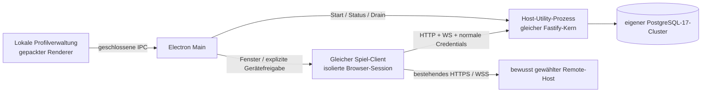

# M8: Electron und lokaler Host — zwei Entwurfsrunden

Stand: 2026-09-06. **Von Root nach unabhängiger Lektüre beider Runden zur Umsetzung angenommen**,
inzwischen mit dem unten belegten lokalen Vertikalschnitt umgesetzt; M8 ist noch nicht freigegeben.
Runde2 ist die Gegenprüfung des Vorschlags durch denselben
Autor. Root übernimmt den eigenen PostgreSQL17-Cluster, Electron-Node24 als zusätzlich ausdrücklich
zu prüfende Serverlaufzeit, getrennte native Verwaltungsrechte und die zwei Sicherungsarten.
Zuerst wird der vollständige lokale Vertikalschnitt mit realem Neustart und V4-Restore umgesetzt.
Die vorhandene Demo und ihre Daten bleiben ein eigenständiges Profil. Eine portable Host-Sicherung
mit Credentials braucht den beschriebenen zusätzlichen Formatentscheid; der native Kampagnenexport
ist bereits der verfügbare portable Weg. Signierte Veröffentlichung, NVDA und externe Topologien
bleiben nachweispflichtig. Die ursprüngliche Entwurfsarbeit hat nur Quellen/Werkzeuge gelesen.

## Bindung und aktueller Bestand

[M8 im Implementierungsplan](../../docs/IMPLEMENTATION_PLAN.md) verlangt Electron als Verpackung derselben Anwendung einschließlich geprüftem lokalem Host-, Update- und Sicherungspfad. [Architektur 06 §16.5 und §19.8](../06-giga-product-architecture.md) bindet Offline-Rechte, gleiche Projektionen, Context Isolation und schmale Dateisystem-IPC. [RB-11](../research/RB-11-steam-vs-browser-verdict.md), insbesondere B1–B8, legt den Web-/DOM-Kern, Electron mit eingebettetem Node-Host und Browser-Parität fest. Ein bloßes Fenster zu einer Serveradresse erfüllt den lokalen Host nicht.

[Backend-Architektur 08](../08-backend-architektur.md) setzt Fastify und PostgreSQL 17 als produktiven Pfad ein; PGlite ist der Testadapter. Electron führt deshalb weder eine zweite produktive Datenbank noch eine zweite Spielengine ein. [Shell-Architektur 07 §5](../07-shell-redesign.md) trennt Befehle, Präsenz und optionalen SFU. Eine Desktop-Verpackung ersetzt keinen LiveKit-/TURN-Betrieb.

Zwei offene Grenzen bleiben ausdrücklich bestehen:

- [P11 im Entscheidungsbuch](OPEN-DECISIONS.md) ist die nicht entschiedene allgemeine Self-Host-Join-/HTTPS-Topologie. Der lokale Desktop-Host funktioniert zunächst auf seinem Rechner. Ein LAN-IP-Link ist keine belegte Passkey-/Medien-Lösung. Zertifikatsfehler werden nicht übergangen; es werden weder Router noch Firewall, DNS oder bezahlte Relays automatisch eingerichtet.
- **RB11-S5** fordert NVDA durch die tatsächliche Electron-Hülle, **RB11-S6** deren gemessenen Platz- und RAM-Bedarf. Diese Bezeichnungen sind nicht die anders benannten S5/S6 im Entscheidungsbuch. Browser-Abnahmen ersetzen beide Messungen nicht. Steam-Overlay, Deck und Depots bleiben die getrennten späteren Steam-Gates.

Der direkt gelesene Code liefert folgende Anschlussstellen:

| Bestand | Konsequenz für Desktop |
|---|---|
| `packages/client` mit Wiki, Tisch, Actor/Inventar, taktischer Karte, Autorenwerkzeugen, lokalem Appearance und MediaPanel | Dasselbe gebaute Client-Artefakt verwenden. Keine Kopie der Features in einem Desktop-Renderer. |
| `packages/server/src/app.ts: buildApp(db, config)` | Wiederverwendbarer Fastify-Kern einschließlich Auth, Projektionen, WebSocket und optionalem Media/Public-Host-Gate. |
| `packages/server/src/main.ts` | Kein Desktop-Import: Top-Level-Zugriffe auf Checkout-`.local`, Dev-Defaults, automatische Migration und Prozess-Signale sind an den CLI-Start gekoppelt. |
| `db/index.ts: createPgDb, migrate` | Gleicher PG-Adapter und dieselben Migrationen mit Checksummen/Lock. Desktop übergibt ausschließlich sein eigenes Profilziel. |
| `identity/index.ts`, `http/lifecycle.ts` | Bestehende Credentials, Origin-/Passkey-Regeln sowie HTTP-Drain und WebSocket-Close wiederverwenden. Ein installiertes Programm ist kein GM-Nachweis. |
| `domain/bundles.ts`, `bundle-cli.ts`, [Restore-Dokumentation](../../docs/CAMPAIGN_RESTORE.md) | Nativer V4-Export, explizite alte Format-Upgrades, leerer Restore und getrenntes Enrollment stehen zur Wiederverwendung bereit. |
| `deploy/docker-compose.*`, `deploy/media` | Vorhandene externe Betriebsoptionen; ihre Dev-Datenbank und Volumes sind keine Desktop-Profile. Docker bleibt eine bewusste Betreiberoption. |

Werkzeugaufnahme dieses Windows-Arbeitsplatzes: Node **22.23.1**, npm **10.9.8**, Git, Docker und dotnet sind auffindbar. Electron und native PostgreSQL-Werkzeuge (`postgres`, `initdb`, `pg_ctl`, `pg_dump`) sind nicht im geprüften PATH; NVDA und Signierwerkzeuge wurden auch an den geprüften Standardorten nicht gefunden. Das ist keine vollständige Softwareinventur. Es gibt noch kein `packages/desktop`. Signierschlüssel und Konten wurden nicht untersucht.

Die offizielle Release-Seite nennt am Prüftag **Electron 44.2.0** als Latest Stable, mit Chromium **152.0.7977.76** und Node **24.20.0**. Dieser genaue Pin ist der Vorschlag für die erste Umsetzung; vor der tatsächlichen Installation erneut prüfen und im Lockfile festhalten. Die zusätzliche Server-Laufzeit Node 24 wird unten ausdrücklich abgenommen, nicht still aus dem Node-22-Vertrag abgeleitet. [Electron-Release](https://releases.electronjs.org/release/v44.2.0)

## Runde 1 — gleicher Client, eigener verwalteter Host

### 1. Laufzeitentscheidung

Empfohlen wird Windows x64 als erste konkrete Desktop-Zielplattform. Electron verwaltet pro lokalem Profil einen eigenen PostgreSQL-17-Cluster und startet den unveränderten Fastify-Domainkern in einem `utilityProcess`. Der lokale Server bedient das bestehende Client-Bundle über einen stabilen Loopback-Origin. Die Anwendung benötigt für diesen Pfad kein separat gestartetes Terminal und keine vorhandene Dev-Installation.

Die PostgreSQL-Seite verweist ausdrücklich auf ein Windows-Binär-ZIP zur Einbettung in andere Installer. Vor Aufnahme in den Build werden ein exakter 17.x-Patchstand, Hersteller-URL, SHA256, mitgelieferte Lizenzen und benötigte DLLs festgelegt und geprüft. Die Quelle belegt die Bezugsoption, noch nicht unseren funktionierenden Paketaufbau. Der am Prüftag genannte 17.x-Stand ist 17.11. Kein Download oder Entpacken aus einer vom Renderer gelieferten URL. [PostgreSQL für Windows](https://www.postgresql.org/download/windows/)

Alternativen und Entscheidung:

| Alternative | Urteil |
|---|---|
| Nur HTTPS-Remote-Fenster | Zusätzlich nützlich, erfüllt den eingebetteten Host nicht. |
| Ausschließlich Docker voraussetzen | Zulässige fortgeschrittene Betriebsoption, aber kein Standardpfad für „App installieren und lokal hosten“. |
| Persistentes PGlite/SQLite verwenden | Widerspricht dem aktuellen produktiven PG-Vertrag; wird nicht eingeführt. |
| Separates Node-22-Executable mitliefern | Technisch möglich, aber zweite zu pflegende Node-Distribution. Nur Ersatzentscheidung, falls der Node-24-Kompatibilitätsnachweis scheitert. |
| Electron-Utility-Prozess mit Node 24 | Empfehlung: zusätzliche Laufzeit explizit annehmen, Serververhalten unter Node 22 und dem tatsächlich gepackten Electron prüfen. |

`utilityProcess.fork` startet erst nach Electron-Ready. Main und Worker kommunizieren über geschlossene Nachrichten; Konfiguration und Startbelege reisen über diesen Kanal, nicht als Geheimnisse in Argumenten oder Logs. Das Worker-Environment wird ausdrücklich aufgebaut, nicht aus `DATABASE_URL`, `NODE_OPTIONS` oder dem Checkout übernommen. Ein Utility-Prozess enthält Node; er ist keine behauptete Sandbox für unbeschränkte Fremddateien. [UtilityProcess](https://www.electronjs.org/docs/latest/api/utility-process)

### 2. Profile und tatsächliche Nutzerwege

Die lokale Verwaltung besteht aus Profilwahl, Host-Zustand, Sicherung/Wiederherstellung und Updates. Sie stammt ausschließlich aus dem signierbaren App-Paket, etwa unter `chronicle-shell://app`. Die Spieloberfläche bleibt der Web-Client in einem eigenen `BrowserWindow` oder `WebContentsView`; sie kann die lokale Verwaltung weder navigieren noch per Frame imitieren. Der DOM-/Fokuswechsel zwischen Verwaltung und Spiel muss mit Tastatur und NVDA geprüft werden.

| Weg | Überprüfbares Verhalten |
|---|---|
| **Neue lokale Welt** | Name des Profils wählen; App legt einen neuen privaten Cluster an, migriert ihn und bietet die bestehende erste Einrichtung an. Danach normale Kampagnenanlage. Fortschritt und Fehler benennen den tatsächlichen Zustand. |
| **Lokales Profil fortsetzen** | Profil-Lock prüfen, eigenen Cluster starten, Schema prüfen, eigenen Host abwarten, dann den Client öffnen. Kein automatischer Wechsel auf ein fremdes Programm am gewünschten Port. |
| **Server verbinden** | Bewusst eingegebenen HTTPS-Origin normalisieren und anzeigen; normale Anmeldung/Einladung/Gerätebindung. Eigene Session-Partition pro Ziel. Keine Desktop-Adminrechte für Remote-Hosts. |
| **Kampagne wiederherstellen** | Native Datei wählen → prüfen → Format-/Migrationsbericht → neues leeres Profil → atomarer Restore → gesonderte Auswahl einer historischen GM-Identität und einmaliges Enrollment. Keine Überschreibung einer geöffneten Welt. |
| **Fenster schließen** | Bei lokal laufendem Host explizit „Host weiterlaufen lassen“, „Host beenden“ oder „Abbrechen“. Im Hintergrund verbleibt ein sichtbarer Tray-Status mit Öffnen/Beenden; versteckter Weiterbetrieb wird nicht vorausgesetzt. |
| **Host nicht erreichbar** | Zustand/letzten bestätigten Stand zeigen und lokale Entwürfe erhalten. Kein Erfolgshinweis für einen unbestätigten Serverbefehl. |
| **Datei bearbeiten/exportieren** | Bestehende Import-/Export- und Autorenoberflächen verwenden; Browser-Dateiauswahl und Download bleiben vollständige Alternativen. Native Dialoge ergänzen diese Wege. |

Profile liegen unter Electron-`userData`, außerhalb von Installation und Checkout, mit generierter Profil-ID, festem Datenverzeichnis, stabilen HTTP-/PG-Ports und einer versionierten Betriebs-Konfiguration. Renderer liefern IDs, keine frei interpretierbaren Dateisystempfade oder DB-URLs. Die App startet zunächst genau einen lokalen Host zugleich; separate Remote-Fenster benötigen keinen zweiten Cluster. Betriebssystembenutzer und Dateirechte begrenzen das Profil, nicht eine behauptete Sandbox gegen Administratoren.

Cookie-/DB-Geheimnisse sind zufällig und profilbezogen. Speicherung mit Windows-DPAPI über `safeStorage`; keine Rückgabe an die Spieloberfläche, keine Ablage in Kampagnenexports. DPAPI schützt unter Windows nicht gegen andere Prozesse desselben angemeldeten Benutzers. Bei nicht verfügbarer Verschlüsselung wird die Einrichtung angehalten; kein Klartext-Fallback. [safeStorage](https://www.electronjs.org/docs/latest/api/safe-storage)

### 3. Origin und Identität

Der lokale Spiel-Origin ist `http://localhost:<profilport>`, gebunden nur an Loopback. Der Port bleibt über Neustarts stabil. Ein erster freier Kandidat gilt erst nach erfolgreichem tatsächlichem Listen als reserviert; bei späterer Kollision endet der Start mit einer Diagnose. Ein ausdrücklich gewählter Portwechsel ist ein Origin-Wechsel mit erneuter Auth-Prüfung. Ein lokaler Worker-Handshake mit frischer Start-ID bestätigt, dass Main genau seinen gestarteten Host geladen hat. Ein bloßes HTTP-200 an einem Port genügt nicht.

Cookies bleiben HttpOnly/Secure/SameSite=Strict; es gelten dieselben Auth- und Request-Origin-Prüfungen. Das bestehende `reachability()` erlaubt `localhost` als Passkey-Origin. Die tatsächliche Electron-/Windows-Hello-Interaktion ist dennoch eine eigene Probe. Electron-Session-Partitionen verhindern eine Vermischung der Profil-Cookies und lokalen Vorlieben. Browser auf demselben Rechner bleiben normale Clients; die bekannte Cookie-Gültigkeit über Ports hinweg ist bei parallelen localhost-Installationen ausdrücklich zu testen, nicht durch schwächere Cookies zu umgehen.

Ersteinrichtung und Restore-Enrollment sind bewusste lokale Verwaltungsaktionen. Die Verwaltung darf nur für ihr eigenes geprüftes Profil bestehende Identity-/Enrollment-Domainfunktionen aufrufen. Erstes Bootstrap ist nur im tatsächlich neuen Ziel erlaubt; Restore erstellt niemals automatisch neue GM-IDs oder Credentials. Ein ausgegebener einmaliger Pairing-Code wird über die vorhandene Gerätebindung eingelöst. Wenn die Erst-Einrichtung eine Sitzung direkt erhält, darf nur Main deren HttpOnly-Cookie in der zugehörigen Session setzen; das Token wird nicht an Renderer-JavaScript oder in eine URL gegeben. Die Server-Transaktionen und vorhandenen Locks bleiben maßgeblich.

Remote-Ziele müssen HTTPS mit gültiger Zertifikatsprüfung verwenden. Keine `ignore-certificate-errors`-, `webSecurity=false`- oder `allowRunningInsecureContent`-Abkürzung. Kein Zugriff auf `file:`, `javascript:`, `data:`, UNC-Pfade oder Betriebssystem-Protokolle durch Linknavigation. Neues Ziel, Redirect zu anderem Origin und externe Links werden aus dem Spiel heraus abgefangen; externe HTTP(S)-Links öffnen nur nach einer bewussten Aktion den Systembrowser. Das ist kein allgemeiner URL-Launcher. [Electron-Sicherheitsregeln](https://www.electronjs.org/docs/latest/tutorial/security)

### 4. Native Brücke und Berechtigungen

Alle Renderer: `nodeIntegration:false`, `contextIsolation:true`, `sandbox:true`, `webSecurity:true`, restriktive CSP, keine freien Electron-/IPC-Objekte. Native Verwaltungs-IPC akzeptiert ausschließlich den registrierten lokalen Main-Frame, seine konkrete `webContents`-Instanz und die aktuelle Navigationsgeneration. Ein gleichnamiger Kanal, Subframe oder gleich aussehender Origin reicht nicht. Prozeduren haben geschlossene Schemas, Längen-/Bytegrenzen und aufrufgebundene Antworten. [Electron-Sicherheitsregeln](https://www.electronjs.org/docs/latest/tutorial/security)

Der B1-Platform-Vertrag wird getrennt nach Fähigkeit angeboten. Die Spieloberfläche erhält insbesondere keine Prozess-, SQL-, Restore-, Updater- oder Geheimnis-IPC. Native Host-Aktionen gehören zur gepackten lokalen Verwaltung. Die Browserimplementierung hat ehrliche Capability-Angaben statt No-Op-Erfolg.

| Port/Funktion | Erlaubter Umfang |
|---|---|
| `openFile(kind)` | Expliziter Dialog mit festen unterstützten Formaten; begrenzte Bytes/Dateimetadaten, keine freie `readFile(path)`-Funktion. Große Dateien laufen als begrenzter Transfer, nicht als beliebig großes IPC-JSON. |
| `saveFile(kind, transfer)` | Dialog, Erweiterung/Größe aus bekanntem Format, Überschreibentscheidung, temporäre Datei plus atomarer Abschluss. Abbruch entfernt ausschließlich eigene temporäre Dateien. |
| `pickFolder(purpose)` | Nur benannte Export-/Sicherungszwecke der lokalen Verwaltung; zeitlich begrenztes internes Handle, keine rekursive Dateisystem-API für Artikel. |
| `hostSession(profileId)` | Verwaltungsaktion für ein angelegtes eigenes Profil. Kein Host/Port/Shell-Text aus der Kampagne. |
| `discoverLAN()` | Zunächst ausdrücklich nicht verfügbar; P11 ist dadurch nicht entschieden. Keine stille Netzwerk-Suche. |
| `openExternal(url)` | Normalisierte HTTP(S)-Adresse nach bewusster Nutzeraktion; kein Credential in der URL, keine frei wählbaren Protokollhandler. |
| `social`, `hasLicence` | Getrennte Ports ohne Steam-Abhängigkeit des Kampagnenformats. Noch keine erfundene Entitlement-/Store-Antwort. Eigene Inhalte bleiben lesbar/bearbeitbar/exportierbar. |

Native Datei-Komfortfunktionen im Spiel werden nur hinzugefügt, wenn die konkrete Auswahl die gleiche Validierung wie der Browserpfad verwendet. Für das erste vertikale Paket reichen Browser-Import/Download plus native Verwaltungs-Sicherung; dies ist eine Reihenfolge, kein Verzicht auf B1 oder Export-Parität.

Für jede Session werden **Permission-Check und Permission-Request** eingerichtet. Mikrofon/Kamera nur für den gerade aktiven bekannten Spiel-Origin nach ausdrücklicher Freigabe; Ablehnung bleibt im vorhandenen MediaPanel verständlich. Screen-Sharing benötigt einen echten Auswahlweg für genau die gewählte Quelle und eine aktuelle Nutzeraktion; nie automatisch den ersten Bildschirm wählen. Nach Navigationswechsel werden ausstehende Entscheidungen verworfen. Unbekannte Berechtigungen, USB/Serial/HID und ungefragtes Clipboard-Lesen werden verweigert; Benachrichtigungen sind optional. Prüfung verwendet Frame, Origin und zugehöriges Fenster gemeinsam. [Electron Session API](https://www.electronjs.org/docs/latest/api/session)

Die vorhandene serverseitige Mitgliedschafts-/Credential-Reconciliation und SFU-Moderation bleibt unverändert entscheidend. Native Gerätefreigabe macht einen Benutzer weder zum Medienmitglied noch zum GM. App/PG funktionieren bei fehlendem SFU weiter; die lokale App meldet Medien als nicht konfiguriert. Kein gebündeltes TURN-Erreichbarkeitsversprechen ohne Betrieb und Abnahme.

### 5. Host-Lebenszyklus und Offline

Geschlossener Zustandsautomat: `stopped → starting-db → checking-schema → starting-app → ready → draining → stopped`; Fehler führen in `failed` mit lesbarer Ursache und zulässiger Wiederholung. Aus `failed` wird nicht automatisch ein anderes Profil oder Ziel gewählt. Update und Restore benötigen einen exklusiven Profil-/Operations-Lock.

Start: Profilbesitz/Runtime-Manifest prüfen → PG nur auf Loopback starten → DB-Ziel/Profilbeleg prüfen → frischen Cluster initialisieren oder bestehende Migration mit Sicherung vorbereiten → Fastify starten → lokalen Startbeleg bestätigen → Client öffnen. `initdb` und `pg_ctl` werden mit festem ausführbarem Pfad und Argument-Array gestartet, verborgen, ohne Shell und ohne Windows-Dienstregistrierung. Auth ist SCRAM mit zufälligem Passwort; kein `trust` für beliebige lokale Clients. [initdb](https://www.postgresql.org/docs/17/app-initdb.html), [pg_ctl](https://www.postgresql.org/docs/17/app-pg-ctl.html)

Beenden: Oberfläche zeigt laufenden Abschluss → keine neuen Host-Operationen → `app.close()` mit vorhandenem HTTP-Drain, WS- und Medien-Cleanup → `db.close()` → eigenen PG-Cluster geordnet stoppen → Zustand persistieren → Prozess beenden. Ein Zeitlimit kann einen Fehler melden und eine explizite weitere Entscheidung anbieten; es darf nicht als Erfolg aktive Transaktionen abschneiden. Ein erzwungener Abbruch ist als solcher sichtbar und erfordert beim nächsten Start Recovery-Prüfung. Keine Prozesssuche nach allgemeinem Namen und kein Stop anderer Node-/PG-Instanzen.

Crash-/Wake-Pfad: nicht bestätigte Befehle bleiben unbestätigt; Datenbank-WAL-Recovery vor Wiederaufnahme; UI lädt aktuelle Versionen und Rechte. Ein hinterbliebener PG-Prozess wird nur anhand des eigenen Datenverzeichnisses, Profilbelegs und verifizierter Prozesszugehörigkeit übernommen/gestoppt, nicht anhand einer gespeicherten PID allein. Parent-Abbruch und Windows-Abmeldung sind eigene Fehlertests. Ohne bewiesene Zuordnung bleibt der Fehler sichtbar; kein breit wirkendes Cleanup.

Offline bedeutet zwei verschiedene Zustände. Läuft der lokale autoritative Host samt PG, kann die lokale Welt auch ohne Internet normale Transaktionen ausführen. Ist der gewählte Remote-Host nicht erreichbar, sind lokale Entwürfe, persönliche Notizen/Präferenzen, Dateiautorenwerkzeuge und bereits erlaubte lokale Inhalte möglich; Reveal, Würfel/Mint, Rollen und gemeinsame Szenen werden nicht lokal als bestätigt fortgeschrieben. Eine Wiederverbindung lädt Rechte/CAS-Stände neu; konfligierende Entwürfe bleiben zur Entscheidung erhalten.

Für gespeicherte Leseransichten gelten Profil-/Benutzer-/Actor-Scope, sichtbarer Stand und Löschung bei Logout, Profilwechsel oder bekanntem Widerruf. Keine GM-Rohdaten als versteckter Offline-Spielercache. Bereits offline ausgelieferte Bytes sind nicht nachträglich fernlöschbar; die App behauptet keine solche Revocation-Garantie. Bestehende Browser-Drafts dürfen nicht durch einen zusätzlichen Desktop-Cache überschrieben werden.

Der Champion-Briefkasten ([§14.1–14.2](CHAMPION.md)) bleibt ein eigener Transportvertrag: bei schlafendem Host keine Auflösung; nur bei tatsächlich konfiguriertem, quittierendem Spool gilt eine Absicht als zugestellt. Bis zu einer realen Implementierung heißt der Zustand „Noch nicht zugestellt — Host offline“. Der Desktop erfindet weder einen Relay-Endpunkt noch eine erfolgreiche Nachrichtenzustellung.

### 6. Sicherung, Wiederherstellung und Updates

Zwei Artefakte dürfen nicht verwechselt werden:

| Artefakt | Inhalt und zulässige Wiederherstellung |
|---|---|
| **Native Kampagne V4** | Bestehender GM-Export einschließlich aller dauerhaften Module/Quellen, ohne Credentials und Betriebsgeheimnisse. Validierter Restore ausschließlich in leeres Ziel, semantischer Reexport-Vergleich; alte Formate nur mit dem vorhandenen ausdrücklichen Upgrade-Bericht. Enrollment bleibt eine zweite Aktion. |
| **Lokale Host-Sicherung** | Gesamter eigener Clusterinhalt einschließlich Credentials plus notwendige Profil-Konfiguration. Für Migration/Recovery; sensibler als ein Kampagnenexport. Kein zweites Kampagnenformat und kein Umdeuten vorhandener Siegel. |

Der erste Host-Sicherungspfad verwendet einen konsistenten `pg_dump` des eigenen gestoppten Anwendungshosts und ein geschlossenes Manifest mit App-, Schema- und PG-Version, Größen und Prüfsummen. Keine Kopie eines laufenden PG-Datenverzeichnisses. App-eigene DB-Rollen werden deterministisch neu angelegt; keine fremden Cluster-Rollen oder SQL-Dateien werden aus einem Renderer übernommen. Automatische lokale Sicherungen bleiben im geschützten Profilbereich und sind ausdrücklich gerätegebundene Recovery-Punkte. Sie verlassen das Gerät nicht automatisch.

Für eine vom Benutzer gewählte transportable **Host**-Sicherung ist zusätzlich eine passwortgeschützte, authentifiziert verschlüsselte Hülle erforderlich; DPAPI allein wäre auf einem anderen Windows-Konto nicht wiederherstellbar. Vor ihrer Umsetzung wird ein kleines eigenes Betriebsformat mit festen Bestandteilen, Größen, KDF-/AEAD-Parametern und vollständiger Authentisierung vor Restore eingefroren. Keine freie ZIP-Pfadextraktion. Alternativ bleibt der explizit credentialfreie Kampagnenexport der verfügbare portable Weg; die UI darf ihn nicht „vollständige Host-Sicherung“ nennen. Diese Unterscheidung ist eine Abnahmebedingung, kein Anlass, den vorhandenen Restore umzuschreiben.

Jeder Host-Restore läuft zuerst in ein neues Profil. Passende Runtime-/Schema-Versionen prüfen, Dump einspielen, Integrität und Anmeldung kontrollieren, erst danach zur Nutzung anbieten. Ein altes oder gefülltes Profil wird nie automatisch geleert. Public Delivery bleibt ein neu zu bestätigendes lokales Host-Gate und standardmäßig aus; Secrets, Medienendpunkte und öffentliche Erreichbarkeit werden nicht durch Kampagneninhalte aktiviert.

Ein Update hat die Zustände `available / downloading / verified / awaiting-stop / installing / failed`. Kein Neustart mitten im Tisch, keine Migration allein durch das Herunterladen. Vor Installation: Entwürfe behandeln, eigenen Host drainen, geprüften Recovery-Punkt erstellen, dann Installer starten. Neue Binärdateien prüfen Schemakompatibilität vor DB-Zugriff. Binär-Rollback allein ist nach einer nicht rückwärts kompatiblen Migration kein Datenbank-Rollback; alte Binärversion und passenden Recovery-Punkt gemeinsam anbieten. PG-Majorwechsel benötigen einen gesonderten Migrationspfad; kein stilles Austauschen der PG17-Datendateien durch PG18.

Empfohlen ist zunächst ein per-user Windows-Installer mit Electron Forge/Squirrel und eine explizite Updateprüfung. Squirrel erzeugt Setup, Paket und `RELEASES`; Start-/Update-Sonderargumente werden vor normaler Profilinitialisierung behandelt. Der öffentliche Feed benötigt einen fest konfigurierten HTTPS-Ursprung und überprüfbare signierte Artefakte. Kampagnen/Artikel/Remote-Server dürfen keine Feed-URL oder ausführbare Datei bestimmen. Kein Remote-JavaScript-Update und keine Veröffentlichung privater Test-Feeds. [Forge Squirrel.Windows](https://www.electronforge.io/config/makers/squirrel.windows), [Electron Updates](https://www.electronjs.org/docs/latest/tutorial/updates)

Ein lokaler unsigned Installer und ein isolierter lokaler Update-Test sind auf diesem Rechner implementierbar. Sie belegen nicht die Vertrauenskette einer öffentlichen signierten Distribution. Signieren, Timestamping, tatsächlicher Release-Feed und dessen Rücknahme-/Notfallverfahren bleiben bis vorhandene Schlüssel/Betreiber und geprüfte Artefakte vorliegen ausdrücklich offen.

### 7. Paketaufbau und konkrete Dateigrenzen

Vorgeschlagene neue Arbeitseinheit `packages/desktop`: Main, gepackte lokale Verwaltung, gebündeltes Preload, geschlossene IPC-Schemas, Profil-/Origin-/Permission-Policy, Host-Controller, PG-Provider, Sicherung/Update und Forge-Konfiguration. Eine kleine reine Platform-Schnittstelle bleibt ohne Electron-/Node-Import im Client verwendbar. Desktop importiert Server über dessen explizite Host-Fassade; die Domain kennt Electron nicht.

Die notwendige bestehende Serveränderung ist eng: eine seiteneffektfreie Start-/Stop-Fassade neben `main.ts`, die DB/Origin/Static-Root/Migrationsmodus ausdrücklich erhält. CLI bleibt ein Adapter; `buildApp` und alle Domain-/Projektionen bleiben gemeinsam. Migrationen als Ressourcen, kompiliertes JS und unverändertes Client-`dist` werden zusammen ausgeliefert. Kein Laufzeit-`tsx`, Vite-Devserver oder mitgepacktes Checkout-`.local`. `sharp` und dessen native Bibliotheken müssen im tatsächlichen Electron-Worker geladen werden; erforderliche native Ressourcen liegen außerhalb komprimierter ASAR-Zugriffe, mit festem Manifest.

Release-Fuses: RunAsNode, Node-Options-Environment und CLI-Inspect abschalten; Cookie-Verschlüsselung, nur ASAR-App-Code und unterstützte ASAR-Integritätsprüfung einschalten und am Paket nachprüfen. Der vorgeschlagene Utility-Prozess vermeidet eine Abhängigkeit von `child_process.fork` bei abgeschaltetem RunAsNode. Fuses ersetzen weder IPC-Prüfung noch Signierung. [Electron Fuses](https://www.electronjs.org/docs/latest/tutorial/fuses)

Der gemeinsame Build liefert Web und Desktop mit identischem Client-Hash, reproduzierbarer Versions-/Lizenzliste sowie separaten Installations-/Runtime-Prüfsummen. Kein SteamPipe-Schritt. Eine Desktop-Version darf Kampagnen-Theme-, Regel- oder Kartenvorlagen-Pins nicht beim Start „aktualisieren“; vorhandene ausdrückliche, diffbare GM-Updates bleiben der einzige fachliche Weg.

## Runde 2 — Angriffe auf den ersten Entwurf und verbindlich vorgeschlagene Korrekturen

| Gegenprobe | Korrektur für die Umsetzung |
|---|---|
| Ein fremder Prozess beantwortet den vorgesehenen localhost-Port. | Erst eigenes Listen und privaten Worker-Startbeleg abwarten; nie anhand von HTTP-200 übernehmen. Native Verwaltung bleibt ein separat gepackter Renderer. Bei Hostverlust seine laufenden Transfers/Capabilities ungültig machen. |
| Ein importierter Artikel oder Preview-Frame sendet dieselbe IPC wie die Profilverwaltung. | Exakte Senderinstanz, Main-Frame, Navigationsgeneration und Capability prüfen. Spiel-/Remote-Renderer erhalten keine Host-/Restore-IPC. Alle Fachrechte weiterhin serverseitig prüfen. |
| Profil A wird während eines Datei-Dialogs durch B ersetzt. | Dialog/Transfer an Profil, Ursprung, Operation und Generation binden; nach jedem Await erneut prüfen. Abgebrochene Arbeit erzeugt keine spätere Mutation mit anderer Identität. |
| Node-22-Tests sind grün, Electron enthält Node 24 und `sharp` fehlt im Paket. | Separater gepackter Worker-Test mit tatsächlichem PG, Migrationen und Decoder; Runtime-Unterschied ausdrücklich übernehmen. Keine reine `electron --version`-Abnahme. |
| Installer ersetzt Dateien, während PG noch schreibt. | Host-Drain, Pool-Close, PG-Stop und Recovery-Nachweis vor Installation. Ein fehlgeschlagener Stop hält das Update an. |
| Ein altes PID-File zeigt nach Crash auf einen fremden Prozess. | Prozesszugehörigkeit und Datenverzeichnis verifizieren; bei Unsicherheit nicht beenden. Eigenen Crash/Restart testen. |
| Restore sieht erfolgreich aus, aber alle Nutzer bleiben credentialfreie Stubs. | Getrenntes ausdrückliches Enrollment mit historischer GM-ID und tatsächlicher Anmeldung als Abnahme, kein automatisches Bootstrap neuer Identitäten. |
| Eine exportierte Kampagne schaltet öffentliches Hosting oder externe Medien frei. | Host-Gates/Secrets sind Betriebszustand; Restore aktiviert sie nicht. Kein Native-Formatwechsel für Desktop-Betriebsdaten. |
| App läuft ohne Internet, UI nennt jede Handlung „offline“. | Lokaler erreichbarer Server bleibt Autorität; unerreichbarer Remote-Server erlaubt nur Entwurf/zulässige lokale Ansicht. Keine automatische gemeinsame Befehlsauflösung. |
| Auth wird widerrufen, aber ein lokaler Cache enthält die frühere GM-Sicht. | Kein pauschaler Rohdaten-Cache; Scope und Logout/Widerruf räumen bekannte lokale Projektionen auf. Unwiderrufbarkeit bereits offline vorhandener Bytes ehrlich benennen. |
| Ein Datenbank-Backup ist DPAPI-verschlüsselt und soll auf einem anderen Rechner laufen. | Gerätegebundenen Recovery-Punkt und portable Kampagne klar trennen; portable Host-Sicherung benötigt eigenen geprüften Passwortschutz. |
| „Selfhost“ suggeriert sofortige Smartphone-Teilnahme über WLAN. | Lokalen Host und tatsächlich geprüfte HTTPS-Remote-Topologie getrennt anzeigen; P11 bleibt offen. Kein Zertifikat-Bypass durch Electron. |
| Screen-Sharing ist ein grüner SDK-Aufruf, hat aber nie einen Bildschirm zur Auswahl angeboten. | Tatsächlicher Picker und Ablehnungs-/Abbruchpfad, Ursprungbindung sowie Track-Stop bei Navigation/Logout prüfen. |
| Der Web-Client ist zugänglich, das native Fenster verschluckt Fokus und NVDA. | RB11-S5 im Paket mit Verwaltung, Dialogen, Spiel, Modal und Rückkehr aus dem Systembrowser ausführen; Paketfreigabe an Ergebnis binden. |

### Umsetzungsfolge und Abnahme, ohne operative Daten anzufassen

1. **Schnittstellen einfrieren.** Root prüft Runde 2 und übernimmt insbesondere PG17 als verwaltete Runtime, Electron-Node24 als zusätzliche Serverlaufzeit, getrennte Verwaltungs-IPC und die zwei Sicherungsarten. Erst danach Dependencies/Runtime-ZIP mit Checksummen aufnehmen. IPC-/Profil-/Runtime-Manifest und vorhandene Server-Fassade bleiben geschlossene Verträge.
2. **Vollständiger lokaler Vertikalschnitt.** In einem neuen Test-`userData` einen echten eigenen PG-Cluster initialisieren, Migrationen aus dem Paket lesen, Client laden, GM einrichten, Welt schreiben, geordnet schließen, neu starten und denselben Stand lesen. Restore einer echten V4-Kampagne in ein zweites leeres Testprofil mit separatem Enrollment und semantisch identischem Reexport. Das ist das erste Desktop-Smoke-Ziel, keine Remote-URL-Demo.
3. **Grenzen und Fehler prüfen.** Unberechtigte IPC/Subframes/URLs/Dateipfade, Profilwechsel während Await, gefülltes Restore-Ziel, Portkollision, fehlende Runtime, unzulässiger Runtime-Hash, PG-Ausfall, Host-Crash, langsame aktive HTTP-Antwort beim Schließen, Medien-Revoke und abgelehnte Geräte. Isolierte Ports und ausdrücklich eigene Prozesse; 3000/54329 und Checkout-Konfiguration bleiben unberührt.
4. **Sicherung und lokales Update durchspielen.** Wiederherstellung eines vollständigen Recovery-Punkts in neues Profil, falsches Passwort/defekte Datei falls portable Host-Hülle enthalten, alter/neuer Paketstand, fehlender Platz, abgebrochener Download, fehlgeschlagene Migration und Neustart. Test-Feeds nur für den Testbuild; kein automatischer echter Download/Release. Vorher/Nachher-Stand und Artefakt-Hashes berichten.
5. **Gleiche Anwendung abnehmen.** Browser und Electron gegen einen isolierten Host: Projektionen/Actor-Perspektive, CAS-Konflikt, Wiki-Entwurf bei Reconnect, taktische Karte einschließlich verdeckter Inhalte, Autoren-/Theme-Roundtrip, Enrollment/Widerruf und optional echte lokale SFU-Geräteabläufe. Fake-Mediengeräte nur mit klarer Kennzeichnung; sie belegen kein reales Mikrofon oder Windows-Screen-Picker-Verhalten.
6. **Windows-Paketgrenzen messen.** Installer und deinstalliertes Programm lassen Profildaten bewusst erhalten; Entfernung von Daten ist eine gesonderte Handlung. Installation ohne Adminbedarf separat belegen. RB11-S5 mit tatsächlichem NVDA; RB11-S6 installiertes Volumen, Startzeit, Idle-CPU/RAM getrennt für Electron und PG sowie Karten-/Medienlast auf diesem Rechner erfassen. Ohne Messung kein erfundener Budgetwert. Windows-Hello, Schlafen/Aufwachen und Start nach OS-Neustart benötigen reale Windows-Abnahme. Linux/macOS und Steam werden damit nicht als geprüft bezeichnet.

Die jetzige Arbeitsumgebung erlaubt nach Freigabe den Code, isolierte echte PG-Profile, ein lokales Windows-Artefakt sowie Paket-/Lifecycle- und Update-Fehlertests. Sie liefert derzeit weder einen bereits installierten Electron-/PG-Runtime-Satz noch NVDA-, Signatur-, öffentlicher-Feed- oder allgemeine LAN-Join-Evidenz. Fehlende externe Release-Zutaten begrenzen die jeweilige Freigabe, nicht die Implementierung des lokalen Hosts.

### Vorgeschlagene Übernahme

Runde 2 ist die empfohlene Implementierungsbasis. Bei Übernahme erhält `packages/desktop` die native Betriebsverantwortung; bestehende Server-/Client-Integrationen bleiben eng und werden durch Root koordiniert. Native V1–V4 und ihre fachlichen Tabellen bleiben unverändert. Die öffentliche Release-Freigabe folgt erst nach den belegten Host-/Sicherungs-/Update-, RB11-S5-/S6- und Signaturabnahmen; die noch offene P11-Entscheidung wird weder versteckt noch durch diesen Vorschlag vorweggenommen.

## Umsetzungsstand nach unabhängiger Lifecycle-Gegenprüfung

Der lokale Windows-Vertikalschnitt, vollständige gerätegebundene Recovery und der verpflichtende
Recovery-Guard vor ausstehenden Migrationen sind implementiert. Der aktuelle Desktop-Checkpoint
hat 33 fokussierte Tests in neun Dateien und TypeScript bestanden. Ein echter Entwicklerlauf und
ein separat gepacktes Windows-Programm bestanden jeweils 10/10 Smoke-Prüfungen, einschließlich
eigener PG17-Instanz, Electron-Node24/sharp, tatsächlichem Grundriss-Generator, Installation und
Aktivierung der HTBAH-V2-Vorlage im gemeinsamen Client, V5-Export, vollständigem App-Neustart,
Recovery in ein neues Profil mit derselben tatsächlichen Credential-ID und getrenntem V5-Restore
mit historischem GM-Enrollment und gleichem Reexport. Belege und Artefakt stehen in
[DESKTOP.md](../../docs/DESKTOP.md). Ältere Artefakte sind durch die Review-Korrekturen überholt.

Bestätigte Review-Angriffe führten vor der Korrektur zu roten Regressionen: lokale angemeldete
Fenster müssen schon bei Beginn von Drain und bei Worker-Verlust verschwinden; ein Timeout oder
fehlgeschlagener Drain entzieht Ready, behält aber Worker, PG und Lock bis zum bestätigten
Abschluss; ein abgelehnter Pool-Close muss ausdrücklich erneut versucht werden können. Eine
Management-Navigation darf einen bereits empfangenen Bootstrap-Beleg nicht verlieren. Der
private Beleg bleibt am ursprünglichen Profil/Origin gebunden, wird verschlüsselt gespeichert
und vor der UI-Lease-Prüfung in dessen Cookie-Partition geflusht. Auch ein später Worker-Erfolg
nach Timeout wird noch privat gesichert. Diese Korrekturen ändern keine fachlichen Rechte.

Offen ist weiterhin Prozessverlust zwischen SQL-Commit und Empfang dieses Belegs in Main. Der
normale erfolgreiche Neustart-Smoke beweist dieses Fehlerfenster nicht. Die folgende Ergänzung
ist deshalb ausdrücklich ein **Vorschlag zur unabhängigen Prüfung, noch kein Root-Übernahme-
oder Implementierungsbeschluss**. Der aktuelle grüne Produktionsstand bleibt währenddessen stehen.

## Ergänzungsentwurf: dauerhafter Setup-Beleg und ausdrückliche Update-Anwendung

### A. Ersteinrichtung überlebt Prozessverlust

Zwei Varianten wurden betrachtet. Ein verschlüsselter transaktionaler SQL-Outbox-Datensatz
könnte die Antwort im selben Commit wie Nutzer und Credential halten. Das verlangt jedoch eine
weitere dauerhafte Betriebstabelle und entsprechende Aufbewahrungs-/Bundle-Ausschlussregeln.
Vorgeschlagen wird stattdessen ein begrenzter privater Prepare/Ack/Commit-Ablauf in der bereits
vorhandenen Host-Setup-Transaktion; das Fachmodell und der normale Web-Bootstrap bleiben gleich.

1. Main bindet den autorisierten Setup-Auftrag an seine konkrete Profilinstanz, Origin,
   Worker-Start-ID und zufällige Auftrags-ID. Dieser private Abschlussauftrag ist von der
   kurzlebigen Management-Dokument-Lease getrennt. Kein Renderer erhält Beleg oder Ack-Kanal.
2. Die Host-Fassade öffnet dieselbe gesperrte Setup-Transaktion, prüft die leere Welt und lässt
   den bestehenden Identity-Kern genau einen Nutzer und ein Cookie-Credential vorbereiten.
   **Vor** Rückkehr aus der Transaktion wartet sie auf einen optionalen internen Persistenz-
   Callback. Desktop verlangt diesen Callback; der normale Webpfad erhält keine neue IPC.
3. Worker sendet einen privaten `setup-prepared`-Beleg für genau diesen ausstehenden Auftrag.
   Main prüft alle Bindungen, schreibt den DPAPI-Beleg mit `fsync` und atomarem Dateischluss
   im Originalprofil und sendet erst dann `setup-durable`. Der Worker akzeptiert dieses Ack
   außerhalb seiner seriellen Befehlswarteschlange, damit die wartende Setup-Transaktion es
   nicht selbst blockiert. Doppeltes, fremdes oder verspätetes Ack nach Abschluss wird verworfen.
4. Erst das passende Ack erlaubt den SQL-Commit. Ausbleibendes Ack, Persistenzfehler oder
   verlorener Parent führen zu Rollback. Ein generischer Timeout darf keinen Commit beweisen.
   Main bewahrt einen schon geschriebenen Beleg auch bei verlorenem abschließenden Worker-Ack.
5. Beim Wiederstart unter bewiesenem eigenen Profilbesitz prüft die Host-Fassade den gespeicherten
   Beleg mit dem bestehenden Identity-Authenticator. Nur ein tatsächlich gültiges Credential
   darf in die ursprüngliche Browserpartition gesetzt und geflusht werden. Danach wird der
   Beleg gelöscht. Ein vor Commit abgebrochener Auftrag ergibt eine weiterhin leere Welt;
   erst eine gesperrte explizite Leerheitsprüfung erlaubt, seinen uncommitteten Beleg zu verwerfen
   und die Ersteinrichtung erneut anzubieten. Existieren bereits Nutzer, ist das kein Beweis für
   erfolgreiche Anmeldung: kein neuer GM, keine automatische Credential-Ausgabe. Widerruf und
   Ablauf bleiben entscheidend und erzeugen einen sichtbaren Anmelde-/Recovery-Zustand.

Die kritischen Zeitpunkte erhalten echte Prozessverlusttests: vor Prepare, nach durable Ack
aber vor Commit, nach Commit vor Antwort, nach Antwort vor Cookie-Flush und nach Flush vor
Beleglöschung. Der Nachweis lautet jeweils entweder leere Welt ohne bestätigte Ersteinrichtung
oder derselbe originale Nutzer **und dieselbe Credential-ID**, niemals nur irgendein erfolgreicher
Login. Zusätzlich: veraltetes Management-Dokument, fremde Auftrags-/Start-ID, doppelte Acks,
DPAPI-/Schreibfehler und Widerruf vor Reconciliation. `host.ts` und bestehende Serverseams werden
erst nach Root-Zuteilung verändert; ein Testfehler friert den abhängigen Update-Apply-Pfad ein.

### B. Installer, Download und Installation bleiben getrennte Schritte

Der bisherige Squirrel-Vorschlag bleibt die Windows-Paketbasis. Vorläufige genaue neue Dev-Pins
sind `electron-winstaller@5.4.4` und `@electron/fuses@2.1.3`; Root verwaltet Installation und
Lockfile erst nach dem aktuellen gemeinsamen Gate. `electron-winstaller` ist das zugrunde
liegende Squirrel-Buildwerkzeug; eine zweite Laufzeit oder neue produktive Datenbank entsteht nicht.

Electron dokumentiert, dass ein über `autoUpdater` heruntergeladenes Squirrel-Update beim nächsten
Start angewendet werden kann. Deshalb genügt ein später Dialog vor `quitAndInstall` unserer
Recovery-Bedingung nicht. Gewählt wird zur Prüfung ein eigener begrenzter Download in den
privaten Staging-Bereich; Squirrel erhält erst nach bestätigter Recovery ausschließlich diesen
bereits geprüften lokalen Paketstand. Ein unmittelbarer `autoUpdater.checkForUpdates`-Download
in Squirrels aktiven Paketordner wird für diesen Ablauf verworfen.
[Electron autoUpdater](https://www.electronjs.org/docs/latest/api/auto-updater)

Der öffentliche Build erhält einen festen HTTPS-Feed-Origin und einen gepinnten öffentlichen
Manifest-Signaturschlüssel im geschützten App-Code. Ohne beides zeigt die Verwaltung verständlich
„Updatekanal nicht eingerichtet“. Der Renderer übermittelt ausschließlich `check`, `download`,
`cancel` oder `apply` samt kurzlebiger interner Auswahl-ID, niemals URL, Pfad, Kommando oder Schlüssel.
Ein geschlossenes signiertes Manifest bindet Produkt/Kanal, Version, Plattform `win32-x64`, PG17,
erforderlichen App-/Schemastand sowie genau benannte Artefakte, Byteobergrenzen und SHA256. URLs
entstehen nur aus erlaubten einfachen Dateinamen unter dem festen Origin; Weiterleitungen,
andere Ursprünge, Credentials und nicht deklarierte Dateien werden verweigert. Manifestmaximalgröße
64 KiB, höchstens vier fest klassifizierte Artefakte, Paketgrößenlimit 2 GiB; kein freies ZIP-Entpacken.
Der erste Pfad nutzt vollständige Squirrel-Pakete, keine Delta-Rekonstruktion.

Ein signiertes Manifest allein ersetzt nicht die öffentliche Windows-Vertrauenskette. Der
Release-Build verlangt zusätzlich gültig signierte App-/Installer-Artefakte und die festgelegte
Herausgeberbindung. Der unsigned Testbuild enthält stattdessen eine ausdrücklich eigene
Testidentität und lokal gepinnte Artefakte. Er bietet keinen öffentlichen Feed an und kann keine
Produktionsinstallation ersetzen. Test-Ausnahmen werden beim Build festgelegt und sind weder
Renderer-, Umgebungsvariablen- noch normale Startargument-Schalter eines Release-Builds.

| Zustand | Beleg und zulässiger nächster Schritt |
|---|---|
| `available` | Signiertes Manifest, Kanal, höhere Version und PG-/Schema-Kompatibilität geprüft; nur Download oder Abbruch. |
| `downloading` | Ausschließlich `.partial` im eigenen Update-Staging; Streaming-Limit, Hash, freier Platz und Abbruch kontrolliert. Keine Änderung an App, Squirrel-RELEASES oder DB. |
| `verified` | Alle deklarierten Bytes, Signaturen und Versionsbindungen überprüft; atomarer Staging-Abschluss. Download allein plant keinen Neustart. |
| `awaiting-stop` | Bewusste Apply-Aktion, sichtbarer Hinweis auf offene Spiel-/Autorenentwürfe, exklusiver App-/Profilauftrag. Keine neue lokale Host-Aktion. |
| `installing` | Erst nach Drain, dauerhaftem Setup-Beleg/Reconciliation, geprüftem Recovery-Punkt, Pool-Close und bestätigtem eigenem PG-Stop. Squirrel nur mit festem eigenen Update.exe-Pfad und geprüftem lokalen Feed-Verzeichnis, Argument-Array, ohne Shell. |
| `failed` | Lesbare Phase und noch nicht bewiesener Abschluss; kein automatisches Löschen, Reboot, Profilwechsel oder Schema-Rollback. Explizite Wiederaufnahme nach neuer Prüfung. |

Vor dem Apply wird ein atomarer eigener Operationsbeleg mit alter/neuer App-Version und
Paket-Hash, Originalprofil, geprüftem Recovery-ID/Hash und erreichter Phase geschrieben. Ein
Start mit unvollständigem Apply-Beleg verbindet niemals eine unbekannte Binärversion automatisch
mit dem alten Profil. Er prüft tatsächliche App-Version, Runtime und Schema und bietet Fortsetzung
oder einen zum alten App-Stand passenden Recovery-Punkt in **neuem** Profil an. Ein bestätigter
Squirrel-Prozessstart ist noch kein Installationsnachweis; dieser entsteht erst aus seinem Abschluss
und dem nachfolgenden geprüften App-Start. Installer-Sonderargumente werden vor Profilinitialisierung
behandelt. Updates verändern weder Kampagnen-Pins noch öffentliche Host-/Media-Gates.

Der Installationspfad ist kein Rendererparameter. Vor einem tatsächlichen lokalen Installer-Test
wird die konkrete Zielauflösung der gepinnten Squirrel-Binärversion überprüft. Dessen Upstream-
Quellcode entfernt bei einem vollständigen Installieren ein vorhandenes Paketverzeichnis; daher
sind ein frei angenommener Installationsschalter oder ein wiederverwendeter Produktname kein
isolierter Test. Der Test braucht einen neuen eigenen Paketnamen und einen nachgewiesenen eigenen
Zielbereich bzw. ein ausdrücklich isoliertes Windows-Testkonto. Profile liegen außerhalb des
Installationsordners; Deinstallation erhält sie. Installation ohne Administratorrechte wird separat
abgenommen, ein Lauf unter dem vorhandenen Administrator-Konto beweist das nicht.
[Squirrel Install/Update-Implementierung](https://github.com/Squirrel/Squirrel.Windows/blob/develop/src/Update/Program.cs)

### C. Gepackter Code und Abnahme vor Übernahme

Main, Worker, Preload, Verwaltung und gemeinsamer Client-Code werden in `app.asar` gepackt;
PG-Werkzeuge und native sharp-Bibliotheken bleiben in festen Ressourcenpfaden außerhalb des
Archivs und werden gegen im geschützten App-Code gebundene Manifeste geprüft. Der erste tatsächliche
ASAR-Worker-Test muss SQL-Ressourcen, statischen Client, Generator-Assets und native Decoder neu
beweisen. Kein Source-Fallback, wenn ein gepackter Ressourcenpfad fehlt. Im finalen Paket werden
RunAsNode, Node-Options, CLI-Inspect und zusätzliche file-Protokollprivilegien deaktiviert sowie
Cookie-Verschlüsselung, OnlyLoadAppFromAsar und eingebettete ASAR-Integrität aktiviert und aus dem
fertigen EXE zurückgelesen. Manipulation an archiviertem Code muss vor App-Start scheitern.
[Electron Fuses](https://www.electronjs.org/docs/latest/tutorial/fuses),
[ASAR-Integrität](https://www.electronjs.org/docs/latest/tutorial/asar-integrity)

Vor Produktionsverdrahtung prüft ein unabhängiger Reviewer diesen Entwurf und zuerst rote Tests
für: Apply trotz fehlgeschlagenem Drain/Dump/PG-Stop; beschädigte oder ausgetauschte Downloadbytes;
fremde/weitergeleitete Feed-URL; falsche Signatur und Binär-Downgrade; verlorenen Setup-Beleg;
Tod während Download/Apply/Migration; sowie Installer-Ziel außerhalb des eigenen Testbereichs.
Danach zwei reale lokale Paketversionen, unveränderte Kampagnen-Hashes und dieselbe gültige
Credential-ID vor/nach Update, fehlgeschlagene Migration mit Restore nur in neuem Profil,
Installer-/EXE-/ASAR-/Ressourcenhashes und tatsächliche Zielpfade. Der bestehende grüne Vertikalschnitt
bleibt bis zur Übernahme dieses Folgeentwurfs die aktuelle ausführbare Liefergrenze.

### Root adoption of the follow-up (2026-09-06)

Root adopts the selected durable prepare/acknowledge/commit and private staging candidates,
subject to **all binding F1–F8 corrections** in `desktop-shell-review-20260906.md:192`.
This supersedes the pending-review status above. No installer/updater implementation or
release acceptance is inferred from design adoption; the current recovery checkpoint stays
frozen while its exact source is verified.

Desktop's durable callback is mandatory. Before commit admission, loss/deadline rolls back;
after accepted durable acknowledgement the outcome is indeterminate and must be reconciled
under the same setup lock by authenticating the exact retained credential. Worker deadlines
do not rely on an undocumented parent-disconnect event.

Update admission binds the exact signed closed manifest and freshness policy, a closed local
RELEASES set, verified updater/target identity, installation-wide exclusion, completed recovery
and a durable external apply intent written before spawn. Native resources are authenticated
before require/spawn. Readback and tamper tests state the measured ASAR/fuse guarantee precisely;
they do not claim protection against replacement of the executable or eager scanning of every
unused archive byte. Apply/release gates remain evidence gates, not another request for permission
to implement the already-authorized local desktop app.
